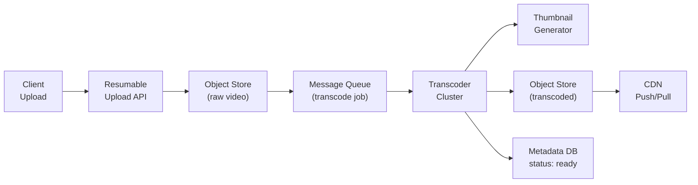
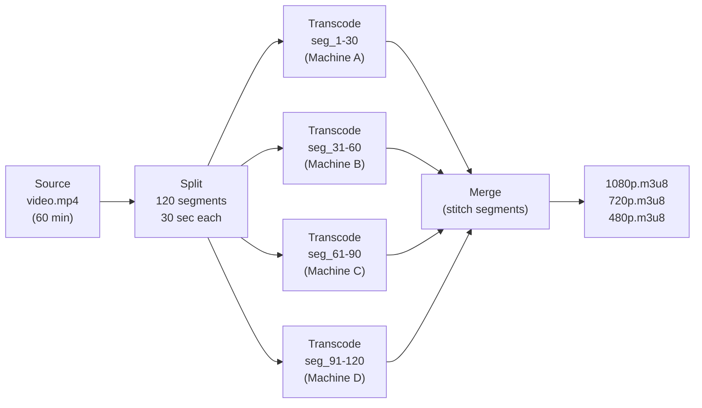
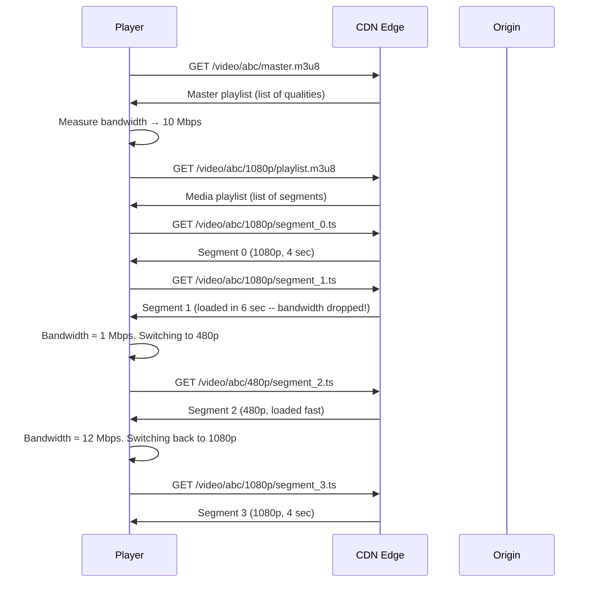
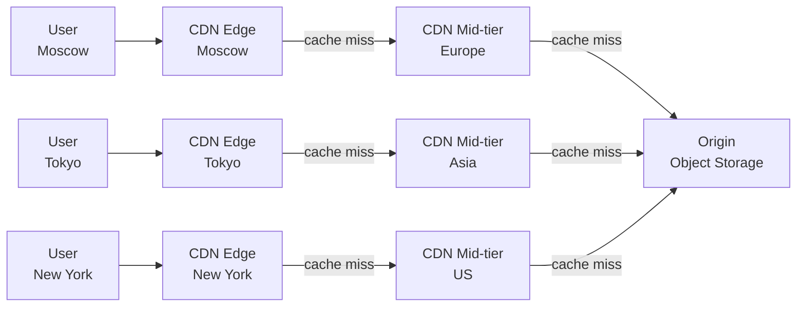

# Level 16: Designing Video Streaming -- Upload, Transcoding, and Adaptive Delivery

## Introduction

Imagine an international publishing house that receives a manuscript and must release it in 50 languages simultaneously, in hardcover, paperback, and electronic versions, with readers in Moscow, Tokyo, and New York receiving their copy within seconds of publication. Moreover -- each reader can open any page directly, without flipping from the beginning. And if the reader is commuting on a subway with unstable connection, the publisher automatically sends a reduced copy instead of the full-size edition, and as soon as the connection is restored -- seamlessly switches back to full quality.

This is exactly how a modern video platform works. YouTube processes **500 hours of video every minute**. Netflix consumes **15% of global internet traffic**. When you press Play, a dozen invisible operations happen in 1-2 seconds -- from selecting the nearest CDN node to determining the optimal bitrate for your connection. This is the system we'll design in this level.

This level is a **CAPSTONE**: it brings together practically all course concepts simultaneously: horizontal scaling, message queues, CDN, different types of databases, real-time data processing. A video platform is one of the best examples of how a planetary-scale system is built from individual blocks.

---

## 1. Requirements: What the System Must Do and How

Good system design starts with requirements, not technologies. First -- "what?", then -- "how?". This rule is broken more often than it seems: engineers rush to draw architecture without fixing what they're building.

### Functional Requirements

A video platform isn't one product, but several interconnected systems. Let's break them down:

1. **Video upload** -- file upload up to 256 GB with resumable upload support. This is critical: if a user uploads 50 GB and the connection breaks at 90%, without resumable they start from scratch.
2. **Transcoding** -- conversion to multiple resolutions (240p -- 4K) and codecs (H.264, H.265, VP9, AV1). One source file becomes dozens of derivative variants.
3. **Streaming** -- adaptive bitrate (HLS/DASH), seeking, subtitles.
4. **Thumbnails** -- automatic generation of previews from key frames.
5. **Search** -- full-text search by title, description, tags.
6. **Recommendations** -- personalized feed based on viewing history.
7. **Live streaming** -- real-time broadcasting (RTMP → HLS).
8. **Analytics** -- views, watch time, engagement.
9. **Copyright detection** -- Content ID (fingerprinting) for violation detection.

### Non-Functional Requirements

These are constraints that determine which technical solutions are even acceptable:

- **Scale**: 2 billion users, 800 million DAU, 500 hours of video/minute uploaded
- **Storage**: petabytes of video content
- **Latency**: playback start < 2 sec, seek < 1 sec
- **Availability**: 99.99% (no more than 52 minutes downtime per year)
- **Throughput**: terabits per second through CDN
- **Global**: worldwide content delivery < 100ms

### Scale Estimates (back-of-the-envelope)

Back-of-the-envelope estimates are a way to verify that the chosen technologies can even handle the load. Count out loud, not in your head:

```
Upload: 500 hours of video/min = 720,000 hours/day

Average video size: 10 minutes
Size after transcoding all resolutions: ~6 GB (all variants together)

Number of uploaded videos:
  500 min/min ÷ 10 min/video = 50 videos/sec

Storage per day:
  720,000 hours × 6 GB/hour ≈ 4.3 PB/day (all resolutions)

Storage per year:
  4.3 PB × 365 ≈ 1.5 EB (exabytes)

CDN bandwidth at peak:
  800M DAU × 30 min/day × 5 Mbps ≈ 200 Tbps peak load

Views per second:
  800M × 30 min ÷ 86,400 sec ≈ 280,000 views/sec
```

These numbers immediately make things clear: it's impossible to use one server, one data center, or one database. The system is distributed by definition -- it's not a choice, it's a consequence of scale.

---

## 2. Upload and Transcoding Pipeline

### Why Video Upload Isn't Just a PUT Request

Regular file upload via HTTP works like this: client sends bytes, server receives, connection closes. This works great for a 1 MB file, but for 50 GB video this approach is catastrophic for several reasons:

- **HTTP timeout**: uploading 50 GB at 100 Mbps takes 67 minutes. During this time, a connection break is inevitable.
- **Mobile internet is unstable**: user is driving in a car, network drops -- and upload stops.
- **Network congestion**: during peak hours, speed drops. 67 minutes become 3 hours.
- **No resume capability**: on break, you start from scratch.

The solution is **Resumable Upload**. The tus.io protocol is an open standard that uses this approach:

```typescript
// Resumable upload protocol (similar to tus.io)
// 4 GB file → split into 8 MB chunks = 500 chunks

// Step 1: Initialization -- register upload session
// POST /api/v1/uploads
// Body: { filename: "video.mp4", size: 4294967296, mimeType: "video/mp4" }
// Response: { uploadId: "abc123", chunkSize: 8388608, expiresAt: "2024-01-01T12:00:00Z" }

// Step 2: Upload chunks (in parallel, up to 6 simultaneously)
// PUT /api/v1/uploads/abc123/chunks/0    (bytes 0 - 8388607)
// PUT /api/v1/uploads/abc123/chunks/1    (bytes 8388608 - 16777215)
// ...
// Response: { chunkIndex: 0, received: 8388608, checksum: "verified" }

// Step 3: If connection breaks -- find out what's already uploaded
// GET /api/v1/uploads/abc123/status
// Response: { completedChunks: [0, 1, 2, 3, 47], totalChunks: 500, percentage: 10 }
// Continue from chunk 4, skip 47 (also uploaded)

// Step 4: Completion -- server assembles all parts
// POST /api/v1/uploads/abc123/complete
// Response: { videoId: "video_xyz", status: "processing" }
// → launches transcoding pipeline
```

Note the `checksum` for each chunk. The network can silently corrupt data (bit rot in RAM, errors in network equipment). The checksum allows detecting corruption and re-requesting the specific chunk, not the entire file.

### Upload and Transcoding Pipeline

After all file parts are uploaded, a multi-stage pipeline begins:



The key decision here is an **asynchronous pipeline through a message queue**. After the raw video is saved to Object Storage, the Upload Service publishes a message to the queue and returns `202 Accepted` with the video ID and "processing" status to the client. The client doesn't wait -- transcoding happens in the background.

Why can't transcoding be done synchronously (within one HTTP request)?

- Transcoding 10 minutes of video takes 5 to 30 minutes depending on hardware
- HTTP connection can't stay open that long (timeouts, NAT timeouts)
- One transcoder server can't handle 50 videos/sec
- If the transcoder crashes -- the message in the queue is preserved, can retry

### Transcoding: One File → Many Formats

Transcoding isn't just "resave in a different format." It's creating an **adaptive bitrate ladder**:

```
One source file → many output variants

Resolutions (adaptive bitrate ladder):
  2160p (4K) -- 20 Mbps  -- Smart TV, desktop, fast internet
  1080p      -- 8 Mbps   -- main quality
  720p       -- 5 Mbps   -- mobile / average internet
  480p       -- 2.5 Mbps -- weak internet
  360p       -- 1 Mbps   -- very weak internet
  240p       -- 0.5 Mbps -- edge case (2G network, IoT devices)

Codecs:
  H.264 (AVC)  -- universal, supported by 95%+ devices
  H.265 (HEVC) -- 50% more efficient than H.264, requires licensing fees
  VP9          -- Google, free, YouTube default for desktop
  AV1          -- next generation, 30% better than VP9, slow encode
```

```typescript
// Transcoding job specification
interface TranscodeJob {
  videoId: string
  sourceUrl: string            // S3 URL of raw video
  outputs: TranscodeOutput[]
  priority: 'high' | 'normal' | 'low'  // new videos -- high, re-transcoding -- low
  callbackUrl: string          // Webhook notification on completion
}

interface TranscodeOutput {
  resolution: '2160p' | '1080p' | '720p' | '480p' | '360p' | '240p'
  codec: 'h264' | 'h265' | 'vp9' | 'av1'
  bitrate: number              // Kbps
  container: 'mp4' | 'webm'
  segmentDuration: number      // seconds (4 for HLS, 2 for live)
}

// What happens at the ffmpeg level:
// ffmpeg -i input.mp4 \
//   -c:v libx264 -b:v 8000k -vf scale=1920:1080 \
//   -hls_time 4 -hls_playlist_type vod output_1080p.m3u8 \
//   -c:v libx264 -b:v 5000k -vf scale=1280:720 \
//   -hls_time 4 -hls_playlist_type vod output_720p.m3u8
```

### DAG Parallelism in Transcoding

YouTube uses a clever trick to speed up transcoding of long videos: **splits the source video into short segments** (e.g., 30 seconds each) and transcodes them in parallel on different machines. Then the segments are stitched back together. This is called a DAG (Directed Acyclic Graph) pipeline:



Instead of one machine transcoding 60 minutes of video in 30 minutes, 4 machines do it in 7-8 minutes. This is **horizontal scaling** of transcoding.

---

## 3. Adaptive Bitrate Streaming: HLS and DASH

### The Problem Adaptive Bitrate Solves

Imagine downloading a movie on a train. First in the city, the speed is great -- 50 Mbps. Then the train enters a tunnel -- speed drops to 0.5 Mbps. Then exits -- back to 50 Mbps.

If the video is one large file, when the speed drops, the player starts buffering (spinning loading circle). The user waits.

**Adaptive Bitrate Streaming (ABR)** solves this differently: the video is cut into short segments (4-6 seconds), and before loading each next segment, the player measures bandwidth and chooses the appropriate quality. In the tunnel -- loads 480p, on exit -- seamlessly switches back to 1080p.

### How HLS Works Internally

HLS (HTTP Live Streaming), developed by Apple, is built on two types of files:

```
// Master playlist (master.m3u8) -- list of all available qualities
// This is the first thing the player requests

#EXTM3U
#EXT-X-STREAM-INF:BANDWIDTH=8000000,RESOLUTION=1920x1080,CODECS="avc1.640028"
1080p/playlist.m3u8
#EXT-X-STREAM-INF:BANDWIDTH=5000000,RESOLUTION=1280x720,CODECS="avc1.4d401f"
720p/playlist.m3u8
#EXT-X-STREAM-INF:BANDWIDTH=2500000,RESOLUTION=854x480,CODECS="avc1.4d401e"
480p/playlist.m3u8
#EXT-X-STREAM-INF:BANDWIDTH=1000000,RESOLUTION=640x360,CODECS="avc1.42e01e"
360p/playlist.m3u8

// Media playlist (1080p/playlist.m3u8) -- list of segments of one quality
// Player requests this after choosing quality

#EXTM3U
#EXT-X-TARGETDURATION:4          // maximum segment length = 4 sec
#EXT-X-MEDIA-SEQUENCE:0
#EXTINF:4.0,                      // length of this segment = 4 sec
segment_0.ts
#EXTINF:4.0,
segment_1.ts
#EXTINF:3.8,                      // last segment may be shorter
segment_2.ts
#EXT-X-ENDLIST                    // end of VOD marker (absent for live)
```

Let's decode the `CODECS="avc1.640028"` field. This isn't just "H.264" -- it's the exact codec profile:
- `avc1` -- this is H.264 (AVC)
- `640028` -- Profile Level 6.4, High profile, level 4.0 (maximum bitrate, 1080p)
- `4d401f` -- Profile Level 4D.4.0.1F, Main profile (720p)
- `42e01e` -- Baseline profile (low resolution, compatibility with legacy devices)

The player uses this information to know in advance whether the device can hardware-decode this quality, before loading segments.

### Request Sequence During Playback



Note: the player never contacts the Origin directly (on cache hit). All requests go to the nearest CDN Edge. Origin is only used on cache miss.

### HLS vs DASH: Detailed Comparison

| Characteristic | HLS | DASH |
|---|---|---|
| **Developer** | Apple (2009) | MPEG (open standard, 2012) |
| **Manifest format** | .m3u8 (text) | .mpd (XML, more complex) |
| **Segment format** | .ts (MPEG-TS) or .fmp4 | .m4s (fragmented MP4) |
| **Segment length** | 4-6 sec | 2-4 sec |
| **DRM protection** | FairPlay (Apple only) | Widevine (Google), PlayReady (Microsoft) |
| **iOS support** | Native, mandatory | Only via MSE (not all versions) |
| **Android support** | Via ExoPlayer | Native via ExoPlayer |
| **Latency (normal)** | 20-30 sec | 3-10 sec |
| **Latency (low-latency)** | LL-HLS: 2-5 sec | LL-DASH: 1-3 sec |
| **Used by** | Netflix (iOS), Twitch | YouTube, Netflix (Android/Web) |

In practice: YouTube uses DASH (its own format -- WebM/VP9 and fMP4/AV1). Netflix -- both HLS and DASH depending on device. Twitch -- LL-HLS for live streams. This explains why real platforms support both formats.

### How the Player Decides Which Quality to Choose

The ABR algorithm isn't just "looked at speed and chose." Modern players use complex heuristics:

```typescript
// Simplified player ABR algorithm
class ABRController {
  private bufferSize = 0        // current buffer in seconds
  private bandwidth = 0         // measured bandwidth in bps

  selectQuality(availableQualities: Quality[]): Quality {
    // 1. Measure bandwidth based on recent segments
    const estimatedBandwidth = this.bandwidth * 0.8  // conservative estimate (80%)

    // 2. Find best quality that fits within bandwidth
    const eligible = availableQualities
      .filter(q => q.bitrate < estimatedBandwidth)
      .sort((a, b) => b.bitrate - a.bitrate)

    // 3. Account for buffer: if buffer is large -- can risk higher quality
    if (this.bufferSize > 30 && eligible.length > 1) {
      // Buffer > 30 sec -- try one step up
      const higherQuality = availableQualities.find(
        q => q.bitrate > eligible[0].bitrate
      )
      if (higherQuality) return higherQuality
    }

    // 4. If buffer is small -- be conservative, don't risk
    if (this.bufferSize < 5) {
      // Buffer < 5 sec -- take lowest quality for stability
      return eligible[eligible.length - 1]
    }

    return eligible[0]
  }
}
```

---

## 4. CDN -- Global Video Delivery

### Why YouTube Is Physically Impossible Without CDN

Imagine: YouTube's Origin server is in a data center in Virginia, USA. A user in Tokyo requests a video segment. RTT (Round Trip Time) to Virginia from Tokyo -- about 200ms. A 4-second video segment at 5 Mbps weighs 2.5 MB. Download takes 200ms (RTT) + 40ms (transfer) = ~240ms per segment.

The player must download the next segment faster than it plays the current one. With 4-second segments, the player must manage to download the next one in 4 seconds. 240ms is fine. But this is with an ideal connection, no congestion, for one user. At **200 Tbps peak load**, one data center simply physically can't handle the traffic.

CDN solves both aspects: latency (physical proximity) and bandwidth (load distribution).

### Three-Tier CDN Architecture



**Edge POP (Point of Presence)** -- node closest to the user:
- 200+ POPs worldwide
- Caches "hot" segments (popular videos)
- Cache hit rate: 85-95%
- Latency to user: < 10ms

**Mid-tier (regional cache)**:
- 10-20 regional centers
- Caches less popular content
- Cache hit rate: 95-99%
- If edge misses -- goes here, not directly to Origin

**Origin**:
- Object Storage (S3/GCS)
- Only for "cold" content (rarely viewed videos)
- Less than 1% of requests reach Origin

```typescript
// Why CDN saves money
// (not only speeds up, but significantly reduces costs)

const cdnEconomics = {
  // Without CDN: every request goes to Origin
  withoutCDN: {
    bandwidthCost: 0.09,           // $0.09/GB outgoing traffic from data center
    latencyTokyoToVirginia: 200,   // ms RTT
    originLoad: '280K requests/sec',
  },

  // With CDN: 95% of requests served from edge
  withCDN: {
    cdnCost: 0.02,                 // $0.02/GB CDN bandwidth
    latencyTokyoToEdge: 5,         // ms RTT to nearest POP
    originLoad: '14K requests/sec', // only 5% cache miss
    savingsVsOrigin: '78%',        // savings on bandwidth
  }
}
```

### Push vs Pull Caching Strategies

```
Hot content (trending, new releases, first 24 hours):
  Push-based -- after transcoding, immediately "push" to nearest Edge POPs
  Don't wait for first request -- video is already in cache at publication time
  TTL: 24 hours, update on metadata change

Long-tail content (99% of videos after 1 week):
  Pull-based -- first request causes cache miss → pull from Origin → cache
  Subsequent requests served from cache
  TTL: 7 days, LRU eviction on disk fill

YouTube's secret -- Google Global Cache (GGC):
  Google installs its servers directly at ISPs (internet service providers)
  YouTube traffic doesn't leave the provider's network at all
  Savings: 60%+ of external bandwidth cost
  Providers agree -- they also save on traffic
```

---

## 5. Storing Petabytes of Video

### Multi-Level Storage (Storage Tiering)

Storing petabytes of video on fast SSD storage is enormously expensive. Most videos after the first week are rarely viewed. The solution is **automatic tiering** of videos between storage levels depending on popularity:

```typescript
// Storage tiers
const storageTiers = {
  hot: {
    description: 'Popular and fresh videos (< 30 days or > 10K views/day)',
    technology: 'S3 Standard (SSD)',
    costPerGBMonth: 0.023,        // $0.023/GB/month
    accessTime: '< 100ms',
    useCase: 'Trending videos, new releases',
  },
  warm: {
    description: 'Videos 30-90 days old, moderate popularity',
    technology: 'S3 Infrequent Access',
    costPerGBMonth: 0.0125,       // $0.0125/GB/month
    accessTime: '< 100ms (but costs more on frequent access)',
    useCase: 'Channel archive, videos with moderate traffic',
  },
  cold: {
    description: 'Videos > 90 days, rarely viewed',
    technology: 'S3 Glacier / Archive',
    costPerGBMonth: 0.004,        // $0.004/GB/month
    accessTime: 'minutes (retrieval time)',
    useCase: 'Historical archive, copyright-pending content',
  }
}

// Transition policy between levels (S3 Lifecycle Policy)
const lifecyclePolicy = {
  transition: [
    { days: 30, storageClass: 'STANDARD_IA' },   // move to warm after 30 days
    { days: 90, storageClass: 'GLACIER' },         // move to cold after 90 days
  ],
  // Exception: if viewCount > 10,000/day -- keep in hot regardless of age
  exception: 'hot_content_override',
}
```

### Chunked Storage: Why Video Is Stored as a Set of Files

Video isn't stored as one monolithic file, but as a set of small segments. Structure in Object Storage:

```
/videos/{videoId}/
  ├── manifest/
  │   ├── master.m3u8                 # Master playlist (< 1 KB)
  │   ├── 1080p/playlist.m3u8         # 1080p playlist
  │   ├── 720p/playlist.m3u8
  │   └── 480p/playlist.m3u8
  ├── segments/
  │   ├── 1080p/
  │   │   ├── segment_0000.ts         # ~3 MB each
  │   │   ├── segment_0001.ts
  │   │   └── ...
  │   ├── 720p/
  │   │   ├── segment_0000.ts         # ~2 MB each
  │   │   └── ...
  │   └── 480p/
  │       └── ...
  └── thumbnails/
      ├── thumb_00m00s.jpg
      ├── thumb_01m00s.jpg
      └── storyboard.vtt              # Preview for seek-bar
```

Why this structure?

- **Parallel loading**: player can request multiple segments simultaneously
- **Seek without downloading entire file**: jumping to the 50th minute = requesting segment_750 directly
- **CDN caches individual segments**: hot moments of a video (e.g., final scenes) are cached separately from the beginning
- **Granular deletion**: you can delete only the 4K version while keeping 1080p

### Metadata Storage: Different Databases for Different Tasks

```typescript
// PostgreSQL -- structured video metadata (ACID)
interface VideoMetadata {
  id: string                    // UUID v7 (time-sortable -- important for sharding)
  title: string
  description: string
  channelId: string
  duration: number              // seconds
  status: 'uploading' | 'processing' | 'ready' | 'failed'
  uploadedAt: Date
  publishedAt: Date
  visibility: 'public' | 'unlisted' | 'private'
  tags: string[]
  category: string
  thumbnailUrl: string
  manifestUrl: string           // HLS master playlist URL
  transcodingProfile: 'standard' | 'hdr' | 'dolby_vision'
}

// Cassandra / DynamoDB -- high-frequency write counters (eventual consistent)
interface VideoStats {
  videoId: string
  viewCount: number             // Approximate, eventual consistent
  likeCount: number
  dislikeCount: number
  commentCount: number
  watchTimeSeconds: number      // Total watch time
  lastUpdated: Date
  // Why not PostgreSQL? 280K writes/sec on view_count = catastrophe for RDBMS
}

// Elasticsearch -- full-text search
interface VideoSearchDoc {
  id: string
  title: string                 // Boost x3 on search
  description: string           // Boost x1
  tags: string[]                // Boost x2
  channelName: string
  category: string
  duration: number
  viewCount: number             // For popularity sorting
  publishedAt: Date             // For time filtering
  // Synchronized from PostgreSQL via Change Data Capture (Debezium → Kafka → ES)
}
```

Why three different databases for metadata? Because they have different access patterns:
- PostgreSQL: transactional operations, JOIN queries, ACID. Slow at high write rates.
- Cassandra: optimized for high writes. No JOIN, eventual consistency -- acceptable for counters.
- Elasticsearch: optimized for full-text search with ranking. PostgreSQL is 100x slower at this task.

---

## 6. Counting Views at Scale

### Why a Simple UPDATE Is a Catastrophe

```typescript
// ❌ Naive approach: each view = UPDATE in SQL
// UPDATE videos SET view_count = view_count + 1 WHERE id = 'abc'

// At 280K views/sec this means:
// - 280K concurrent UPDATEs on one row per second
// - Row-level lock on each UPDATE (in most RDBMS)
// - Lock contention → request queue → deadlock
// - One viral video → entire videos table degrades
// - Duplication: F5 = infinite view counter
```

### Correct Solution: Aggregation Through Event Stream

```typescript
// ✅ Aggregated views through event stream
// Each view generates an event → Kafka → batch aggregation → update DB

// View event (written to Kafka)
interface ViewEvent {
  videoId: string
  userId: string
  watchedSeconds: number
  timestamp: Date
  // No deduplication here -- handled downstream
}

// Aggregator (runs every 10 seconds)
// Reads from Kafka, aggregates by videoId, writes batch update
async function aggregateViews(events: ViewEvent[]): Promise<void> {
  const counts = new Map<string, number>()
  for (const event of events) {
    counts.set(event.videoId, (counts.get(event.videoId) || 0) + 1)
  }

  // Batch update -- one UPDATE per video, not per view
  for (const [videoId, count] of counts) {
    await db.query(
      'UPDATE videos SET view_count = view_count + $1 WHERE id = $2',
      [count, videoId]
    )
  }
}

// 280K views → aggregated to ~50K unique videos → 50K UPDATEs per 10 seconds
// = 5K UPDATEs/sec instead of 280K concurrent UPDATEs
```

### Deduplication

To prevent F5 spamming, use a unique view session:

```typescript
// Track unique view sessions in Redis
async function recordView(videoId: string, userId: string): Promise<boolean> {
  const key = `view:${videoId}:${userId}:${getHourBucket()}`
  // Only count one view per user per video per hour
  const wasNew = await redis.set(key, '1', 'NX', 'EX', 3600)
  return wasNew !== null  // true = new unique view
}
```

---

## 7. Live Streaming

### How Live Streaming Differs from VOD

Live streaming has additional constraints:
- Content doesn't exist yet -- it's being created in real time
- Latency must be minimal (ideally < 10 seconds)
- No seeking ahead (only behind, in the DVR window)

### Live Streaming Pipeline

```
Broadcaster → RTMP ingest → Transcoder → HLS/DASH segments → CDN → Players
```

```typescript
// Live streaming pipeline
// 1. Broadcaster sends RTMP stream to ingest server
// 2. Ingest server receives stream, forwards to transcoder
// 3. Transcoder creates multiple resolution variants in real time
// 4. Segments are written to Object Storage (continuously)
// 5. Playlist (m3u8) is updated every 2-4 seconds
// 6. CDN picks up new segments
// 7. Players poll the playlist for new segments

interface LiveStream {
  streamKey: string             // Unique key for broadcaster authentication
  status: 'live' | 'ended' | 'idle'
  viewers: number               // Current viewer count
  startedAt: Date
  dvrWindowMinutes: number      // How far back viewers can seek (usually 120 min)
}
```

---

## Common Mistakes

### Mistake 1: Synchronous Transcoding

Transcoding in the HTTP request path blocks the upload for minutes. Always use asynchronous processing through a message queue.

### Mistake 2: Storing Video in a Database

Video content belongs in Object Storage (S3), not PostgreSQL. Store only metadata and references in the database.

### Mistake 3: Not Using Adaptive Bitrate

Serving only one quality means users with poor connections experience buffering, while users with great connections don't get the best quality. Always provide a bitrate ladder.

### Mistake 4: Ignoring CDN Economics

Without CDN, origin server bandwidth costs are 4-5x higher. CDN is not optional for a video platform at scale.

### Mistake 5: Simple UPDATE for View Counting

At 280K views/sec, row-level locks on a single UPDATE cause catastrophic lock contention. Use event stream aggregation.

### Mistake 6: No Resumable Upload

For large files (50+ GB), connection breaks are inevitable. Without resumable upload, users lose hours of upload progress.

---

## Summary

| Component | Key Decision |
|-----------|-------------|
| **Upload** | Resumable upload with chunked transfer and checksums |
| **Transcoding** | Asynchronous pipeline via message queue, DAG parallelism |
| **Streaming** | HLS/DASH with adaptive bitrate ladder (240p-4K, multiple codecs) |
| **CDN** | Three-tier: Edge → Mid-tier → Origin, push for hot content, pull for long-tail |
| **Storage** | Multi-tier: hot (SSD) → warm (IA) → cold (Glacier), automatic transitions |
| **Metadata** | PostgreSQL (metadata) + Cassandra (counters) + Elasticsearch (search) |
| **View counting** | Event stream → Kafka → batch aggregation, not direct UPDATE |
| **Live streaming** | RTMP ingest → real-time transcoding → HLS segments → CDN |

**Main principle:** a video platform is the ultimate test of distributed system design. It combines every concept from this course: horizontal scaling (transcoder cluster), message queues (async pipeline), CDN (global delivery), multiple databases (metadata, counters, search), and real-time processing (live streaming). Each component is optimized for its specific workload pattern, and the system as a whole handles planetary-scale traffic through careful layering and caching.
