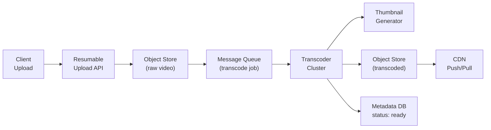
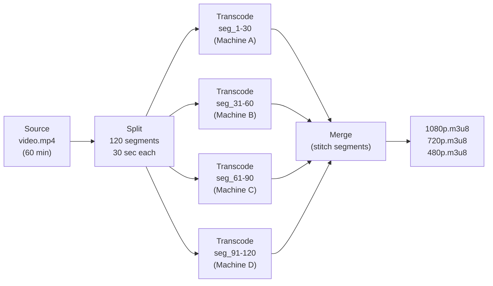
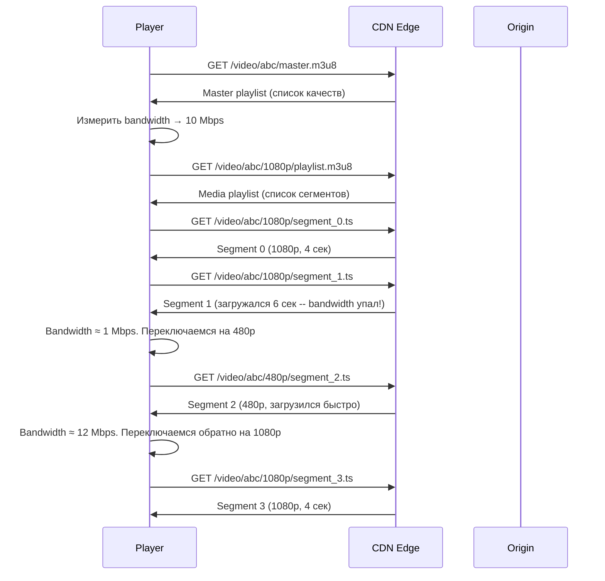
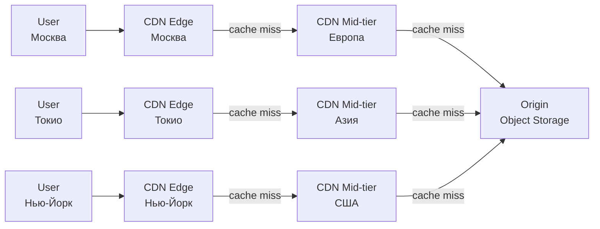
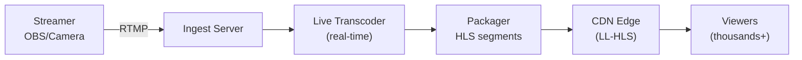
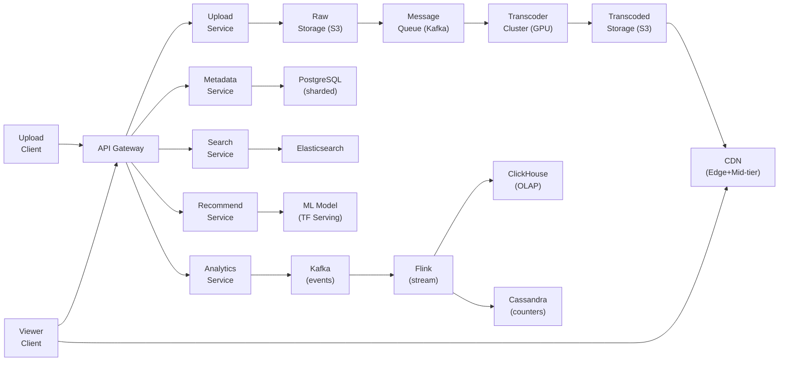

# Уровень 16: Проектируем видеостриминг -- загрузка, транскодирование и адаптивная доставка

## Введение

Представьте международную типографию, которая получает рукопись и должна выпустить её на 50 языках одновременно, в твёрдой обложке, мягкой и электронной версии, причём читатели в Москве, Токио и Нью-Йорке должны получить свой экземпляр в течение нескольких секунд после публикации. Мало того -- каждый читатель может открыть любую страницу напрямую, не листая с начала. И если читатель едет в метро и связь нестабильна, типография автоматически присылает ему уменьшенную копию вместо полноразмерного издания, а как только связь восстановилась -- незаметно переключается обратно на полное качество.

Именно так работает современная видеоплатформа. YouTube обрабатывает **500 часов видео каждую минуту**. Netflix потребляет **15% мирового интернет-трафика**. Когда вы нажимаете Play, за 1-2 секунды происходит десяток невидимых операций -- от выбора ближайшего CDN-узла до определения оптимального битрейта для вашего соединения. Именно эту систему мы спроектируем на данном уровне.

Этот уровень -- **CAPSTONE**: здесь собраны практически все концепции курса одновременно: горизонтальное масштабирование, очереди сообщений, CDN, базы данных разных типов, real-time обработка данных. Видеоплатформа -- один из лучших примеров того, как из отдельных блоков строится система планетарного масштаба.

---

## 1. Требования: что и как должна делать система

Хорошее системное проектирование начинается с требований, а не с технологий. Сначала -- "что?", потом -- "как?". Это правило нарушается чаще, чем кажется: инженеры торопятся рисовать архитектуру, не зафиксировав, что именно строят.

### Функциональные требования

Видеоплатформа -- это не один продукт, а несколько взаимосвязанных систем. Разберём их:

1. **Upload видео** -- загрузка файлов до 256 GB с поддержкой возобновляемой загрузки (resumable upload). Это критично: если пользователь загружает 50 GB и соединение обрывается на 90%, без resumable он начинает заново.
2. **Transcoding** -- конвертация в несколько разрешений (240p -- 4K) и кодеков (H.264, H.265, VP9, AV1). Один исходный файл превращается в десятки производных вариантов.
3. **Streaming** -- адаптивный битрейт (HLS/DASH), перемотка (seek), субтитры.
4. **Thumbnails** -- автоматическая генерация превью из ключевых кадров.
5. **Search** -- полнотекстовый поиск по заголовку, описанию, тегам.
6. **Recommendations** -- персонализированная лента на основе истории просмотров.
7. **Live streaming** -- трансляция в реальном времени (RTMP → HLS).
8. **Analytics** -- просмотры, watch time, вовлечённость.
9. **Copyright detection** -- Content ID (fingerprinting) для обнаружения нарушений.

### Нефункциональные требования

Это ограничения, которые определяют, какие технические решения вообще допустимы:

- **Масштаб**: 2 млрд пользователей, 800 млн DAU, 500 часов видео/минуту при загрузке
- **Хранение**: петабайты видеоконтента
- **Задержка**: старт воспроизведения < 2 сек, seek < 1 сек
- **Доступность**: 99.99% (не более 52 минут downtime в год)
- **Пропускная способность**: терабиты в секунду через CDN
- **Глобальность**: доставка контента по всему миру < 100 мс

### Масштабные оценки (back-of-the-envelope)

Оценки на "обёртке конверта" -- это способ убедиться, что выбранные технологии вообще справятся с нагрузкой. Считаем вслух, не в уме:

```
Upload: 500 часов видео/мин = 720,000 часов/день

Средний размер видео: 10 минут
Размер после транскодирования всех разрешений: ~6 GB (все варианты вместе)

Количество загружаемых видео:
  500 мин/мин ÷ 10 мин/видео = 50 videos/sec

Хранение в день:
  720,000 часов × 6 GB/час ≈ 4.3 PB/день (все разрешения)

Хранение в год:
  4.3 PB × 365 ≈ 1.5 EB (exabytes)

CDN bandwidth в пиковое время:
  800M DAU × 30 мин/день × 5 Mbps ≈ 200 Tbps пиковая нагрузка

Просмотры в секунду:
  800M × 30 мин ÷ 86,400 сек ≈ 280,000 views/sec
```

💡 Эти цифры сразу ставят точки над i: невозможно использовать один сервер, один датацентр или одну базу данных. Система распределённая по определению -- это не выбор, это следствие масштаба.

---

## 2. Upload и Transcoding Pipeline

### Почему загрузка видео -- это не просто PUT-запрос

Обычная загрузка файла через HTTP работает так: клиент отправляет байты, сервер принимает, connection закрывается. Это отлично работает для файла размером 1 MB, но для 50 GB видео такой подход катастрофичен по нескольким причинам:

- **HTTP timeout**: загрузка 50 GB по 100 Mbps занимает 67 минут. За это время неизбежно произойдёт разрыв соединения.
- **Мобильный интернет нестабилен**: пользователь едет в машине, сеть прерывается -- и загрузка прерывается.
- **Перегрузка сети**: в пиковые часы скорость падает. 67 минут превращаются в 3 часа.
- **Нет возможности продолжить**: при обрыве нужно начинать заново.

Решение -- **Resumable Upload** (возобновляемая загрузка). Протокол tus.io -- открытый стандарт, который использует этот подход:

```typescript
// Resumable upload protocol (похож на tus.io)
// Файл 4 GB → разбиваем на chunks по 8 MB = 500 chunks

// Шаг 1: Инициализация -- регистрируем сессию загрузки
// POST /api/v1/uploads
// Body: { filename: "video.mp4", size: 4294967296, mimeType: "video/mp4" }
// Response: { uploadId: "abc123", chunkSize: 8388608, expiresAt: "2024-01-01T12:00:00Z" }

// Шаг 2: Загрузка chunks (параллельно, до 6 одновременно)
// PUT /api/v1/uploads/abc123/chunks/0    (байты 0 - 8388607)
// PUT /api/v1/uploads/abc123/chunks/1    (байты 8388608 - 16777215)
// ...
// Response: { chunkIndex: 0, received: 8388608, checksum: "verified" }

// Шаг 3: Если соединение оборвалось -- узнаём, что уже загружено
// GET /api/v1/uploads/abc123/status
// Response: { completedChunks: [0, 1, 2, 3, 47], totalChunks: 500, percentage: 10 }
// Продолжаем с chunk 4, пропускаем 47 (тоже загружен)

// Шаг 4: Завершение -- сервер собирает все части
// POST /api/v1/uploads/abc123/complete
// Response: { videoId: "video_xyz", status: "processing" }
// → запускает transcoding pipeline

interface UploadChunk {
  uploadId: string
  chunkIndex: number
  totalChunks: number
  data: ArrayBuffer
  checksum: string  // MD5/SHA256 для integrity check -- важно!
}
```

Обратите внимание на `checksum` для каждого chunk. Сеть может тихо исказить данные (bit rot в оперативной памяти, ошибки в сетевом оборудовании). Контрольная сумма позволяет обнаружить повреждение и повторно запросить конкретный chunk, а не весь файл.

### Pipeline загрузки и транскодирования

После того как все части файла загружены, начинается многоступенчатый pipeline:



Ключевое решение здесь -- **асинхронный pipeline через очередь сообщений**. После того как raw-видео сохранено в Object Storage, Upload Service публикует сообщение в очередь и возвращает клиенту `202 Accepted` с ID видео и статусом "processing". Клиент не ждёт -- транскодирование происходит в фоне.

Почему нельзя делать транскодирование синхронно (в рамках одного HTTP-запроса)?

- Транскодирование 10 минут видео занимает от 5 до 30 минут в зависимости от железа
- HTTP-соединение не может держаться так долго (timeouts, NAT-таймауты)
- Один сервер транскодирования не справится с 50 videos/sec
- Если транскодер упадёт -- сообщение в очереди сохранится, можно повторить

### Transcoding: один файл → множество форматов

Транскодирование -- это не просто "пересохранить в другом формате". Это создание **адаптивной лестницы битрейтов** (bitrate ladder):

```
Один исходный файл → множество вариантов вывода

Разрешения (adaptive bitrate ladder):
  2160p (4K) -- 20 Mbps  -- Smart TV, десктоп, быстрый интернет
  1080p      -- 8 Mbps   -- основное качество
  720p       -- 5 Mbps   -- мобильный / средний интернет
  480p       -- 2.5 Mbps -- слабый интернет
  360p       -- 1 Mbps   -- очень слабый интернет
  240p       -- 0.5 Mbps -- edge case (2G сеть, IoT устройства)

Кодеки:
  H.264 (AVC)  -- универсальный, поддерживается 95%+ устройств
  H.265 (HEVC) -- на 50% эффективнее H.264, требует лицензионных отчислений
  VP9          -- Google, бесплатный, YouTube default для десктопа
  AV1          -- следующее поколение, на 30% лучше VP9, медленный encode
```

```typescript
// Спецификация задачи транскодирования
interface TranscodeJob {
  videoId: string
  sourceUrl: string            // S3 URL сырого видео
  outputs: TranscodeOutput[]
  priority: 'high' | 'normal' | 'low'  // новые видео -- high, ретранскодирование -- low
  callbackUrl: string          // Webhook-уведомление по завершению
}

interface TranscodeOutput {
  resolution: '2160p' | '1080p' | '720p' | '480p' | '360p' | '240p'
  codec: 'h264' | 'h265' | 'vp9' | 'av1'
  bitrate: number              // Kbps
  container: 'mp4' | 'webm'
  segmentDuration: number      // секунды (4 для HLS, 2 для live)
}

// Что происходит на уровне ffmpeg:
// ffmpeg -i input.mp4 \
//   -c:v libx264 -b:v 8000k -vf scale=1920:1080 \
//   -hls_time 4 -hls_playlist_type vod output_1080p.m3u8 \
//   -c:v libx264 -b:v 5000k -vf scale=1280:720 \
//   -hls_time 4 -hls_playlist_type vod output_720p.m3u8 \
//   -c:v libx264 -b:v 2500k -vf scale=854:480 \
//   -hls_time 4 -hls_playlist_type vod output_480p.m3u8
```

### DAG-параллелизм в транскодировании

📌 YouTube использует хитрый трюк для ускорения транскодирования длинных видео: **разбивает исходное видео на короткие сегменты** (например, по 30 секунд) и транскодирует их параллельно на разных машинах. Потом сегменты собираются обратно. Это называется DAG (Directed Acyclic Graph) pipeline:



Вместо одной машины, транскодирующей 60 минут видео за 30 минут, 4 машины делают это за 7-8 минут. Это **горизонтальное масштабирование** транскодирования.

---

## 3. Adaptive Bitrate Streaming: HLS и DASH

### Проблема, которую решает adaptive bitrate

Представьте, что вы скачиваете фильм в поезде. Сначала в городе скорость отличная -- 50 Mbps. Потом поезд въезжает в туннель -- скорость падает до 0.5 Mbps. Потом выезжает -- снова 50 Mbps.

Если видео -- это один большой файл, то при падении скорости плеер начнёт буферизировать (крутить кружок загрузки). Пользователь ждёт.

**Adaptive Bitrate Streaming (ABR)** решает эту проблему иначе: видео нарезано на короткие сегменты (4-6 секунд), и плеер перед загрузкой каждого следующего сегмента измеряет пропускную способность и выбирает подходящее качество. В туннеле -- загружает 480p, на выходе -- незаметно переключается обратно на 1080p.

### Как работает HLS изнутри

Протокол HLS (HTTP Live Streaming), разработанный Apple, строится на двух видах файлов:

```
// Мастер-плейлист (master.m3u8) -- список всех доступных качеств
// Это первое, что запрашивает плеер

#EXTM3U
#EXT-X-STREAM-INF:BANDWIDTH=8000000,RESOLUTION=1920x1080,CODECS="avc1.640028"
1080p/playlist.m3u8
#EXT-X-STREAM-INF:BANDWIDTH=5000000,RESOLUTION=1280x720,CODECS="avc1.4d401f"
720p/playlist.m3u8
#EXT-X-STREAM-INF:BANDWIDTH=2500000,RESOLUTION=854x480,CODECS="avc1.4d401e"
480p/playlist.m3u8
#EXT-X-STREAM-INF:BANDWIDTH=1000000,RESOLUTION=640x360,CODECS="avc1.42e01e"
360p/playlist.m3u8

// Медиа-плейлист (1080p/playlist.m3u8) -- список сегментов одного качества
// Плеер запрашивает его после выбора качества

#EXTM3U
#EXT-X-TARGETDURATION:4          // максимальная длина сегмента = 4 сек
#EXT-X-MEDIA-SEQUENCE:0
#EXTINF:4.0,                      // длина этого сегмента = 4 сек
segment_0.ts
#EXTINF:4.0,
segment_1.ts
#EXTINF:3.8,                      // последний сегмент может быть короче
segment_2.ts
#EXT-X-ENDLIST                    // маркер конца VOD (нет для live)
```

Разберём поле `CODECS="avc1.640028"`. Это не просто "H.264" -- это точный профиль кодека:
- `avc1` -- это H.264 (AVC)
- `640028` -- Profile Level 6.4, High profile, уровень 4.0 (максимальный битрейт, 1080p)
- `4d401f` -- Profile Level 4D.4.0.1F, Main profile (720p)
- `42e01e` -- Baseline profile (низкое разрешение, совместимость с устаревшими устройствами)

Плеер использует эту информацию, чтобы заранее знать, сможет ли устройство декодировать данное качество аппаратно, до загрузки сегментов.

### Последовательность запросов при воспроизведении



Обратите внимание: плеер никогда не обращается к Origin напрямую (при cache hit). Все запросы идут к ближайшему CDN Edge. Origin задействуется только при cache miss.

### HLS vs DASH: детальное сравнение

| Характеристика | HLS | DASH |
|---|---|---|
| **Разработчик** | Apple (2009) | MPEG (открытый стандарт, 2012) |
| **Формат манифеста** | .m3u8 (текстовый) | .mpd (XML, сложнее) |
| **Формат сегментов** | .ts (MPEG-TS) или .fmp4 | .m4s (fragmented MP4) |
| **Длина сегмента** | 4-6 сек | 2-4 сек |
| **DRM-защита** | FairPlay (только Apple) | Widevine (Google), PlayReady (Microsoft) |
| **Поддержка iOS** | Нативная, обязательная | Только через MSE (не все версии) |
| **Поддержка Android** | Через ExoPlayer | Нативная через ExoPlayer |
| **Задержка (обычный)** | 20-30 сек | 3-10 сек |
| **Задержка (low-latency)** | LL-HLS: 2-5 сек | LL-DASH: 1-3 сек |
| **Используют** | Netflix (iOS), Twitch | YouTube, Netflix (Android/Web) |

📌 На практике: YouTube использует DASH (свой формат -- WebM/VP9 и fMP4/AV1). Netflix -- и HLS и DASH в зависимости от устройства. Twitch -- LL-HLS для живых трансляций. Это объясняет, почему реальные платформы поддерживают оба формата.

### Как плеер решает, какое качество выбрать

ABR-алгоритм -- это не просто "посмотрел скорость и выбрал". Современные плееры используют сложные эвристики:

```typescript
// Упрощённый ABR-алгоритм плеера
class ABRController {
  private bufferSize = 0        // текущий буфер в секундах
  private bandwidth = 0         // измеренная пропускная способность в bps

  selectQuality(availableQualities: Quality[]): Quality {
    // 1. Измерить пропускную способность на основе последних сегментов
    const estimatedBandwidth = this.bandwidth * 0.8  // консервативная оценка (80%)

    // 2. Найти лучшее качество, которое умещается в пропускную способность
    const eligible = availableQualities
      .filter(q => q.bitrate < estimatedBandwidth)
      .sort((a, b) => b.bitrate - a.bitrate)

    // 3. Учесть буфер: если буфер большой -- можно рискнуть взять качество выше
    if (this.bufferSize > 30 && eligible.length > 1) {
      // Буфер > 30 сек -- попробуем взять на 1 ступень выше
      const higherQuality = availableQualities.find(
        q => q.bitrate > eligible[0].bitrate
      )
      if (higherQuality) return higherQuality
    }

    // 4. Если буфер маленький -- быть консервативным, не рисковать
    if (this.bufferSize < 5) {
      // Буфер < 5 сек -- берём самое низкое качество для стабильности
      return eligible[eligible.length - 1]
    }

    return eligible[0]
  }
}
```

---

## 4. CDN -- глобальная доставка видео

### Почему без CDN YouTube физически невозможен

Представьте: Origin-сервер YouTube стоит в дата-центре в Вирджинии, США. Пользователь в Токио запрашивает сегмент видео. RTT (Round Trip Time) до Вирджинии из Токио -- около 200 мс. Сегмент видео длиной 4 секунды при 5 Mbps весит 2.5 MB. Загрузка займёт 200 мс (RTT) + 40 мс (transfer) = ~240 мс на один сегмент.

Плеер должен загружать следующий сегмент быстрее, чем воспроизводит текущий. При 4-секундных сегментах плеер должен успевать за 4 сек загружать следующий. 240 мс -- это нормально. Но это при идеальном соединении, без перегрузок, для одного пользователя. При **200 Tbps пиковой нагрузки** один дата-центр просто физически не справится с трафиком.

CDN решает оба аспекта: и задержку (физическая близость), и пропускную способность (распределение нагрузки).

### Трёхуровневая архитектура CDN



**Edge POP (Point of Presence)** -- ближайший к пользователю узел:
- 200+ POPs по всему миру
- Кеширует "горячие" сегменты (популярные видео)
- Cache hit rate: 85-95%
- Задержка до пользователя: < 10 мс

**Mid-tier (региональный кэш)**:
- 10-20 региональных центров
- Кеширует менее популярный контент
- Cache hit rate: 95-99%
- Если edge промахивается -- идёт сюда, а не сразу на Origin

**Origin**:
- Object Storage (S3/GCS)
- Только для "холодного" контента (редко просматриваемые видео)
- Менее 1% запросов достигает Origin

```typescript
// Почему CDN экономит деньги
// (не только ускоряет, но и значительно снижает затраты)

const cdnEconomics = {
  // Без CDN: каждый запрос идёт на Origin
  withoutCDN: {
    bandwidthCost: 0.09,           // $0.09/GB исходящий трафик из дата-центра
    latencyTokyoToVirginia: 200,   // мс RTT
    originLoad: '280K requests/sec',
  },

  // С CDN: 95% запросов обслуживается с edge
  withCDN: {
    cdnCost: 0.02,                 // $0.02/GB CDN bandwidth
    latencyTokyoToEdge: 5,         // мс RTT до ближайшего POP
    originLoad: '14K requests/sec', // только 5% cache miss
    savingsVsOrigin: '78%',        // экономия на bandwidth
  }
}
```

### Push vs Pull стратегии кеширования

```
Горячий контент (trending, новинки, первые 24 часа):
  Push-based -- после транскодирования сразу "пушим" на ближайшие Edge POPs
  Не ждём первого запроса -- видео уже в кэше к моменту публикации
  TTL: 24 часа, обновление при изменении метаданных

Long-tail контент (99% видео после 1 недели):
  Pull-based -- первый запрос вызывает cache miss → pull из Origin → cache
  Следующие запросы обслуживаются из кэша
  TTL: 7 дней, вытеснение по LRU при заполнении диска

Секрет YouTube -- Google Global Cache (GGC):
  Google устанавливает свои серверы прямо у ISP (интернет-провайдеров)
  Трафик YouTube не покидает сеть провайдера вообще
  Экономия: 60%+ от стоимости внешнего bandwidth
  Провайдеры соглашаются -- они тоже экономят на трафике
```

---

## 5. Хранение петабайт видео

### Многоуровневое хранение (Storage Tiering)

Хранить петабайты видео на быстром SSD-хранилище -- чудовищно дорого. Большинство видео после первой недели просматриваются редко. Решение -- **автоматическое переливание** видео между уровнями хранения в зависимости от популярности:

```typescript
// Уровни хранения (Storage Tiers)
const storageTiers = {
  hot: {
    description: 'Популярные и свежие видео (< 30 дней или > 10K просмотров/день)',
    technology: 'S3 Standard (SSD)',
    costPerGBMonth: 0.023,        // $0.023/GB/месяц
    accessTime: '< 100 мс',
    useCase: 'Trending видео, новинки',
  },
  warm: {
    description: 'Видео 30-90 дней, средняя популярность',
    technology: 'S3 Infrequent Access',
    costPerGBMonth: 0.0125,       // $0.0125/GB/месяц
    accessTime: '< 100 мс (но стоит дороже при частом обращении)',
    useCase: 'Архив канала, видео с умеренным трафиком',
  },
  cold: {
    description: 'Видео > 90 дней, редко просматриваемые',
    technology: 'S3 Glacier / Archive',
    costPerGBMonth: 0.004,        // $0.004/GB/месяц
    accessTime: 'минуты (retrieval time)',
    useCase: 'Исторический архив, copyright-pending контент',
  }
}

// Политика перехода между уровнями (S3 Lifecycle Policy)
const lifecyclePolicy = {
  transition: [
    { days: 30, storageClass: 'STANDARD_IA' },   // переход в warm через 30 дней
    { days: 90, storageClass: 'GLACIER' },         // переход в cold через 90 дней
  ],
  // Исключение: если viewCount > 10,000/день -- держим в hot независимо от возраста
  exception: 'hot_content_override',
}
```

### Chunked Storage: почему видео хранится как набор файлов

Видео хранится не как один монолитный файл, а как набор маленьких сегментов. Структура в Object Storage:

```
/videos/{videoId}/
  ├── manifest/
  │   ├── master.m3u8                 # Мастер-плейлист (< 1 KB)
  │   ├── 1080p/playlist.m3u8         # Плейлист 1080p
  │   ├── 720p/playlist.m3u8
  │   └── 480p/playlist.m3u8
  ├── segments/
  │   ├── 1080p/
  │   │   ├── segment_0000.ts         # ~3 MB каждый
  │   │   ├── segment_0001.ts
  │   │   └── ...
  │   ├── 720p/
  │   │   ├── segment_0000.ts         # ~2 MB каждый
  │   │   └── ...
  │   └── 480p/
  │       └── ...
  └── thumbnails/
      ├── thumb_00m00s.jpg
      ├── thumb_01m00s.jpg
      └── storyboard.vtt              # Превью для seek-bar
```

Зачем такая структура?

- **Параллельная загрузка**: плеер может запрашивать несколько сегментов одновременно
- **Seek без скачивания всего файла**: перемотка на 50-ю минуту = запрос segment_750 напрямую
- **CDN кеширует отдельные сегменты**: горячие моменты видео (например, финальные кадры) кешируются отдельно от начала
- **Гранулярное удаление**: можно удалить только 4K-версию, сохранив 1080p

### Metadata Storage: разные базы данных для разных задач

```typescript
// PostgreSQL -- структурированные метаданные видео (ACID)
interface VideoMetadata {
  id: string                    // UUID v7 (time-sortable -- важно для шардирования)
  title: string
  description: string
  channelId: string
  duration: number              // секунды
  status: 'uploading' | 'processing' | 'ready' | 'failed'
  uploadedAt: Date
  publishedAt: Date
  visibility: 'public' | 'unlisted' | 'private'
  tags: string[]
  category: string
  thumbnailUrl: string
  manifestUrl: string           // URL HLS master playlist
  transcodingProfile: 'standard' | 'hdr' | 'dolby_vision'
}

// Cassandra / DynamoDB -- счётчики с высокой частотой записи (eventual consistent)
interface VideoStats {
  videoId: string
  viewCount: number             // Приближённый, eventual consistent
  likeCount: number
  dislikeCount: number
  commentCount: number
  watchTimeSeconds: number      // Суммарное время просмотра
  lastUpdated: Date
  // Почему не в PostgreSQL? 280K writes/sec на view_count = катастрофа для RDBMS
}

// Elasticsearch -- полнотекстовый поиск
interface VideoSearchDoc {
  id: string
  title: string                 // Boost x3 при поиске
  description: string           // Boost x1
  tags: string[]                // Boost x2
  channelName: string
  category: string
  duration: number
  viewCount: number             // Для сортировки по популярности
  publishedAt: Date             // Для фильтрации по времени
  // Синхронизация из PostgreSQL через Change Data Capture (Debezium → Kafka → ES)
}
```

Почему три разные базы данных для метаданных? Потому что у них разные access patterns:
- PostgreSQL: транзакционные операции, JOIN-запросы, ACID. Медленно при высоком write rate.
- Cassandra: оптимизирована под высокую запись. Нет JOIN, eventual consistency -- это нормально для счётчиков.
- Elasticsearch: оптимизирована под полнотекстовый поиск с ранжированием. PostgreSQL на этой задаче в 100 раз медленнее.

---

## 6. Подсчёт просмотров в масштабе

### Почему простой UPDATE -- это катастрофа

```typescript
// ❌ Наивный подход: каждый просмотр = UPDATE в SQL
// UPDATE videos SET view_count = view_count + 1 WHERE id = 'abc'

// При 280K views/sec это означает:
// - 280K конкурентных UPDATE на одну строку в секунду
// - Row-level lock при каждом UPDATE (в большинстве RDBMS)
// - Lock contention → очередь запросов → deadlock
// - Один вирусный ролик → вся таблица videos деградирует
// - Дублирование: F5 = бесконечный счётчик просмотров
```

### Правильное решение: агрегация через поток событий

```typescript
// ✅ Aggregated counting pipeline
//
// Шаг 1: Client → API → записать view event в Kafka (< 1 мс, non-blocking)
const viewEvent = {
  videoId: 'abc',
  userId: 'user_123',
  sessionId: 'sess_xyz',
  watchedAt: Date.now(),
  country: 'RU',
  deviceType: 'mobile',
}
await kafka.produce('view-events', viewEvent)

// Шаг 2: Flink/Spark Streaming агрегирует события за временное окно
// Tumbling window: каждые 60 сек суммируем view events по videoId
// Дедупликация: один userId + videoId + sessionId = один просмотр

// Шаг 3: Batch write каждые 60 сек
// UPDATE video_stats SET view_count += 15000 WHERE video_id = 'abc'
//                        ^^^^^^^^
//                        60 сек × 250 views/sec (для популярного видео)

// Итог:
// 280K writes/sec (наивный) → ~5K batch writes/sec (56x снижение нагрузки)
```

### Дедупликация: как не считать одного пользователя дважды

```typescript
// Проблема: пользователь перезагружает страницу → +1 просмотр снова
// F5-атака: спамер жмёт F5 → миллион просмотров

// Метод 1: HyperLogLog (приближённый счёт уникальных)
// - 12 KB памяти на 1 видео
// - Точность: ±1.5%
// - Используется для отображения в UI (достаточно "~1.2M просмотров")

// Метод 2: Bloom Filter (для точной дедупликации в реальном времени)
// - При просмотре: проверить, есть ли userId+videoId в фильтре
// - Если нет -- засчитать просмотр и добавить в фильтр
// - Ложноположительные срабатывания: 1% (редко засчитаем меньше реальных просмотров)
// - Ложноотрицательных нет: если в фильтре -- точно просматривал

// Метод 3: Временное окно сессии
// - Один userId может засчитать просмотр раз в 30 минут для одного видео
// - Хранится в Redis: SET view:{userId}:{videoId} 1 EX 1800 (30 мин TTL)
// - Проверка перед записью в Kafka: redis.exists(key)

// На практике YouTube используется комбинация:
// - Immediate display: HyperLogLog (приближённый, реальное время)
// - Monetization accounting: точный batch job каждый час
// Пример: "1.2M просмотров" в UI ≠ точное число для расчёта выплат
```

---

## 7. Рекомендации: основы

Рекомендательная система -- отдельный ML-продукт, заслуживающий отдельного курса. Здесь разберём архитектуру на высоком уровне, которого достаточно для системного проектирования.

### Трёхступенчатая воронка

```typescript
// Шаг 1: Candidate Generation (широкий фильтр) -- миллионы → тысячи
// Цель: быстро выбрать тысячи потенциально интересных видео из миллиардов
//
// Сигналы:
// - Collaborative filtering: "пользователи похожего вкуса смотрели X"
// - Content-based: похожие видео по тегам, описанию, аудио
// - Trending: популярные видео в регионе за последние 24 часа
// - Subscriptions: новые видео каналов, на которые подписан пользователь

// Шаг 2: Ranking (узкий фильтр) -- тысячи → десятки
// Цель: отранжировать кандидатов по вероятности вовлечённости
//
// ML-модель (Deep Neural Network):
const rankingFeatures = {
  user: ['watch_history', 'liked_videos', 'search_history', 'demographics'],
  video: ['view_count', 'like_ratio', 'avg_watch_percentage', 'freshness'],
  context: ['time_of_day', 'device_type', 'session_length'],
  interaction: ['user_watched_similar', 'user_subscribed_to_channel'],
}
// Предсказание: P(user watches > 50% of video)

// Шаг 3: Re-ranking (бизнес-правила) -- десятки → финальный список
// - Убрать дубли и уже просмотренные видео
// - Добавить diversity (не только один канал/жанр)
// - Boosting: продвигаемый контент, новые авторы
// - Filtering: возрастные ограничения, региональные блокировки

// Feature Store (Redis + Cassandra):
// user:42:history    → [videoId1, videoId2, ...] (последние 1000 просмотров)
// user:42:embedding  → float[256] (вектор интересов пользователя)
// video:abc:embedding → float[256] (вектор содержания видео)
// Схожесть = cosine(user_embedding, video_embedding)
```

---

## 8. Live Streaming: трансляция в реальном времени

### Архитектура live стриминга

VOD (Video on Demand) и Live -- принципиально разные режимы:
- **VOD**: транскодируем один раз → отдаём бесконечно → держим в хранилище
- **Live**: транскодируем в реальном времени → отдаём немедленно → архивируем (или выбрасываем)



### Протоколы и задержки

```
Протокол приёма (стример → сервер):
  RTMP (Real-Time Messaging Protocol) -- стандарт де-факто
  - TCP-based, низкий overhead
  - Поддерживается OBS, FFmpeg, большинством камер
  - Задержка: 1-3 сек

Протокол доставки (сервер → зрители):
  LL-HLS (Low-Latency HLS)
  - HTTP-based, работает везде
  - Длина сегмента: 1-2 сек (против 4-6 сек у обычного HLS)
  - Partial segments: сервер отдаёт незавершённый сегмент (push-based)
  - Итоговая задержка glass-to-glass: 2-5 сек

WebRTC (для ультра-низкой задержки):
  - Задержка: < 500 мс
  - Используется для видеозвонков, интерактивных трансляций
  - Масштаб: сложнее (требует TURN/STUN серверы)
  - Пример: Zoom, Google Meet, некоторые режимы Twitch
```

### Масштабирование live на миллионы зрителей

```
1 стример → 1 Ingest Server → 1 Transcoder → Origin → CDN → N зрителей

CDN делает всю тяжёлую работу масштабирования:
  - Origin генерирует 1 поток (например, 3 Mbps для 1080p)
  - CDN реплицирует этот поток на 200+ POPs
  - Каждый POP обслуживает тысячи зрителей из локального кэша
  - Итог: 1 Mbps от стримера выдерживает 10 млн зрителей
    (с правильной CDN-конфигурацией)

Узкое место -- не CDN, а Ingest:
  - При большой нагрузке Ingest тоже надо масштабировать
  - Решение: anycast DNS → ближайший Ingest Server
  - Стример подключается к географически ближайшему инджесту
```

---

## 9. Обнаружение нарушения авторских прав (Content ID)

### Как работает аудио/видео fingerprinting

```typescript
// Audio fingerprint (Chromaprint / AcoustID):
// 1. Извлечь 10 сек аудио → спектограмма → хэш → 32-bit fingerprint на кадр
// 2. Сравнить с базой отпечатков правообладателей
// 3. Hamming distance < threshold → совпадение

// Пример: загружен видеоролик, фоном играет песня
// 1. Извлечь аудиодорожку
// 2. Разбить на 10-секундные окна с перекрытием 5 сек
// 3. Для каждого окна: spectrogram → PCA → fingerprint
// 4. Сравнить с 100M+ track fingerprints в базе
// 5. Если 3+ совпадения подряд -- это нарушение

// Video fingerprint (pHash -- perceptual hash):
// 1. Извлечь ключевые кадры (I-frames) через равные интервалы
// 2. Масштабировать до 32x32 пикселей, конвертировать в grayscale
// 3. Применить DCT (дискретное косинусное преобразование)
// 4. Взять знак каждого коэффициента → 64-битный hash
// 5. Hamming distance < 10 → визуально похожие кадры → совпадение

// Устойчивость pHash:
// ✅ Масштабирование (1080p vs 720p -- тот же отпечаток)
// ✅ Сжатие (перекодирование в другой битрейт)
// ✅ Незначительный обрез (crop < 20%)
// ❌ Зеркальное отражение (самый простой способ обойти)
// ❌ Значительное редактирование (speed up 2x, цветокоррекция)

// Масштаб YouTube Content ID:
// - 100M+ референсных треков/видео в базе
// - ~50M upload-ов в день проходят проверку
// - Каждая проверка: параллельно против всех референсов
// - Время обработки: < 10 мин для 10 мин видео (I/O bound, не CPU bound)
// - При совпадении → применить policy: block / claim revenue / allow + track
```

---

## 10. Полная архитектура системы

Объединим все компоненты в единую картину:



### Выбор технологий: почему именно эти

| Компонент | Технология | Обоснование |
|---|---|---|
| **Upload API** | Resumable (tus.io protocol) | Надёжная загрузка файлов > 1 GB с поддержкой retry |
| **Raw Storage** | S3 / GCS | Дёшево, надёжно, unlimited scale, 11 девяток durability |
| **Queue** | Kafka / SQS | Decoupling upload от transcoding, retry, at-least-once delivery |
| **Transcoder** | FFmpeg на GPU-инстансах | GPU ускорение кодирования в 10x vs CPU |
| **Transcoded Storage** | S3 + Lifecycle Policies | Автоматическое hot/warm/cold tiering |
| **CDN** | CloudFront / собственный GGC | Глобальная доставка, 95%+ cache hit rate |
| **Metadata DB** | PostgreSQL (sharded по channelId) | ACID, rich queries, proven at scale |
| **Counters** | Kafka → Flink → Cassandra | Eventual consistent high-write counters |
| **Search** | Elasticsearch | Full-text search, faceted filtering, relevance ranking |
| **Recommendations** | TensorFlow Serving + Feature Store (Redis) | Real-time ML inference, low latency |
| **Analytics** | Kafka → Flink → ClickHouse | Real-time OLAP, columnar storage, fast aggregations |
| **Live Ingest** | RTMP → LL-HLS | Low latency delivery, universal compatibility |
| **Copyright** | Chromaprint (audio) + pHash (video) | Проверено в production, устойчивость к ресайзу/сжатию |

---

## 11. Частые ошибки

### Ошибка 1: Хранить видео как один монолитный файл

❌ Загрузить файл целиком → отдавать целиком:
```
GET /videos/abc.mp4
// 2 GB файл передаётся полностью
// Seek на 50-ю минуту = скачать первые 50 минут
// CDN не может кэшировать "часть" файла
// Адаптивное качество невозможно
```

✅ Видео разбито на 4-секундные сегменты (HLS/DASH):
```
GET /videos/abc/master.m3u8           → список качеств (200 байт)
GET /videos/abc/1080p/segment_42.ts   → конкретный сегмент (3 MB)
// Seek = запросить segment_N напрямую (быстро, без скачивания всего)
// CDN кэширует горячие сегменты (начало + конец видео)
// Плеер переключает качество посегментно
```

### Ошибка 2: Транскодировать синхронно в рамках HTTP-запроса

❌ Блокирующее транскодирование:
```typescript
// POST /upload → ждём transcoding → response
// Транскодирование 10-минутного видео: 5-30 минут
// HTTP timeout: пользователь видит ошибку
// Retry = дублирование работы
// Сервер не может параллельно обслуживать других пользователей
```

✅ Асинхронный pipeline:
```typescript
// POST /upload → 202 Accepted { videoId: "abc", status: "processing" }
// Транскодирование через message queue (Kafka/SQS)
// Webhook / polling / WebSocket для уведомления о готовности
// Пользователь закрывает страницу -- процесс продолжается
// При падении транскодера -- сообщение остаётся в очереди, retry автоматический
```

### Ошибка 3: Прямой подсчёт просмотров в реляционной базе

❌ Наивный UPDATE:
```sql
-- При каждом просмотре:
UPDATE videos SET view_count = view_count + 1 WHERE id = 'abc';
-- 280K views/sec → 280K concurrent UPDATE на одну строку
-- Lock contention → deadlock → timeout → потеря просмотров
-- Пользователь нажал F5 десять раз = +10 просмотров
```

✅ Агрегация через очередь событий:
```typescript
// View event → Kafka → Flink (1-min tumbling window) → batch UPDATE
// Дедупликация: HyperLogLog / Bloom filter
// Eventual consistency: display обновляется раз в 1-5 мин (пользователь не замечает)
// Точный подсчёт для монетизации: batch job каждый час
```

### Ошибка 4: Один CDN origin для глобальной аудитории

❌ Один дата-центр для всего мира:
```
Origin в US-East, пользователь в Токио
RTT: 200+ мс на каждый сегмент
4 сегмента для первичного буфера × 200 мс = 800 мс только на ping
+ время передачи данных → 2-3 сек до старта воспроизведения
В пиковое время: 280K requests/sec на один сервер → деградация
```

✅ Трёхуровневый CDN:
```
Edge POP (200+ узлов) → Mid-tier (20 регионов) → Origin
Популярный контент pre-pushed на edge
Google GGC: серверы прямо у ISP
Результат: < 5 мс задержки для 95% запросов
Origin видит менее 1% от общего трафика
```

### Ошибка 5: Одинаковый bitrate ladder для всего контента

❌ Универсальный подход:
```
Все видео → 6 разрешений × 4 кодека = 24 варианта
50 videos/sec × 24 jobs = 1,200 transcoding jobs/sec
GPU-инстанс: $3/час × тысячи машин = огромные расходы
Лекция со слайдами и спортивный матч -- одинаковый bitrate (нерационально)
```

✅ Per-title Encoding (Netflix approach):
```typescript
// Анализ содержимого видео → выбор оптимального bitrate ladder
const contentAnalysis = {
  lecture: {
    motionLevel: 'low',         // Презентация, почти нет движения
    colorComplexity: 'low',
    recommendedBitrate: 2000,   // Kbps для 1080p (вместо стандартных 8000)
  },
  sports: {
    motionLevel: 'high',        // Быстрое движение, сложные сцены
    colorComplexity: 'high',
    recommendedBitrate: 12000,  // Kbps для 1080p
  },
}
// Netflix экономит ~20% bandwidth с per-title encoding
// Lazy transcoding: 4K только для видео с > 1000 просмотров в первые сутки
```

### Ошибка 6: Игнорировать дедупликацию при live streaming

❌ Неконтролируемое подключение зрителей:
```
1 зритель → открыл стрим в 3 вкладках → 3 соединения к CDN
CDN → 3 pull запроса к Origin → 3× нагрузка на origin
Множество зрителей → Origin умирает под нагрузкой
```

✅ Правильная CDN-конфигурация для live:
```
CDN Edge реплицирует поток один раз при первом подключении
Все зрители на этом Edge получают из локального кэша
Origin (transcoder) видит 1 соединение на регион, а не 1 на зрителя
Механизм: CDN "subscription" к origin stream (не per-user pull)
```

---

## 12. Итоги

Проектирование видеоплатформы -- это упражнение в **разделении задач**: каждая часть системы решает одну задачу хорошо, и все части соединены асинхронными интерфейсами (очереди, webhook, CDN).

| Аспект | Решение | Ключевая идея |
|---|---|---|
| **Upload** | Resumable, chunked, parallel (tus protocol) | Большие файлы = разбить на части |
| **Transcoding** | Async pipeline (Kafka → GPU cluster), DAG parallelism | Один файл → параллельная обработка |
| **Streaming** | HLS/DASH adaptive bitrate, 4-сек сегменты | Качество = адаптация к сети в реальном времени |
| **CDN** | 3-tier (Edge → Mid-tier → Origin), pre-push hot content | 95%+ запросов не доходят до Origin |
| **Storage** | S3 tiered (hot/warm/cold), chunked segments | Стоимость хранения = функция от частоты обращения |
| **Metadata** | PostgreSQL (sharded) + Elasticsearch (search) | Разные базы для разных access patterns |
| **View Count** | Kafka → Flink aggregation → Cassandra | Агрегация снижает нагрузку в 50x |
| **Recommendations** | Candidate gen → Ranking (ML) → Re-ranking | Воронка: широко → узко → бизнес-правила |
| **Live Streaming** | RTMP ingest → LL-HLS delivery (2-5 сек) | CDN масштабирует 1 поток до миллионов зрителей |
| **Copyright** | Audio fingerprint (Chromaprint) + video pHash | Отпечаток ≠ контент, устойчив к сжатию |

💡 На интервью по системному проектированию акцентируйте внимание на четырёх ключевых решениях, которые отличают видеоплатформу от обычного веб-сервиса:

1. **Transcoding pipeline** -- async, DAG-параллелизм, GPU-кластер
2. **Adaptive bitrate** -- как HLS/DASH позволяет плееру переключать качество посегментно
3. **CDN architecture** -- трёхуровневая иерархия, push vs pull, почему 95%+ не доходит до Origin
4. **View counting at scale** -- Kafka-агрегация, дедупликация, eventual consistency

Именно эти четыре аспекта показывают, что вы понимаете уникальные технические вызовы видеоплатформы, а не просто воспроизводите generic web architecture.
