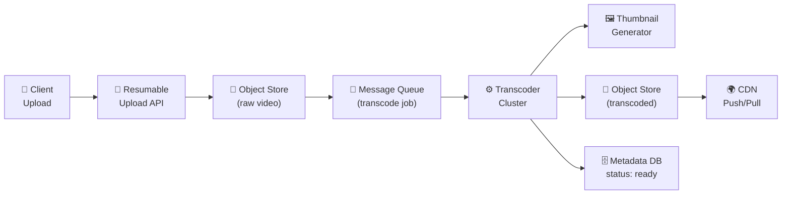
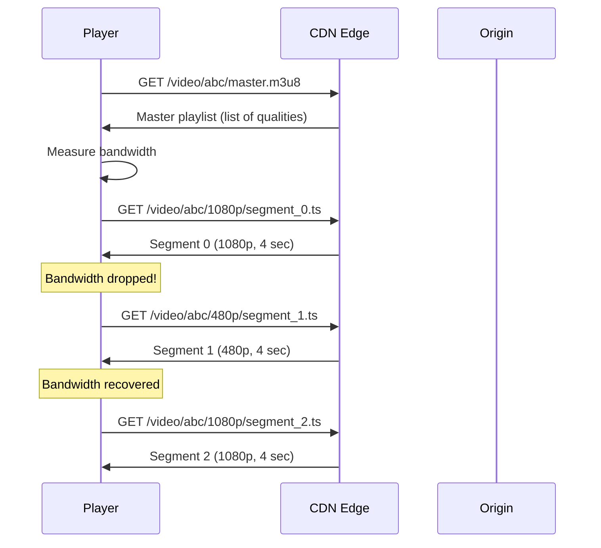
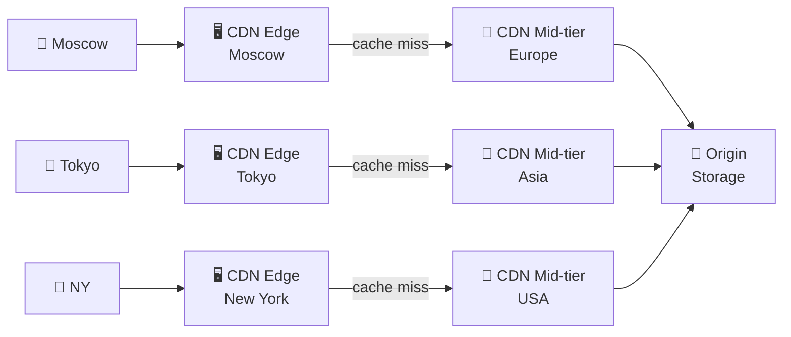
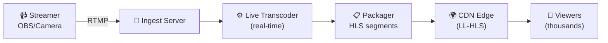
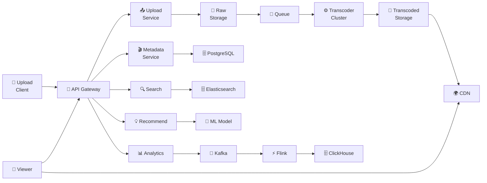

# 🔥 Level 16: Designing a Video Streaming Platform (YouTube-like) — CAPSTONE

## 🎯 What is this case about?

A video platform is one of the most complex systems in the world. YouTube processes **500 hours of video every minute**, delivers **1 billion hours of viewing per day**, and stores **petabytes** of data. Netflix consumes **15% of world internet traffic**. When a user presses Play, dozens of processes happen behind the scenes: from selecting the optimal codec to delivery through a CDN with adaptive bitrate.

Analogy: imagine an **international food delivery service**. Instead of one dish (one file), you cut a pizza into slices (chunks), pack them in different boxes of different sizes (resolutions), store them in warehouses around the world (CDN), and the courier (player) decides what portion size to deliver (adaptive bitrate) — if the road is clear, it brings a large pizza (1080p), if there's a traffic jam — a small one (360p).

## 📌 Step 1: Requirements

### Functional Requirements (what the system does)

1. **Video upload** — file upload up to 256 GB, resumable upload
2. **Transcoding** — conversion to multiple resolutions and codecs (H.264, H.265, VP9, AV1)
3. **Streaming** — adaptive bitrate (HLS/DASH), seek, subtitles
4. **Thumbnails** — automatic preview generation
5. **Search** — search by title, description, tags
6. **Recommendations** — personalized "Recommended" feed
7. **Live streaming** — real-time broadcast (RTMP → HLS)
8. **Analytics** — views, watch time, engagement
9. **Copyright detection** — Content ID (fingerprinting)

### Non-Functional Requirements (how the system works)

- **Scale** — 2B users, 800M DAU, 500 hours video/min upload
- **Storage** — petabytes of video content
- **Latency** — start playback < 2 sec, seek < 1 sec
- **Availability** — 99.99% (52 min downtime/year)
- **Bandwidth** — terabits per second on CDN
- **Global** — worldwide content delivery < 100 ms

### Scale estimates (back-of-the-envelope)

```
Upload: 500 hours video/min = 720,000 hours/day
Avg video: 10 min, avg size after transcoding: 1 GB (all resolutions)
Raw upload: 500 × 60 / 10 = 3000 videos/min = 50 videos/sec
Storage/day: 720,000 hours × 6 GB/hour ≈ 4.3 PB/day (all resolutions)
Storage/year: 4.3 PB × 365 ≈ 1.5 EB (exabytes)
CDN bandwidth: 800M DAU × 30 min/day × 5 Mbps = ~200 Tbps peak
Views/sec: 800M × 30 min / 86400 sec ≈ 280K views/sec
```

## 🔥 Step 2: Video Upload and Transcoding Pipeline

Uploading video is not just "putting a file on a server". It's a multi-stage pipeline with error handling, parallelization, and notifications.



### Resumable Upload — uploading large files

```typescript
// Resumable upload protocol (similar to tus.io)
// 4 GB file → split into 8 MB chunks = 500 chunks

// 1. Initialization
// POST /api/v1/uploads
// → { uploadId: "abc123", chunkSize: 8388608 }

// 2. Upload chunks (in parallel, up to 6 simultaneously)
// PUT /api/v1/uploads/abc123/chunks/0
// PUT /api/v1/uploads/abc123/chunks/1
// ...

// 3. If connection drops — ask what's already uploaded
// GET /api/v1/uploads/abc123/status
// → { completedChunks: [0, 1, 2, 3, 47], totalChunks: 500 }
// And continue from chunk 4 (skipping uploaded ones)

// 4. Completion
// POST /api/v1/uploads/abc123/complete
// → triggers transcoding pipeline

interface UploadChunk {
  uploadId: string
  chunkIndex: number
  totalChunks: number
  data: ArrayBuffer
  checksum: string  // MD5/SHA256 for integrity check
}
```

### Transcoding — conversion to multiple formats

```
// One source file → many variants

// Resolutions (adaptive bitrate ladder):
// 2160p (4K) — 20 Mbps  — for Smart TV / desktop
// 1080p      — 8 Mbps   — main quality
// 720p       — 5 Mbps   — mobile / average internet
// 480p       — 2.5 Mbps — weak internet
// 360p       — 1 Mbps   — very weak internet
// 240p       — 0.5 Mbps — edge case (2G network)

// Codecs:
// H.264 (AVC)  — universal, 95%+ devices
// H.265 (HEVC) — 50% more efficient, but licensing
// VP9          — Google, free, YouTube default
// AV1          — future, 30% better than VP9, slow encode
```

```typescript
// Transcoding job specification
interface TranscodeJob {
  videoId: string
  sourceUrl: string            // S3 URL of raw video
  outputs: TranscodeOutput[]
  priority: 'high' | 'normal' | 'low'
  callbackUrl: string          // Webhook on completion
}

interface TranscodeOutput {
  resolution: '2160p' | '1080p' | '720p' | '480p' | '360p' | '240p'
  codec: 'h264' | 'h265' | 'vp9' | 'av1'
  bitrate: number              // Kbps
  container: 'mp4' | 'webm'
}

// ffmpeg equivalent:
// ffmpeg -i input.mp4 \
//   -c:v libx264 -b:v 8000k -vf scale=1920:1080 output_1080p.mp4 \
//   -c:v libx264 -b:v 5000k -vf scale=1280:720 output_720p.mp4 \
//   -c:v libx264 -b:v 2500k -vf scale=854:480 output_480p.mp4
```

💡 **DAG (Directed Acyclic Graph) Pipeline**: transcoding each resolution independently, thumbnail generation in parallel with transcoding. One node can process video chunks in parallel (split → transcode → merge). YouTube uses exactly this approach — splits video into 4-second segments and transcodes them on different machines in parallel.

## 🔥 Step 3: Adaptive Bitrate Streaming (HLS / DASH)

Key technology: the player **dynamically** switches video quality depending on network speed.



### HLS (HTTP Live Streaming) — Apple's standard

```
// Master playlist (master.m3u8) — list of all qualities
#EXTM3U
#EXT-X-STREAM-INF:BANDWIDTH=8000000,RESOLUTION=1920x1080,CODECS="avc1.640028"
1080p/playlist.m3u8
#EXT-X-STREAM-INF:BANDWIDTH=5000000,RESOLUTION=1280x720,CODECS="avc1.4d401f"
720p/playlist.m3u8
#EXT-X-STREAM-INF:BANDWIDTH=2500000,RESOLUTION=854x480,CODECS="avc1.4d401e"
480p/playlist.m3u8
#EXT-X-STREAM-INF:BANDWIDTH=1000000,RESOLUTION=640x360,CODECS="avc1.42e01e"
360p/playlist.m3u8

// Media playlist (1080p/playlist.m3u8) — list of segments
#EXTM3U
#EXT-X-TARGETDURATION:4
#EXT-X-MEDIA-SEQUENCE:0
#EXTINF:4.0,
segment_0.ts
#EXTINF:4.0,
segment_1.ts
#EXTINF:4.0,
segment_2.ts
#EXT-X-ENDLIST
```

### HLS vs DASH

| Characteristic | HLS | DASH |
|---|---|---|
| **Developer** | Apple | MPEG (open standard) |
| **Manifest format** | .m3u8 (text) | .mpd (XML) |
| **Segments** | .ts (MPEG-TS) or .fmp4 | .m4s (fMP4) |
| **Segment length** | 4-6 sec | 2-4 sec |
| **DRM** | FairPlay | Widevine, PlayReady |
| **Support** | Required on iOS, Android ok | Android native, web |
| **Latency** | 20-30 sec (normal), 2-5 sec (LL-HLS) | 3-10 sec (LL-DASH) |

📌 **In practice**: YouTube uses DASH (own format — WebM/VP9), Netflix — both HLS and DASH (for different devices), Twitch — LL-HLS for streams.

## 🔥 Step 4: CDN — delivering video worldwide

CDN (Content Delivery Network) — a network of servers around the world that cache content closer to users. For video, CDN is a **critically important** component: without CDN, YouTube would be physically impossible.



### CDN architecture for video

```typescript
// CDN hierarchy for video:
// 1. Edge POP (Point of Presence) — closest to the user
//    - 200+ POPs worldwide
//    - Caches hot segments (popular videos)
//    - Cache hit rate: 85-95%

// 2. Mid-tier (Regional cache)
//    - 10-20 regional centers
//    - Caches less popular content
//    - Hit rate: 95-99%

// 3. Origin
//    - Object Storage (S3/GCS)
//    - Only for cold content (rarely viewed videos)
//    - <1% of requests reach origin

// ✅ For video, CDN saves:
// - 95% bandwidth from origin
// - Latency: 5 ms (edge) vs 200 ms (origin in another region)
// - Cost: CDN $0.02/GB vs Origin bandwidth $0.09/GB
```

### Caching strategy

```
// Hot content (trending, new releases):
// Push-based: after transcoding, immediately push to nearest edge POPs
// TTL: 24 hours, refresh on change

// Long tail (99% of videos):
// Pull-based: first request — cache miss → pull from origin → cache
// TTL: 7 days, LRU eviction on fill

// YouTube Google Global Cache (GGC):
// Installs servers directly at ISPs (providers)
// → traffic doesn't leave the provider's network
// → 60%+ bandwidth cost savings
```

## 📌 Step 5: Storage — how to store petabytes of video

### Video Storage Architecture

```typescript
// Storage tiers:
// 1. Hot storage (SSD, Object Store)
//    - Videos < 30 days or popular
//    - Cost: $0.023/GB/month (S3 Standard)

// 2. Warm storage
//    - Videos 30-90 days, medium popularity
//    - Cost: $0.0125/GB/month (S3 IA)

// 3. Cold storage (Glacier / Archive)
//    - Videos > 90 days, rarely viewed
//    - Cost: $0.004/GB/month (S3 Glacier)

// Chunked storage:
// Video stored not as one file, but as a set of chunks (segments)
// /videos/{videoId}/{resolution}/{segment_N}.ts
// This enables:
// ✅ Parallel upload and delivery
// ✅ Seek without downloading the entire file
// ✅ Caching individual segments on CDN
// ✅ Efficient deletion (by segment, not entire file)
```

### Metadata Storage

```typescript
// PostgreSQL (relational) — structured metadata
interface VideoMetadata {
  id: string                    // UUID v7 (time-sortable)
  title: string
  description: string
  channelId: string
  duration: number              // seconds
  status: 'uploading' | 'processing' | 'ready' | 'failed'
  uploadedAt: Date
  publishedAt: Date
  visibility: 'public' | 'unlisted' | 'private'
  tags: string[]
  category: string
  thumbnailUrl: string
  manifestUrl: string           // HLS master playlist URL
}

// Cassandra / DynamoDB — high-write counters
interface VideoStats {
  videoId: string
  viewCount: number             // Approximate, eventually consistent
  likeCount: number
  dislikeCount: number
  commentCount: number
  lastUpdated: Date
}

// Elasticsearch — full-text search
interface VideoSearchDoc {
  id: string
  title: string
  description: string
  tags: string[]
  channelName: string
  category: string
  duration: number
  viewCount: number
  publishedAt: Date
}
```

## 📌 Step 6: View Counting at Scale

Counting views is a surprisingly difficult task at 280K views/sec.

```typescript
// ❌ Naive approach — each view = UPDATE in SQL
// UPDATE videos SET view_count = view_count + 1 WHERE id = 'abc'
// At 280K/sec → 280K writes/sec to one row → deadlock, timeout

// ✅ Aggregated counting pipeline
// 1. Client → API → write view event to Kafka
// 2. Stream processor (Flink/Spark) aggregates over a window (1 min)
// 3. Batch write: UPDATE videos SET view_count += 15000 WHERE id = 'abc'
// Total: 280K writes/sec → ~5K batch writes/sec (50x reduction)

// De-duplication:
// - One user = one view per session
// - HyperLogLog for approximate unique count (12 KB per video)
// - Bloom filter for exact de-dup (more memory, but more accurate)

// Eventual consistency:
// View count may lag by 1-5 minutes
// For trending/recommendations — approximate is enough
// For monetization — exact counting via batch processing (hourly)
```

## 📌 Step 7: Recommendations (Basics)

```typescript
// Recommendation pipeline:
// 1. Candidate Generation (broad) — millions → thousands
//    - Collaborative filtering: "users like you also watched..."
//    - Content-based: similar videos by tags, description, audio
//    - Trending / popular in the region

// 2. Ranking (narrow) — thousands → dozens
//    - ML model: features = [watch_time, click_rate, user_history, freshness]
//    - Predict: P(user watches > 50% video)
//    - Balance: engagement vs diversity vs freshness

// 3. Re-ranking (business rules)
//    - Remove duplicates, already watched
//    - Boosting: promoted content, new creators
//    - Filtering: age restrictions, copyright blocks

// Feature store (Redis/Cassandra):
// user:42:history → [videoId1, videoId2, ...] (last 1000)
// user:42:embedding → float[256] (user interest vector)
// video:abc:embedding → float[256] (video content vector)
// Similarity = cosine(user_embedding, video_embedding)
```

## 📌 Step 8: Live Streaming



```
// Live streaming vs VOD:
// VOD: transcode once → serve forever
// Live: transcode in real-time → serve immediately → discard (or archive)

// Protocols:
// Ingest: RTMP (Real-Time Messaging Protocol) — streamer → server
//   - TCP, low overhead, widely supported (OBS, FFmpeg)
//   - Latency: 1-3 sec
//
// Delivery: LL-HLS (Low-Latency HLS) — server → viewers
//   - HTTP-based, works everywhere
//   - Segment duration: 1-2 sec (vs 4-6 sec normal HLS)
//   - Partial segments: push before segment complete
//   - Latency: 2-5 sec (glass-to-glass)

// Scaling live to millions of viewers:
// 1 streamer → 1 ingest server → transcoder → CDN → millions
// CDN does all the heavy lifting: 1 origin stream → replicated to 200+ POPs
// Each POP serves thousands of viewers from cache
```

## 📌 Step 9: Content ID / Copyright Detection

```typescript
// Audio/Video fingerprinting:
// 1. Extract "fingerprint" from each video on upload
// 2. Compare with rights holders' fingerprint database
// 3. On match: block / monetize / track

// Audio fingerprint (Chromaprint / AcoustID):
// - 10 sec audio → spectrogram → hash → 32-bit fingerprint per frame
// - Comparison: Hamming distance < threshold → match
// - Database: ~100M tracks, ~1 TB fingerprints

// Video fingerprint:
// - Key frames → perceptual hash (pHash)
// - Resistant to: resizing, compression, slight crop
// - Not resistant to: heavy editing, mirror flip

// YouTube Content ID pipeline:
// Upload → Extract fingerprint → Compare with 100M+ references
// → Match found → Apply policy (block / claim revenue / allow)
// Processing: ~parallel, each reference check < 1ms with index
// Total scan: < 10 min for 10 min video (mostly I/O bound)
```

## 📌 Step 10: Full Video Platform Architecture



### Technology Choices

| Component | Technology | Why |
|---|---|---|
| **Upload** | Resumable (tus.io protocol) | Reliable large file upload |
| **Raw Storage** | S3 / GCS | Cheap, reliable, unlimited scale |
| **Queue** | Kafka / SQS | Decoupling upload from transcoding |
| **Transcoder** | FFmpeg on GPU instances | Parallel transcoding, GPU acceleration |
| **Transcoded Storage** | S3 + lifecycle policies | Hot/warm/cold tiering automatically |
| **CDN** | CloudFront / own (GGC) | Global delivery, 95%+ cache hit |
| **Metadata DB** | PostgreSQL (sharded) | ACID, rich queries, proven at scale |
| **Counters** | Kafka → Flink → Cassandra | Eventually consistent high-write counters |
| **Search** | Elasticsearch | Full-text search, faceted filtering |
| **Recommendations** | TensorFlow Serving + Feature Store | Real-time ML inference |
| **Analytics** | Kafka → Flink → ClickHouse | Real-time OLAP, columnar storage |
| **Live Ingest** | RTMP → LL-HLS | Low latency, universal compatibility |
| **Copyright** | Chromaprint + pHash | Audio/video fingerprinting |

## ⚠️ Common beginner mistakes

### Mistake 1: Storing video as a single file

```
❌ Bad:
// Upload 2 GB file entirely, serve entirely
GET /videos/abc.mp4
// Problems:
// - Seek impossible without downloading the entire file
// - CDN cannot cache individual parts
// - Adaptive bitrate is impossible
```

```
✅ Good:
// Video split into 4-sec segments (HLS/DASH)
GET /videos/abc/master.m3u8          → list of qualities
GET /videos/abc/1080p/segment_42.ts  → specific segment
// ✅ Seek = load the needed segment
// ✅ CDN caches hot segments
// ✅ Player switches quality on the fly
```

### Mistake 2: Transcoding synchronously on upload

```
❌ Bad:
// POST /upload → wait for transcoding → response
// Transcoding 10 min video ≈ 5-30 minutes
// HTTP timeout, user leaves
```

```
✅ Good:
// POST /upload → 202 Accepted { videoId: "abc", status: "processing" }
// Transcoding via message queue (async)
// Webhook / polling / WebSocket for readiness notification
// User can close the page — the process continues
```

### Mistake 3: Direct view counting in SQL

```
❌ Bad:
// Each view → UPDATE videos SET views = views + 1
// 280K writes/sec on one row → lock contention → timeout
// Duplication: F5 = +100 views
```

```
✅ Good:
// View event → Kafka → aggregate (1 min window) → batch UPDATE
// De-dup: HyperLogLog / Bloom filter
// Eventual consistency: display updates every 1-5 min
// Exact counting: batch job every hour for monetization
```

### Mistake 4: Single CDN origin for the whole world

```
❌ Bad:
// Origin in US-East, users in Japan
// Latency: 200+ ms per segment
// First buffer: 4 segments × 200 ms = 800 ms + transfer time
```

```
✅ Good:
// Multi-tier CDN: Edge (200+ POPs) → Mid-tier (20 regions) → Origin
// Popular content pre-pushed to edge
// Google GGC: servers at ISPs — traffic doesn't leave provider network
// Result: < 5 ms latency for 95%+ of requests
```

### Mistake 5: Same transcoding for all content

```
❌ Bad:
// All videos → 6 resolutions × 4 codecs = 24 variants
// 500 videos/min × 24 = 12,000 transcoding jobs/min
// GPU compute cost: enormous
```

```
✅ Good:
// Title-specific encoding ladder:
// - Lecture (static content) → less bitrate for same quality
// - Sports (fast motion) → more bitrate
// - Per-title encoding: analyze content → optimal bitrate ladder
// - Lazy transcoding: 4K only for videos with > 1000 views
// Netflix saves ~20% bandwidth with per-title encoding
```

## 🎯 Summary

| Aspect | Solution |
|---|---|
| **Upload** | Resumable, chunked, parallel (tus protocol) |
| **Transcoding** | Async pipeline (Kafka → GPU cluster), DAG parallelism |
| **Streaming** | HLS/DASH adaptive bitrate, 4-sec segments |
| **CDN** | 3-tier (Edge → Mid-tier → Origin), pre-push hot content |
| **Storage** | S3 tiered (hot/warm/cold), chunked segments |
| **Metadata** | PostgreSQL (sharded) + Elasticsearch (search) |
| **View Count** | Kafka → Flink aggregation → Cassandra (eventual consistent) |
| **Recommendations** | Candidate gen → Ranking (ML) → Re-ranking |
| **Live Streaming** | RTMP ingest → LL-HLS delivery (2-5 sec latency) |
| **Copyright** | Audio fingerprint (Chromaprint) + video pHash |

💡 In interviews, emphasize the **transcoding pipeline** (async, DAG, parallelism), **adaptive bitrate** (HLS/DASH, how the player switches quality), **CDN architecture** (3-tier, cache hit rate, push vs pull), and **view counting at scale** (Kafka aggregation, de-dup, eventual consistency). These are the four key decisions that show you understand the unique challenges of a video platform, not just reciting generic web architecture.
