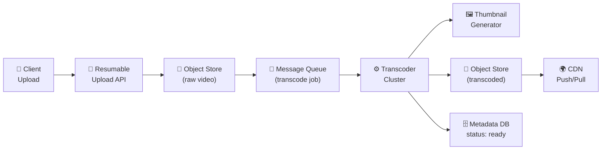
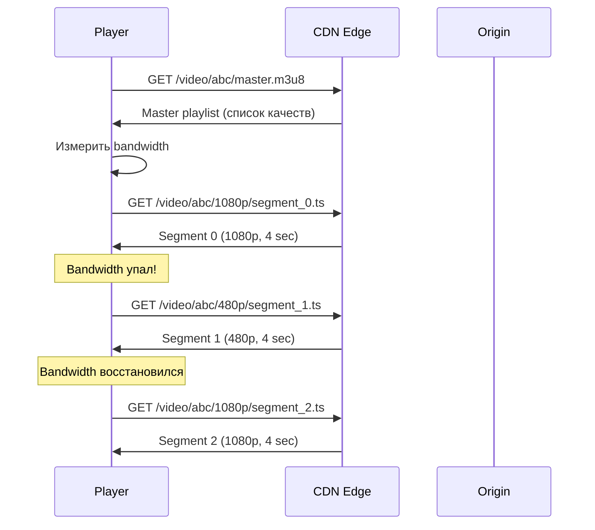
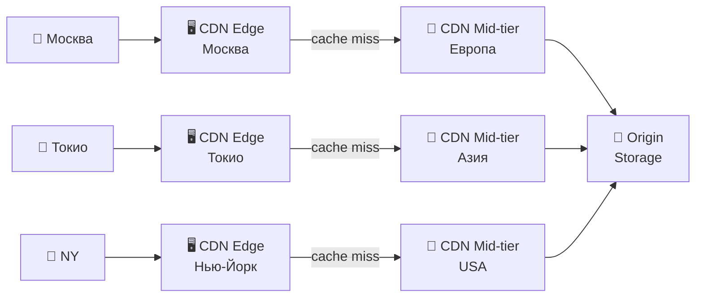
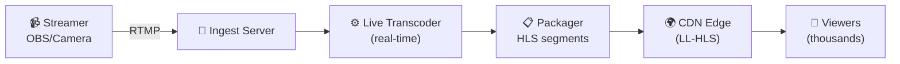
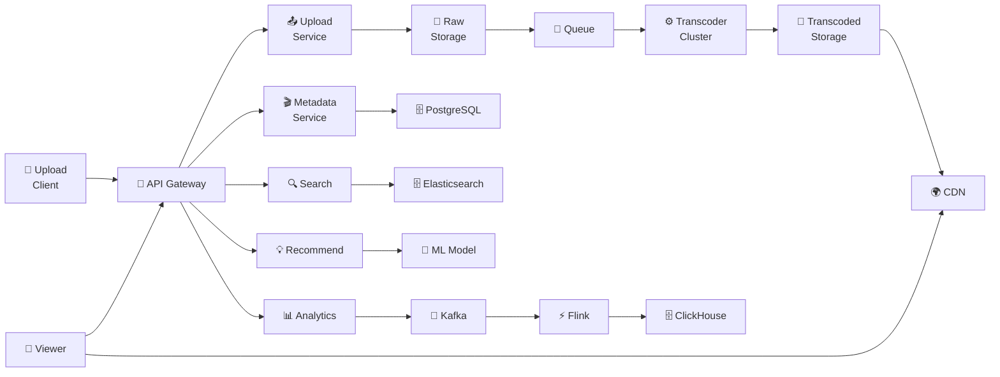

# 🔥 Уровень 16: Проектируем видеостриминг (YouTube-like) — CAPSTONE

## 🎯 О чём этот кейс?

Видеоплатформа — одна из самых сложных систем в мире. YouTube обрабатывает **500 часов видео каждую минуту**, отдаёт **1 миллиард часов просмотра в день** и хранит **петабайты** данных. Netflix потребляет **15% мирового интернет-трафика**. Когда пользователь нажимает Play, за кулисами происходит десятки процессов: от выбора оптимального кодека до доставки через CDN с адаптивным битрейтом.

Аналогия: представьте **международную службу доставки еды**. Вместо одного блюда (одного файла) вы разрезаете пиццу на кусочки (chunks), упаковываете в разные коробки разного размера (resolutions), раскладываете по складам по всему миру (CDN), а курьер (player) сам решает, какой размер порции доставлять (adaptive bitrate) — если дорога свободна, везёт большую пиццу (1080p), если пробка — маленькую (360p).

## 📌 Шаг 1: Требования

### Functional Requirements (что система делает)

1. **Upload видео** — загрузка файлов до 256 GB, resumable upload
2. **Transcoding** — конвертация в несколько разрешений и кодеков (H.264, H.265, VP9, AV1)
3. **Streaming** — adaptive bitrate (HLS/DASH), seek, subtitles
4. **Thumbnails** — автоматическая генерация превью
5. **Search** — поиск по заголовку, описанию, тегам
6. **Recommendations** — персонализированная лента «Рекомендации»
7. **Live streaming** — трансляция в реальном времени (RTMP → HLS)
8. **Analytics** — просмотры, watch time, engagement
9. **Copyright detection** — Content ID (fingerprinting)

### Non-Functional Requirements (как система работает)

- **Масштаб** — 2B пользователей, 800M DAU, 500 часов видео/мин upload
- **Storage** — петабайты видеоконтента
- **Latency** — start playback < 2 sec, seek < 1 sec
- **Availability** — 99.99% (52 мин downtime/год)
- **Bandwidth** — терабиты в секунду на CDN
- **Global** — доставка контента по всему миру < 100 мс

### Масштабные оценки (back-of-the-envelope)

```
Upload: 500 часов видео/мин = 720,000 часов/день
Avg video: 10 мин, avg size after transcoding: 1 GB (все разрешения)
Raw upload: 500 × 60 / 10 = 3000 videos/min = 50 videos/sec
Storage/day: 720,000 часов × 6 GB/час ≈ 4.3 PB/day (все разрешения)
Storage/year: 4.3 PB × 365 ≈ 1.5 EB (exabytes)
CDN bandwidth: 800M DAU × 30 мин/день × 5 Mbps = ~200 Tbps peak
Views/sec: 800M × 30 min / 86400 sec ≈ 280K views/sec
```

## 🔥 Шаг 2: Video Upload и Transcoding Pipeline

Загрузка видео — это не просто «положить файл на сервер». Это многоступенчатый pipeline с обработкой ошибок, параллелизацией и уведомлениями.



### Resumable Upload — загрузка больших файлов

```typescript
// Resumable upload protocol (похож на tus.io)
// Файл 4 GB → разбиваем на chunks по 8 MB = 500 chunks

// 1. Инициализация
// POST /api/v1/uploads
// → { uploadId: "abc123", chunkSize: 8388608 }

// 2. Загрузка chunk-ов (параллельно, до 6 одновременно)
// PUT /api/v1/uploads/abc123/chunks/0
// PUT /api/v1/uploads/abc123/chunks/1
// ...

// 3. Если соединение оборвалось — спрашиваем, что уже загружено
// GET /api/v1/uploads/abc123/status
// → { completedChunks: [0, 1, 2, 3, 47], totalChunks: 500 }
// И продолжаем с chunk 4 (пропуская загруженные)

// 4. Завершение
// POST /api/v1/uploads/abc123/complete
// → запускает transcoding pipeline

interface UploadChunk {
  uploadId: string
  chunkIndex: number
  totalChunks: number
  data: ArrayBuffer
  checksum: string  // MD5/SHA256 для integrity check
}
```

### Transcoding — конвертация в множество форматов

```
// Один исходный файл → множество вариантов

// Resolutions (adaptive bitrate ladder):
// 2160p (4K) — 20 Mbps  — для Smart TV / десктоп
// 1080p      — 8 Mbps   — основное качество
// 720p       — 5 Mbps   — mobile / средний интернет
// 480p       — 2.5 Mbps — слабый интернет
// 360p       — 1 Mbps   — очень слабый интернет
// 240p       — 0.5 Mbps — edge case (2G сеть)

// Codecs:
// H.264 (AVC)  — универсальный, 95%+ устройств
// H.265 (HEVC) — на 50% эффективнее, но лицензии
// VP9          — Google, бесплатный, YouTube default
// AV1          — будущее, на 30% лучше VP9, медленный encode
```

```typescript
// Transcoding job specification
interface TranscodeJob {
  videoId: string
  sourceUrl: string            // S3 URL сырого видео
  outputs: TranscodeOutput[]
  priority: 'high' | 'normal' | 'low'
  callbackUrl: string          // Webhook по завершению
}

interface TranscodeOutput {
  resolution: '2160p' | '1080p' | '720p' | '480p' | '360p' | '240p'
  codec: 'h264' | 'h265' | 'vp9' | 'av1'
  bitrate: number              // Kbps
  container: 'mp4' | 'webm'
}

// ffmpeg equivalent:
// ffmpeg -i input.mp4 \
//   -c:v libx264 -b:v 8000k -vf scale=1920:1080 output_1080p.mp4 \
//   -c:v libx264 -b:v 5000k -vf scale=1280:720 output_720p.mp4 \
//   -c:v libx264 -b:v 2500k -vf scale=854:480 output_480p.mp4
```

💡 **DAG (Directed Acyclic Graph) Pipeline**: transcoding каждого разрешения независимо, thumbnail generation параллельно с transcoding. Один node может обрабатывать chunks видео параллельно (split → transcode → merge). YouTube использует именно такой подход — разбивает видео на 4-секундные сегменты и транскодирует их на разных машинах параллельно.

## 🔥 Шаг 3: Adaptive Bitrate Streaming (HLS / DASH)

Ключевая технология: плеер **динамически** переключает качество видео в зависимости от скорости сети.



### HLS (HTTP Live Streaming) — стандарт Apple

```
// Master playlist (master.m3u8) — список всех качеств
#EXTM3U
#EXT-X-STREAM-INF:BANDWIDTH=8000000,RESOLUTION=1920x1080,CODECS="avc1.640028"
1080p/playlist.m3u8
#EXT-X-STREAM-INF:BANDWIDTH=5000000,RESOLUTION=1280x720,CODECS="avc1.4d401f"
720p/playlist.m3u8
#EXT-X-STREAM-INF:BANDWIDTH=2500000,RESOLUTION=854x480,CODECS="avc1.4d401e"
480p/playlist.m3u8
#EXT-X-STREAM-INF:BANDWIDTH=1000000,RESOLUTION=640x360,CODECS="avc1.42e01e"
360p/playlist.m3u8

// Media playlist (1080p/playlist.m3u8) — список сегментов
#EXTM3U
#EXT-X-TARGETDURATION:4
#EXT-X-MEDIA-SEQUENCE:0
#EXTINF:4.0,
segment_0.ts
#EXTINF:4.0,
segment_1.ts
#EXTINF:4.0,
segment_2.ts
#EXT-X-ENDLIST
```

### HLS vs DASH

| Характеристика | HLS | DASH |
|---|---|---|
| **Разработчик** | Apple | MPEG (открытый стандарт) |
| **Формат манифеста** | .m3u8 (текст) | .mpd (XML) |
| **Сегменты** | .ts (MPEG-TS) или .fmp4 | .m4s (fMP4) |
| **Длина сегмента** | 4-6 сек | 2-4 сек |
| **DRM** | FairPlay | Widevine, PlayReady |
| **Поддержка** | iOS обязательно, Android ok | Android native, веб |
| **Latency** | 20-30 сек (обычный), 2-5 сек (LL-HLS) | 3-10 сек (LL-DASH) |

📌 **На практике**: YouTube использует DASH (свой формат — WebM/VP9), Netflix — и HLS и DASH (для разных устройств), Twitch — LL-HLS для стримов.

## 🔥 Шаг 4: CDN — доставка видео по всему миру

CDN (Content Delivery Network) — сеть серверов по всему миру, кеширующих контент ближе к пользователям. Для видео CDN — это **критически важный** компонент: без CDN YouTube был бы физически невозможен.



### Архитектура CDN для видео

```typescript
// CDN hierarchy для видео:
// 1. Edge POP (Point of Presence) — ближе всего к пользователю
//    - 200+ POPs по миру
//    - Кеширует hot segments (популярные видео)
//    - Попадание в кэш (hit rate): 85-95%

// 2. Mid-tier (Regional cache)
//    - 10-20 региональных центров
//    - Кеширует менее популярный контент
//    - Hit rate: 95-99%

// 3. Origin
//    - Object Storage (S3/GCS)
//    - Только для cold content (редко просматриваемые видео)
//    - <1% запросов доходит до origin

// ✅ Для видео CDN экономит:
// - 95% bandwidth от origin
// - Latency: 5 ms (edge) vs 200 ms (origin в другом регионе)
// - Cost: CDN $0.02/GB vs Origin bandwidth $0.09/GB
```

### Стратегия кеширования

```
// Hot content (trending, новинки):
// Push-based: после transcoding сразу пушим на ближайшие edge POPs
// TTL: 24 часа, обновление при изменении

// Long tail (99% видео):
// Pull-based: первый запрос — cache miss → pull из origin → cache
// TTL: 7 дней, eviction по LRU при заполнении

// YouTube Google Global Cache (GGC):
// Устанавливают серверы прямо у ISP (провайдеров)
// → трафик не покидает сеть провайдера
// → экономия 60%+ bandwidth costs
```

## 📌 Шаг 5: Storage — как хранить петабайты видео

### Video Storage Architecture

```typescript
// Уровни хранения:
// 1. Hot storage (SSD, Object Store)
//    - Видео < 30 дней или popular
//    - Cost: $0.023/GB/month (S3 Standard)

// 2. Warm storage
//    - Видео 30-90 дней, средняя популярность
//    - Cost: $0.0125/GB/month (S3 IA)

// 3. Cold storage (Glacier / Archive)
//    - Видео > 90 дней, редко просматриваемые
//    - Cost: $0.004/GB/month (S3 Glacier)

// Chunked storage:
// Видео хранится не как один файл, а как набор chunks (segments)
// /videos/{videoId}/{resolution}/{segment_N}.ts
// Это позволяет:
// ✅ Параллельную загрузку и отдачу
// ✅ Seek без скачивания всего файла
// ✅ Кеширование отдельных сегментов на CDN
// ✅ Эффективное удаление (по segment, не весь файл)
```

### Metadata Storage

```typescript
// PostgreSQL (relational) — structured metadata
interface VideoMetadata {
  id: string                    // UUID v7 (time-sortable)
  title: string
  description: string
  channelId: string
  duration: number              // seconds
  status: 'uploading' | 'processing' | 'ready' | 'failed'
  uploadedAt: Date
  publishedAt: Date
  visibility: 'public' | 'unlisted' | 'private'
  tags: string[]
  category: string
  thumbnailUrl: string
  manifestUrl: string           // HLS master playlist URL
}

// Cassandra / DynamoDB — high-write counters
interface VideoStats {
  videoId: string
  viewCount: number             // Approximate, eventually consistent
  likeCount: number
  dislikeCount: number
  commentCount: number
  lastUpdated: Date
}

// Elasticsearch — full-text search
interface VideoSearchDoc {
  id: string
  title: string
  description: string
  tags: string[]
  channelName: string
  category: string
  duration: number
  viewCount: number
  publishedAt: Date
}
```

## 📌 Шаг 6: View Counting at Scale

Подсчёт просмотров — неожиданно сложная задача при 280K views/sec.

```typescript
// ❌ Наивный подход — каждый просмотр = UPDATE в SQL
// UPDATE videos SET view_count = view_count + 1 WHERE id = 'abc'
// При 280K/sec → 280K writes/sec в одну строку → deadlock, timeout

// ✅ Aggregated counting pipeline
// 1. Client → API → записать view event в Kafka
// 2. Stream processor (Flink/Spark) агрегирует за окно (1 мин)
// 3. Batch write: UPDATE videos SET view_count += 15000 WHERE id = 'abc'
// Итого: 280K writes/sec → ~5K batch writes/sec (50x reduction)

// De-duplication:
// - Один пользователь = один view за сессию
// - HyperLogLog для approximate unique count (12 KB на видео)
// - Bloom filter для exact de-dup (больше памяти, но точнее)

// Eventual consistency:
// View count может отставать на 1-5 минут
// Для trending/recommendations — достаточно approximate
// Для monetization — точный подсчёт через batch processing (ежечасно)
```

## 📌 Шаг 7: Рекомендации (Basics)

```typescript
// Recommendation pipeline:
// 1. Candidate Generation (broad) — миллионы → тысячи
//    - Collaborative filtering: "пользователи, похожие на тебя, смотрели..."
//    - Content-based: похожие видео по тегам, description, audio
//    - Trending / popular в регионе

// 2. Ranking (narrow) — тысячи → десятки
//    - ML model: features = [watch_time, click_rate, user_history, freshness]
//    - Predict: P(user watches > 50% video)
//    - Balance: engagement vs diversity vs freshness

// 3. Re-ranking (business rules)
//    - Убрать дубли, уже просмотренные
//    - Boosting: promoted content, new creators
//    - Filtering: age restrictions, copyright blocks

// Feature store (Redis/Cassandra):
// user:42:history → [videoId1, videoId2, ...] (last 1000)
// user:42:embedding → float[256] (user interest vector)
// video:abc:embedding → float[256] (video content vector)
// Similarity = cosine(user_embedding, video_embedding)
```

## 📌 Шаг 8: Live Streaming



```
// Live streaming vs VOD:
// VOD: transcode once → serve forever
// Live: transcode in real-time → serve immediately → discard (or archive)

// Protocols:
// Ingest: RTMP (Real-Time Messaging Protocol) — стример → сервер
//   - TCP, low overhead, widely supported (OBS, FFmpeg)
//   - Latency: 1-3 sec
//
// Delivery: LL-HLS (Low-Latency HLS) — сервер → зрители
//   - HTTP-based, works everywhere
//   - Segment duration: 1-2 sec (vs 4-6 sec обычный HLS)
//   - Partial segments: push before segment complete
//   - Latency: 2-5 sec (glass-to-glass)

// Scaling live to millions of viewers:
// 1 streamer → 1 ingest server → transcoder → CDN → millions
// CDN делает всю тяжёлую работу: 1 origin stream → replicated на 200+ POPs
// Каждый POP обслуживает тысячи зрителей из кэша
```

## 📌 Шаг 9: Content ID / Copyright Detection

```typescript
// Audio/Video fingerprinting:
// 1. Извлечь «отпечаток» из каждого видео при upload
// 2. Сравнить с базой отпечатков правообладателей
// 3. При совпадении: block / monetize / track

// Audio fingerprint (Chromaprint / AcoustID):
// - 10 sec audio → spectogram → hash → 32-bit fingerprint per frame
// - Сравнение: Hamming distance < threshold → match
// - Database: ~100M tracks, ~1 TB fingerprints

// Video fingerprint:
// - Key frames → perceptual hash (pHash)
// - Resistant to: resizing, compression, slight crop
// - Not resistant to: heavy editing, mirror flip

// YouTube Content ID pipeline:
// Upload → Extract fingerprint → Compare with 100M+ references
// → Match found → Apply policy (block / claim revenue / allow)
// Processing: ~parallel, each reference check < 1ms with index
// Total scan: < 10 min for 10 min video (mostly I/O bound)
```

## 📌 Шаг 10: Полная архитектура видеоплатформы



### Выбор технологий

| Компонент | Технология | Почему |
|---|---|---|
| **Upload** | Resumable (tus.io protocol) | Надёжная загрузка больших файлов |
| **Raw Storage** | S3 / GCS | Дёшево, надёжно, unlimited scale |
| **Queue** | Kafka / SQS | Decoupling upload от transcoding |
| **Transcoder** | FFmpeg на GPU instances | Параллельный transcoding, GPU ускорение |
| **Transcoded Storage** | S3 + lifecycle policies | Hot/warm/cold tiering автоматически |
| **CDN** | CloudFront / собственный (GGC) | Глобальная доставка, 95%+ cache hit |
| **Metadata DB** | PostgreSQL (sharded) | ACID, rich queries, proven at scale |
| **Counters** | Kafka → Flink → Cassandra | Eventual consistent high-write counters |
| **Search** | Elasticsearch | Full-text search, faceted filtering |
| **Recommendations** | TensorFlow Serving + Feature Store | Real-time ML inference |
| **Analytics** | Kafka → Flink → ClickHouse | Real-time OLAP, columnar storage |
| **Live Ingest** | RTMP → LL-HLS | Low latency, universal compatibility |
| **Copyright** | Chromaprint + pHash | Audio/video fingerprinting |

## ⚠️ Частые ошибки новичков

### Ошибка 1: Хранить видео как один файл

```
❌ Плохо:
// Загрузить 2 GB файл целиком, отдавать целиком
GET /videos/abc.mp4
// Проблемы:
// - Seek невозможен без скачивания всего файла
// - CDN не может кэшировать отдельные части
// - Adaptive bitrate невозможен
```

```
✅ Хорошо:
// Видео разбито на сегменты по 4 сек (HLS/DASH)
GET /videos/abc/master.m3u8          → список качеств
GET /videos/abc/1080p/segment_42.ts  → конкретный сегмент
// ✅ Seek = загрузить нужный сегмент
// ✅ CDN кэширует горячие сегменты
// ✅ Player переключает качество на лету
```

### Ошибка 2: Транскодировать синхронно при загрузке

```
❌ Плохо:
// POST /upload → ждём transcoding → response
// Transcoding 10 мин видео ≈ 5-30 минут
// HTTP timeout, пользователь уходит
```

```
✅ Хорошо:
// POST /upload → 202 Accepted { videoId: "abc", status: "processing" }
// Transcoding через message queue (async)
// Webhook / polling / WebSocket для уведомления о готовности
// Пользователь может закрыть страницу — процесс продолжается
```

### Ошибка 3: Прямой подсчёт просмотров в SQL

```
❌ Плохо:
// Каждый view → UPDATE videos SET views = views + 1
// 280K writes/sec на одну строку → lock contention → timeout
// Дублирование: F5 = +100 views
```

```
✅ Хорошо:
// View event → Kafka → aggregate (1 min window) → batch UPDATE
// De-dup: HyperLogLog / Bloom filter
// Eventual consistency: display обновляется раз в 1-5 мин
// Точный подсчёт: batch job каждый час для monetization
```

### Ошибка 4: Один CDN origin для всего мира

```
❌ Плохо:
// Origin в US-East, пользователи в Японии
// Latency: 200+ ms на каждый сегмент
// Первый буфер: 4 сегмента × 200 ms = 800 ms + transfer time
```

```
✅ Хорошо:
// Multi-tier CDN: Edge (200+ POPs) → Mid-tier (20 регионов) → Origin
// Popular content pre-pushed на edge
// Google GGC: серверы у ISP — трафик не покидает сеть провайдера
// Result: < 5 ms latency для 95%+ запросов
```

### Ошибка 5: Одинаковый transcoding для всего контента

```
❌ Плохо:
// Все видео → 6 resolutions × 4 codecs = 24 варианта
// 500 videos/min × 24 = 12,000 transcoding jobs/min
// Стоимость GPU compute: огромная
```

```
✅ Хорошо:
// Title-specific encoding ladder:
// - Лекция (статичный контент) → меньше bitrate при том же качестве
// - Спорт (быстрое движение) → больше bitrate
// - Per-title encoding: анализ контента → оптимальный bitrate ladder
// - Lazy transcoding: 4K только для видео с > 1000 views
// Netflix saves ~20% bandwidth с per-title encoding
```

## 🎯 Итоги

| Аспект | Решение |
|---|---|
| **Upload** | Resumable, chunked, parallel (tus protocol) |
| **Transcoding** | Async pipeline (Kafka → GPU cluster), DAG parallelism |
| **Streaming** | HLS/DASH adaptive bitrate, 4-sec segments |
| **CDN** | 3-tier (Edge → Mid-tier → Origin), pre-push hot content |
| **Storage** | S3 tiered (hot/warm/cold), chunked segments |
| **Metadata** | PostgreSQL (sharded) + Elasticsearch (search) |
| **View Count** | Kafka → Flink aggregation → Cassandra (eventual consistent) |
| **Recommendations** | Candidate gen → Ranking (ML) → Re-ranking |
| **Live Streaming** | RTMP ingest → LL-HLS delivery (2-5 sec latency) |
| **Copyright** | Audio fingerprint (Chromaprint) + video pHash |

💡 На интервью акцентируйте внимание на **transcoding pipeline** (async, DAG, parallelism), **adaptive bitrate** (HLS/DASH, как плеер переключает качество), **CDN architecture** (3-tier, cache hit rate, push vs pull) и **view counting at scale** (Kafka aggregation, de-dup, eventual consistency). Это четыре ключевых решения, которые показывают, что вы понимаете уникальные вызовы видеоплатформы, а не просто пересказываете generic web architecture.
