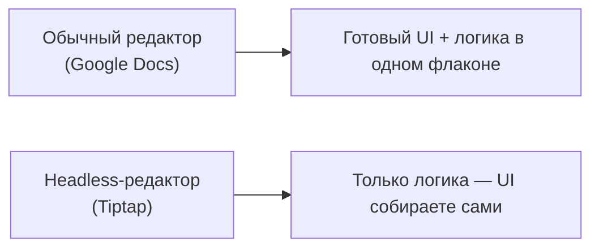
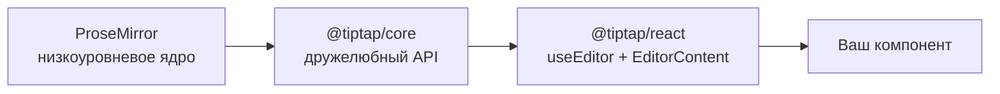
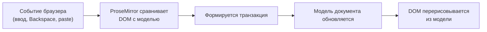
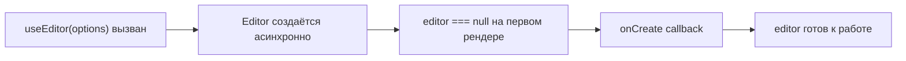

# Введение и setup

## Что такое headless-редактор

Большинство текстовых редакторов (Google Docs, Word) — это готовый продукт: у него уже есть тулбар, свои стили, своя логика. Если вам нужно что-то нестандартное — вы упираетесь в стену.

**Headless-редактор** — это редактор без "головы", то есть без готового UI. Он даёт вам только "мозг": модель документа, команды для его изменения, систему расширений. А тулбар, кнопки, меню — рисуете вы сами, любыми React-компонентами.



Аналогия: обычный редактор — это готовый автомобиль. Headless-редактор — это двигатель и шасси, кузов вы проектируете сами под свою задачу.

### Зачем вообще так усложнять? Практический сценарий

Представьте, что вы делаете внутренний CMS для команды контент-менеджеров. Дизайнер требует: тулбар должен выглядеть как часть дизайн-системы компании (тот же `Button`, те же токены цвета), а не как чужеродный виджет со своими стилями. Если взять "готовый" редактор (например, старый CKEditor или TinyMCE), UI придётся либо перекрашивать CSS-хаками поверх чужой разметки, либо вообще выдирать встроенный тулбар и городить костыли поверх недокументированного API. С headless-подходом такой проблемы просто не существует: у Tiptap нет своего тулбара, поэтому не с чем "бороться" — вы с первого дня пишете свои React-компоненты, стилизуете их как угодно, используете свои иконки, свою логику доступности (aria-атрибуты, фокус-менеджмент).

Ещё один частый сценарий: вам нужен редактор внутри модального окна с ограниченным набором функций (только жирный, курсив, ссылки — без картинок и таблиц). У обычного редактора пришлось бы "выключать" фичи через конфигурацию, борясь с тем, что дизайнер тулбара не предусмотрел. У Tiptap вы просто не подключаете лишние extensions — тулбара для несуществующих команд у вас никогда и не появится, потому что вы его не рисовали.

## Tiptap и ProseMirror

Tiptap не изобретает редактирование текста с нуля — он построен поверх **ProseMirror**, библиотеки Марейна Хабера (автора CodeMirror). ProseMirror — это низкоуровневый, очень мощный, но неудобный в прямом использовании инструмент: голый API, никакого React, много бойлерплейта.

Tiptap — это дружелюбная обёртка над ProseMirror:

- **`@tiptap/core`** — ядро: `Editor`, система расширений, команды
- **`@tiptap/pm`** — реэкспорт пакетов ProseMirror (state, view, model, transform), чтобы не тянуть их отдельно
- **`@tiptap/react`** — React-биндинг: хук `useEditor` и компонент `EditorContent`
- **`@tiptap/starter-kit`** — набор самых нужных расширений "из коробки" (параграфы, заголовки, списки, bold/italic и т.д.)



Под капотом документ Tiptap — это не HTML и не строка, а **дерево** (аналог DOM, но своё, управляемое ProseMirror). Каждое изменение — это не мутация DOM напрямую, а **транзакция** над этим деревом, которая потом рендерится в DOM. Это важно понимать с самого начала: вы никогда не трогаете `contenteditable`-DOM руками, вы работаете через команды и транзакции.

### Почему нельзя просто использовать `contenteditable` напрямую

Логичный вопрос: браузер уже умеет редактировать текст через `contenteditable="true"` — зачем такая толстая прослойка? Ответ — `contenteditable` по спецификации крайне ненадёжен и непредсказуем между браузерами: одна и та же операция (например, Enter в середине списка) в Chrome, Firefox и Safari может произвести совершенно разный HTML. Если разработчик пытается "читать" DOM после каждого действия пользователя и на основе этого хранить состояние — он быстро тонет в десятках частных случаев и багов, специфичных для конкретного браузера.

ProseMirror решает эту проблему принципиально иначе: он **не доверяет DOM**. У него есть собственная модель документа (дерево узлов и marks) — единственный источник правды. При любом браузерном событии (ввод текста, вставка, Enter, Backspace) ProseMirror сравнивает получившийся DOM с ожидаемым состоянием модели и формирует **транзакцию**, которая переводит модель из старого состояния в новое. Реальный DOM затем перерисовывается на основе модели, а не наоборот. Именно поэтому один и тот же код Tiptap работает одинаково во всех браузерах — вся "грязная работа" по нормализации браузерных отличий уже сделана внутри ProseMirror.



### Роль пакетов подробнее

- **`prosemirror-model`** (входит в `@tiptap/pm`) — описывает структуры данных: `Node`, `Mark`, `Schema`, `Fragment`. Это "чистые данные", без знания о DOM или React.
- **`prosemirror-state`** — состояние редактора (`EditorState`), включая `Selection` и историю плагинов.
- **`prosemirror-view`** — единственный слой, который реально трогает DOM: следит за синхронизацией модели и `contenteditable`-элемента.
- **`prosemirror-transform`** — механизм транзакций: `Transaction`, `Step` (атомарные операции над документом, например "вставить текст в позицию X").

Tiptap не переизобретает ни один из этих слоёв — он добавляет сверху удобные абстракции: `Extension`/`Node`/`Mark` вместо голых `NodeSpec`/`MarkSpec`, `chain().command().run()` вместо ручного создания транзакций, `useEditor`/`EditorContent` вместо ручной инициализации `EditorView`.

## useEditor и EditorContent

Вся интеграция с React строится на двух вещах:

```tsx
import { EditorContent, useEditor } from '@tiptap/react'
import StarterKit from '@tiptap/starter-kit'

function MyEditor() {
  const editor = useEditor({
    extensions: [StarterKit],
    content: '<p>Привет, Tiptap!</p>',
  })

  return <EditorContent editor={editor} />
}
```

- **`useEditor(options)`** — хук, который создаёт инстанс `Editor` (ProseMirror-обёртку) и держит его живым между рендерами React. Возвращает объект `editor` (или `null` в первый момент — редактор создаётся асинхронно).
- **`<EditorContent editor={editor} />`** — компонент, который рендерит `contenteditable`-DOM внутри React-дерева и синхронизирует его с состоянием `editor`.

📌 Важно: `editor` в первый рендер может быть `null` — Tiptap создаёт редактор после монтирования. Поэтому используйте опциональную цепочку (`editor?.commands...`) или проверку `if (!editor) return null` там, где обращаетесь к `editor` до его инициализации.

### Что происходит внутри useEditor "под капотом"

Полезно представлять `useEditor` не как магию, а как обычный `useEffect`-паттерн, аккуратно завёрнутый в хук:

1. При первом рендере React `useEditor` возвращает `null` — редактор ещё не существует.
2. Внутри `useEffect` (упрощённо) Tiptap создаёт настоящий `new Editor({...})` — тяжёлый объект, который инициализирует `EditorView` из `prosemirror-view` и монтирует `contenteditable`-DOM.
3. После создания вызывается `onCreate`, и React-компонент, использующий `useEditor`, перерисовывается — на этот раз `editor` уже не `null`.
4. При каждом изменении документа (пользователь печатает, вызывается команда) ProseMirror создаёт транзакцию → `Editor` применяет её → вызывается `onUpdate` → (если ваш компонент подписан на изменения через `useEditor`) React-компонент, содержащий тулбар/панель, перерисовывается, чтобы, например, обновить состояние кнопки "Bold".
5. При размонтировании компонента `useEditor` автоматически вызывает `editor.destroy()`, освобождая ресурсы ProseMirror (обработчики событий DOM, плагины).

Именно из-за пункта 5 не стоит вручную создавать `new Editor()` без `useEditor` в React-проектах "по приколу" — вы легко забудете про `destroy()` и получите утечку памяти при частом монтировании/размонтировании компонента (например, внутри модального окна, которое открывается и закрывается).

## Первый extension: без чего редактор не заработает

Даже "пустой" редактор требует минимум трёх extensions, потому что ProseMirror ничего не знает про параграфы и текст по умолчанию:

```tsx
import Document from '@tiptap/extension-document'
import Paragraph from '@tiptap/extension-paragraph'
import Text from '@tiptap/extension-text'

const editor = useEditor({
  extensions: [Document, Paragraph, Text],
})
```

- **Document** — корневой узел документа (аналог `<html>`)
- **Paragraph** — узел параграфа (блочный контейнер для текста)
- **Text** — сам текстовый узел (leaf-нода, содержащая символы)

На практике в 99% случаев вместо этого списка используют **`StarterKit`**, который уже включает эти три extension плюс ещё два десятка полезных (см. следующий уровень).

### Почему именно эти три обязательны

ProseMirror строит **схему** документа (Schema) из зарегистрированных нод — набор правил "что может быть внутри чего" (подробно разберём на уровне 7). Без `Document` у схемы нет корневого узла — не с чего начать дерево. Без `Paragraph` (или любой другой block-ноды) `Document`-у некуда помещать текст — по умолчанию `doc` требует хотя бы один block-элемент внутри. Без `Text` в схеме вообще нет понятия "символ текста" — попытка напечатать букву в редакторе без Text extension закончится тем, что ProseMirror просто не будет знать, куда её положить, и ввод будет молча игнорироваться.

Мысленный эксперимент: уберите `Paragraph` из списка и оставьте только `Document` + `Text`. Редактор упадёт при инициализации с ошибкой вида "Schema is missing its top node type" или "There is no default block type" — потому что `doc` не может напрямую содержать `text` (текст — inline-нода, а `doc` по умолчанию ожидает block-контент).

## Жизненный цикл редактора



Опция `onUpdate` вызывается на каждое изменение документа, `onCreate` — один раз, когда редактор готов. Мы используем их в следующих уровнях.

### Полный набор callback-ов жизненного цикла (забегая вперёд)

Помимо `onCreate` и `onUpdate`, у `useEditor` есть ещё несколько колбэков, с которыми мы познакомимся ближе на следующих уровнях, но стоит знать об их существовании уже сейчас:

| Колбэк | Когда срабатывает |
|---|---|
| `onCreate` | Один раз, сразу после инициализации `Editor` |
| `onUpdate` | После каждой транзакции, изменившей документ |
| `onSelectionUpdate` | При изменении выделения/позиции курсора (даже без изменения текста) |
| `onFocus` / `onBlur` | При получении/потере фокуса |
| `onTransaction` | На **любую** транзакцию, включая те, что не меняют документ (например, чисто "мета"-транзакции плагинов) |
| `onDestroy` | Перед уничтожением редактора |

`onTransaction` — самый "широкий" колбэк: он вызывается чаще всего, поэтому логику внутри него стоит держать максимально лёгкой (без тяжёлых вычислений), иначе можно заметно просадить производительность ввода текста.

## ⚠️ Частые ошибки новичков

**Ошибка 1: обращение к `editor` без проверки на `null`**

```tsx
// ❌ Плохо — упадёт при первом рендере, пока editor === null
function Toolbar({ editor }: { editor: Editor }) {
  return <button onClick={() => editor.chain().focus().toggleBold().run()}>B</button>
}
```

```tsx
// ✅ Хорошо — проверяем editor перед использованием
function Toolbar({ editor }: { editor: Editor | null }) {
  if (!editor) return null
  return <button onClick={() => editor.chain().focus().toggleBold().run()}>B</button>
}
```

**Ошибка 2: пересоздание массива `extensions` на каждый рендер**

```tsx
// ❌ Плохо — новый массив extensions на каждый рендер лишний раз
// пересоздаёт часть внутренних структур редактора
function MyEditor() {
  const editor = useEditor({
    extensions: [StarterKit.configure({ heading: { levels: [1, 2, 3] } })],
  })
}
```

```tsx
// ✅ Хорошо — выносим конфигурацию за пределы компонента или в useMemo,
// если конфигурация зависит от пропсов
const extensions = [StarterKit.configure({ heading: { levels: [1, 2, 3] } })]

function MyEditor() {
  const editor = useEditor({ extensions })
}
```

**Ошибка 3: забыть про `EditorContent`**

Просто вызвать `useEditor` недостаточно — без `<EditorContent editor={editor} />` в дереве не появится ни одного `contenteditable`-элемента, и редактор не будет виден на странице.

**Ошибка 4: несколько `EditorContent` на один и тот же `editor`**

```tsx
// ❌ Плохо — второй EditorContent попытается смонтировать тот же
// contenteditable-DOM повторно, что приведёт к непредсказуемому поведению
<EditorContent editor={editor} />
<EditorContent editor={editor} />
```

У ProseMirror `EditorView` привязывается к одному DOM-узлу. Если нужно показать содержимое документа сразу в двух местах на странице (например, превью рядом с редактором), для второго места используйте `editor.getHTML()`/`editor.getJSON()` и отдельный компонент отображения, а не второй `EditorContent`.

**Ошибка 5: инициализация тяжёлых extensions с сайд-эффектами прямо в теле компонента**

```tsx
// ❌ Плохо — новый экземпляр lowlight/сложной конфигурации на каждый рендер
function MyEditor() {
  const lowlight = createLowlight() // пересоздаётся каждый раз
  const editor = useEditor({ extensions: [CodeBlockLowLight.configure({ lowlight })] })
}
```

Такие объекты стоит создавать один раз — вне компонента или через `useMemo`/`useState` с ленивой инициализацией.

## 💡 Best practices

- Всегда деструктурируйте `editor` из `useEditor` и проверяйте на `null` перед первым использованием в JSX
- Не создавайте объект `extensions` заново в теле компонента без необходимости — выносите наружу или в `useMemo`
- Начинайте с `StarterKit` — не собирайте набор extensions вручную, если не нужна тонкая настройка
- Оборачивайте `EditorContent` в свой контейнер с классом — так удобнее стилизовать `contenteditable`-зону через CSS
- Помните, что `Editor` — тяжёлый объект с побочными эффектами (DOM-подписки, плагины) — доверяйте его жизненный цикл `useEditor`, а не создавайте `new Editor()` вручную без явной необходимости
- Если нужно показать содержимое документа сразу в нескольких местах UI — используйте `getHTML()`/`getJSON()` для второстепенных мест, а не несколько `EditorContent`

## Итоги уровня

- Tiptap — надстройка над ProseMirror, дающая удобный React-friendly API поверх низкоуровневой, но очень надёжной модели документа
- Документ Tiptap — не HTML и не DOM, а собственное дерево узлов, изменяемое транзакциями; DOM — лишь проекция этого дерева
- `useEditor` + `EditorContent` — минимальная пара для интеграции с React, с обязательной проверкой `editor` на `null`
- Даже "пустой" редактор требует минимум `Document` + `Paragraph` + `Text` — в 99% случаев их заменяет `StarterKit`
