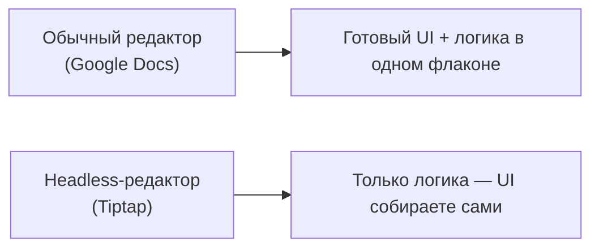
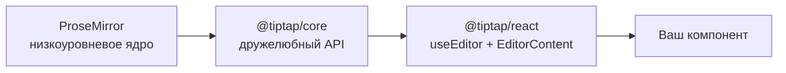
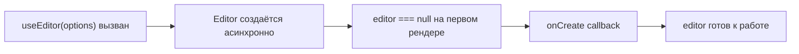

# Введение и setup

## Что такое headless-редактор

Большинство текстовых редакторов (Google Docs, Word) — это готовый продукт: у него уже есть тулбар, свои стили, своя логика. Если вам нужно что-то нестандартное — вы упираетесь в стену.

**Headless-редактор** — это редактор без "головы", то есть без готового UI. Он даёт вам только "мозг": модель документа, команды для его изменения, систему расширений. А тулбар, кнопки, меню — рисуете вы сами, любыми React-компонентами.



Аналогия: обычный редактор — это готовый автомобиль. Headless-редактор — это двигатель и шасси, кузов вы проектируете сами под свою задачу.

## Tiptap и ProseMirror

Tiptap не изобретает редактирование текста с нуля — он построен поверх **ProseMirror**, библиотеки Марейна Хабера (автора CodeMirror). ProseMirror — это низкоуровневый, очень мощный, но неудобный в прямом использовании инструмент: голый API, никакого React, много бойлерплейта.

Tiptap — это дружелюбная обёртка над ProseMirror:

- **`@tiptap/core`** — ядро: `Editor`, система расширений, команды
- **`@tiptap/pm`** — реэкспорт пакетов ProseMirror (state, view, model, transform), чтобы не тянуть их отдельно
- **`@tiptap/react`** — React-биндинг: хук `useEditor` и компонент `EditorContent`
- **`@tiptap/starter-kit`** — набор самых нужных расширений "из коробки" (параграфы, заголовки, списки, bold/italic и т.д.)



Под капотом документ Tiptap — это не HTML и не строка, а **дерево** (аналог DOM, но своё, управляемое ProseMirror). Каждое изменение — это не мутация DOM напрямую, а **транзакция** над этим деревом, которая потом рендерится в DOM. Это важно понимать с самого начала: вы никогда не трогаете `contenteditable`-DOM руками, вы работаете через команды и транзакции.

## useEditor и EditorContent

Вся интеграция с React строится на двух вещах:

```tsx
import { EditorContent, useEditor } from '@tiptap/react'
import StarterKit from '@tiptap/starter-kit'

function MyEditor() {
  const editor = useEditor({
    extensions: [StarterKit],
    content: '<p>Привет, Tiptap!</p>',
  })

  return <EditorContent editor={editor} />
}
```

- **`useEditor(options)`** — хук, который создаёт инстанс `Editor` (ProseMirror-обёртку) и держит его живым между рендерами React. Возвращает объект `editor` (или `null` в первый момент — редактор создаётся асинхронно).
- **`<EditorContent editor={editor} />`** — компонент, который рендерит `contenteditable`-DOM внутри React-дерева и синхронизирует его с состоянием `editor`.

📌 Важно: `editor` в первый рендер может быть `null` — Tiptap создаёт редактор после монтирования. Поэтому используйте опциональную цепочку (`editor?.commands...`) или проверку `if (!editor) return null` там, где обращаетесь к `editor` до его инициализации.

## Первый extension: без чего редактор не заработает

Даже "пустой" редактор требует минимум трёх extensions, потому что ProseMirror ничего не знает про параграфы и текст по умолчанию:

```tsx
import Document from '@tiptap/extension-document'
import Paragraph from '@tiptap/extension-paragraph'
import Text from '@tiptap/extension-text'

const editor = useEditor({
  extensions: [Document, Paragraph, Text],
})
```

- **Document** — корневой узел документа (аналог `<html>`)
- **Paragraph** — узел параграфа (блочный контейнер для текста)
- **Text** — сам текстовый узел (leaf-нода, содержащая символы)

На практике в 99% случаев вместо этого списка используют **`StarterKit`**, который уже включает эти три extension плюс ещё два десятка полезных (см. следующий уровень).

## Жизненный цикл редактора



Опция `onUpdate` вызывается на каждое изменение документа, `onCreate` — один раз, когда редактор готов. Мы используем их в следующих уровнях.

## ⚠️ Частые ошибки новичков

**Ошибка 1: обращение к `editor` без проверки на `null`**

```tsx
// ❌ Плохо — упадёт при первом рендере, пока editor === null
function Toolbar({ editor }: { editor: Editor }) {
  return <button onClick={() => editor.chain().focus().toggleBold().run()}>B</button>
}
```

```tsx
// ✅ Хорошо — проверяем editor перед использованием
function Toolbar({ editor }: { editor: Editor | null }) {
  if (!editor) return null
  return <button onClick={() => editor.chain().focus().toggleBold().run()}>B</button>
}
```

**Ошибка 2: пересоздание массива `extensions` на каждый рендер**

```tsx
// ❌ Плохо — новый массив extensions на каждый рендер лишний раз
// пересоздаёт часть внутренних структур редактора
function MyEditor() {
  const editor = useEditor({
    extensions: [StarterKit.configure({ heading: { levels: [1, 2, 3] } })],
  })
}
```

```tsx
// ✅ Хорошо — выносим конфигурацию за пределы компонента или в useMemo,
// если конфигурация зависит от пропсов
const extensions = [StarterKit.configure({ heading: { levels: [1, 2, 3] } })]

function MyEditor() {
  const editor = useEditor({ extensions })
}
```

**Ошибка 3: забыть про `EditorContent`**

Просто вызвать `useEditor` недостаточно — без `<EditorContent editor={editor} />` в дереве не появится ни одного `contenteditable`-элемента, и редактор не будет виден на странице.

## 💡 Best practices

- Всегда деструктурируйте `editor` из `useEditor` и проверяйте на `null` перед первым использованием в JSX
- Не создавайте объект `extensions` заново в теле компонента без необходимости — выносите наружу или в `useMemo`
- Начинайте с `StarterKit` — не собирайте набор extensions вручную, если не нужна тонкая настройка
- Оборачивайте `EditorContent` в свой контейнер с классом — так удобнее стилизовать `contenteditable`-зону через CSS
