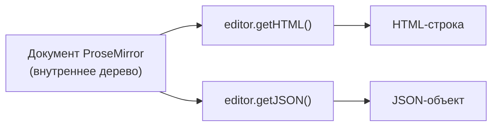

# Базовое редактирование

## content: как задать начальное состояние

В прошлом уровне мы уже передавали `content` в `useEditor`. Разберём подробнее, что туда можно положить:

```tsx
useEditor({
  extensions: [StarterKit],
  content: '<p>HTML-строка</p>', // 1. HTML
})

useEditor({
  extensions: [StarterKit],
  content: {
    // 2. JSON-документ ProseMirror
    type: 'doc',
    content: [{ type: 'paragraph', content: [{ type: 'text', text: 'Привет' }] }],
  },
})
```

Оба варианта эквивалентны — Tiptap умеет парсить HTML в дерево узлов и наоборот. О различиях между HTML и JSON подробно поговорим на уровне 6.

## Получение контента: getHTML() и getJSON()

Чтобы прочитать текущее содержимое редактора, есть два метода:

```tsx
editor.getHTML() // '<p>Привет</p>' — строка HTML
editor.getJSON() // { type: 'doc', content: [...] } — объект ProseMirror JSON
```

Оба метода **синхронные** и вызываются в любой момент — они не требуют подписки, просто читают текущее состояние документа.



## onUpdate: реагируем на изменения

Чтобы узнавать об изменениях документа в реальном времени (например, чтобы сохранить его в состояние React или отправить на сервер), используется колбэк `onUpdate`:

```tsx
const editor = useEditor({
  extensions: [StarterKit],
  onUpdate: ({ editor }) => {
    console.log('Новый HTML:', editor.getHTML())
  },
})
```

`onUpdate` вызывается **после каждой транзакции**, которая меняет документ (ввод текста, удаление, форматирование). Не вызывается на изменения выделения без изменения контента — для этого есть отдельный колбэк `onSelectionUpdate`.

📌 Если вы хотите синхронизировать содержимое редактора с состоянием React (например, для контролируемой формы), используйте `onUpdate` + `useState`, а не пытайтесь читать `editor.getHTML()` прямо в рендере — это создаст лишние ре-рендеры и рассинхронизацию курсора (подробнее — на уровне 6, "Контролируемый контент").

## editable: включаем и выключаем редактирование

Опция `editable` определяет, можно ли редактировать документ:

```tsx
const editor = useEditor({
  extensions: [StarterKit],
  editable: false, // редактор в режиме "только чтение"
})
```

Чтобы переключать это состояние динамически (например, кнопкой "Редактировать" / "Просмотр"), нельзя просто поменять пропс — нужно вызвать метод `setEditable`:

```tsx
editor.setEditable(false) // выключить редактирование
editor.setEditable(true) // включить обратно
```

А для React-компонента типично делать так:

```tsx
useEffect(() => {
  editor?.setEditable(isEditable)
}, [editor, isEditable])
```

## Автофокус: autofocus

Чтобы курсор сразу оказался в редакторе при монтировании, есть опция `autofocus`:

```tsx
useEditor({
  extensions: [StarterKit],
  autofocus: true, // фокус в начало документа
  // autofocus: 'end',   // фокус в конец
  // autofocus: 10,      // фокус на позицию 10
})
```

## Полезные свойства editor

- `editor.isEditable` — булево значение, можно ли сейчас редактировать
- `editor.isEmpty` — пуст ли документ (полезно для плейсхолдеров и валидации форм)
- `editor.isFocused` — находится ли фокус внутри редактора
- `editor.storage.characterCount` — доступ к storage extension (если он подключён), например для счётчика символов

## ⚠️ Частые ошибки новичков

**Ошибка 1: вызов `editor.getHTML()` прямо в JSX без onUpdate**

```tsx
// ❌ Плохо — компонент не перерендерится при изменении текста,
// значение будет "застывшим" на момент последнего рендера по другой причине
function Preview({ editor }: { editor: Editor | null }) {
  return <pre>{editor?.getHTML()}</pre>
}
```

```tsx
// ✅ Хорошо — подписываемся на onUpdate и храним HTML в state
function Preview() {
  const [html, setHtml] = useState('')
  const editor = useEditor({
    extensions: [StarterKit],
    onUpdate: ({ editor }) => setHtml(editor.getHTML()),
  })
  return <pre>{html}</pre>
}
```

**Ошибка 2: попытка поменять editable через пропс, а не setEditable**

```tsx
// ❌ Не работает — editable влияет только на создание редактора,
// повторный вызов useEditor с новым editable не переключает существующий инстанс
useEditor({ extensions: [StarterKit], editable: isReadonly })
```

```tsx
// ✅ Хорошо — реагируем на изменение через useEffect и setEditable
const editor = useEditor({ extensions: [StarterKit] })
useEffect(() => {
  editor?.setEditable(!isReadonly)
}, [editor, isReadonly])
```

**Ошибка 3: забыть про null-проверку внутри onUpdate-колбэков, которые обновляют внешний state**

Колбэк `onUpdate` вызывается только когда `editor` уже существует — внутри него `editor` из аргумента гарантированно не `null`. Ошибка возникает не тут, а когда снаружи (в JSX) вы читаете стейт до первого onUpdate — тогда просто покажите заглушку ("Пока пусто").

## 💡 Best practices

- Используйте `getHTML()`/`getJSON()` для экспорта данных (например, при отправке формы), а не как источник правды для рендера
- Для реактивного UI (счётчики, превью) держите состояние в React через `onUpdate`, а не читайте `editor` напрямую в рендере
- Переключайте `editable` через `editor.setEditable()` в `useEffect`, а не через пересоздание редактора
- Проверяйте `editor.isEmpty` вместо сравнения `getHTML() === '<p></p>'` — это надёжнее и не зависит от структуры пустого документа
