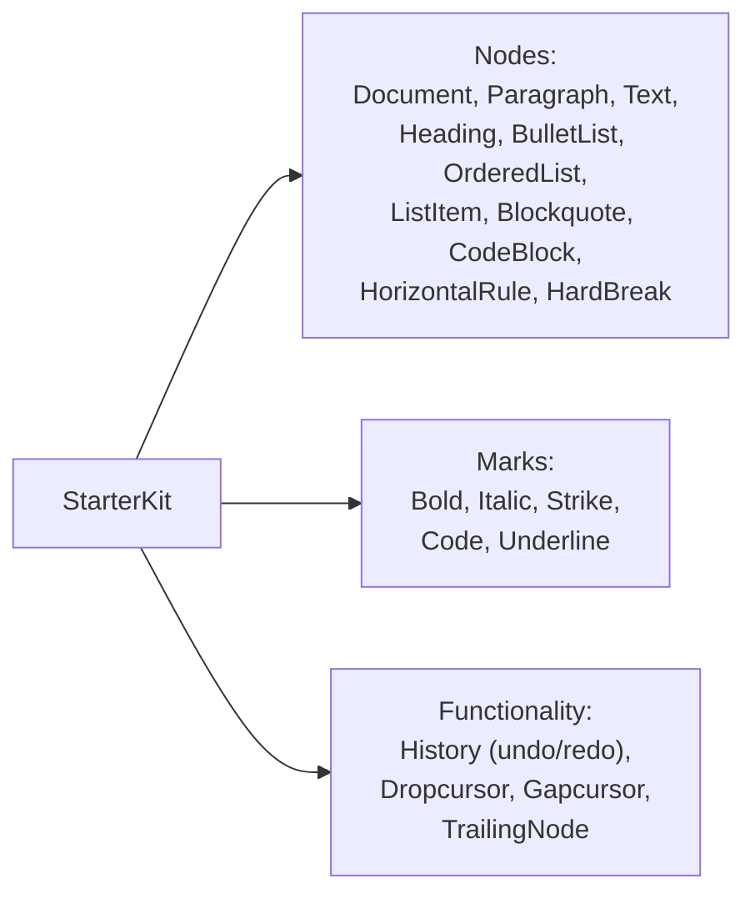

# StarterKit и встроенные extensions

## Что внутри StarterKit

`StarterKit` — это не отдельное расширение, а **бандл** из полутора-двух десятков extensions, которые нужны почти в любом текстовом редакторе. Вместо того чтобы импортировать и подключать каждое расширение по отдельности, вы получаете их одним пакетом:



Каждый из этих extensions можно было бы подключить вручную:

```tsx
import Document from '@tiptap/extension-document'
import Paragraph from '@tiptap/extension-paragraph'
import Text from '@tiptap/extension-text'
import Bold from '@tiptap/extension-bold'
import Italic from '@tiptap/extension-italic'
import Heading from '@tiptap/extension-heading'
// ...ещё десяток импортов
```

Но `StarterKit` избавляет от этого:

```tsx
import StarterKit from '@tiptap/starter-kit'

useEditor({ extensions: [StarterKit] })
```

## Конфигурация: configure()

У каждого extension (и у самого `StarterKit`) есть метод `.configure(options)`, который возвращает новую, настроенную версию расширения. `StarterKit.configure()` принимает объект, где ключ — имя вложенного extension, а значение — либо `false` (выключить), либо объект с его собственными опциями:

```tsx
StarterKit.configure({
  heading: { levels: [1, 2, 3] }, // разрешить только H1–H3, а не все H1–H6
  codeBlock: false, // полностью выключить codeBlock
  undoRedo: false, // выключить встроенный undo/redo (например, если своя история через collaboration)
})
```

📌 В Tiptap v3 extension истории переименован из `history` в `undoRedo` (и физически переехал в общий пакет `@tiptap/extensions`) — при конфигурации `StarterKit.configure()` ключ теперь `undoRedo`, а не `history`.

📌 Выключать extension через `false` полезно, когда вы хотите заменить его на кастомную версию (например, свой `CodeBlock` с подсветкой синтаксиса через lowlight — см. уровень 4) — иначе Tiptap выбросит ошибку о дублирующемся имени ноды.

## Точечная замена: extend()

Если нужно не выключить, а слегка изменить поведение встроенного extension, используйте `.extend()`:

```tsx
import Heading from '@tiptap/extension-heading'

const CustomHeading = Heading.extend({
  renderHTML({ node, HTMLAttributes }) {
    const level = node.attrs.level
    return [`h${level}`, { ...HTMLAttributes, class: `heading-${level}` }, 0]
  },
})

useEditor({
  extensions: [
    StarterKit.configure({ heading: false }), // выключаем встроенный
    CustomHeading, // подключаем свой
  ],
})
```

## Полный список extensions в StarterKit (v3)

| Категория         | Extensions                                                                                                                                                      |
| ----------------- | --------------------------------------------------------------------------------------------------------------------------------------------------------------- |
| Обязательные узлы | `Document`, `Paragraph`, `Text`                                                                                                                                 |
| Блочные узлы      | `Heading`, `BulletList`, `OrderedList`, `ListItem`, `Blockquote`, `CodeBlock`, `HorizontalRule`                                                                 |
| Служебные узлы    | `HardBreak` (перенос строки Shift+Enter), `TrailingNode` (гарантирует пустой параграф в конце)                                                                  |
| Marks             | `Bold`, `Italic`, `Strike`, `Code`, `Underline`, `Link`                                                                                                         |
| Функциональность  | `UndoRedo` (undo/redo через `Ctrl+Z`/`Ctrl+Y`), `Dropcursor` (курсор при drag&drop), `Gapcursor` (курсор между несовместимыми блоками, например перед таблицей) |

📌 В Tiptap v3 в `StarterKit` добавили `Underline` и `Link` (раньше их нужно было подключать отдельно) — теперь ссылки и подчёркивание работают "из коробки". Явно выключить их можно так же, как остальные: `StarterKit.configure({ link: false })`.

Того, чего в `StarterKit` всё ещё **нет**: `Image`, `Table`, `Placeholder`, `CharacterCount`, `TextAlign`, `Highlight`, `TaskList`, `Collaboration` — эти extensions подключаются отдельными пакетами по необходимости.

## Как проверить, что реально включено

Каждый созданный `editor` хранит список активных extensions:

```tsx
editor.extensionManager.extensions.map(ext => ext.name)
// ['doc', 'paragraph', 'text', 'bold', 'italic', 'heading', ...]
```

Это удобно для отладки — если extension не работает, первым делом проверьте, что он вообще присутствует в этом списке.

## ⚠️ Частые ошибки новичков

**Ошибка 1: одновременное подключение StarterKit и отдельного extension с тем же именем**

```tsx
// ❌ Плохо — Heading уже есть внутри StarterKit, будет конфликт имён
useEditor({
  extensions: [StarterKit, Heading],
})
```

```tsx
// ✅ Хорошо — сначала выключить встроенный, потом подключить свой
useEditor({
  extensions: [StarterKit.configure({ heading: false }), CustomHeading],
})
```

**Ошибка 2: попытка передать опции нижнего уровня extension прямо в StarterKit.configure()**

```tsx
// ❌ Плохо — 'levels' должен быть внутри объекта heading, а не рядом с ним
StarterKit.configure({ levels: [1, 2] })
```

```tsx
// ✅ Хорошо — вложенная структура: имя extension → его собственные опции
StarterKit.configure({ heading: { levels: [1, 2] } })
```

**Ошибка 3: считать, что StarterKit включает вообще всё нужное для "богатого" редактора**

Ссылки, изображения, таблицы, плейсхолдер — всё это отдельные пакеты. Начинающие иногда тратят время в поисках несуществующей опции внутри `StarterKit.configure()`, хотя нужного extension там попросту нет.

## 💡 Best practices

- Начинайте всегда с `StarterKit` без конфигурации — добавляйте `.configure()` только когда реально нужно что-то отключить/настроить
- Явно выключайте (`false`) то, что точно не нужно в вашем UI (например, `codeBlock: false`, если редактор не для кода) — это уменьшает список доступных команд и снижает риск случайного использования
- Для замены поведения используйте `.extend()`, а не пишите extension с нуля, если 90% логики уже есть во встроенном
- Держите конфигурацию `StarterKit.configure({...})` вне тела компонента (в отдельной константе), чтобы не пересоздавать объект на каждый рендер
