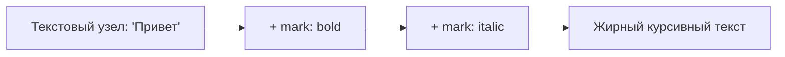

# Marks и Toolbar

## Что такое Mark

В терминологии ProseMirror/Tiptap документ состоит из двух типов сущностей: **nodes** (узлы — параграфы, заголовки, списки — то, что определяет _структуру_) и **marks** (марки — bold, italic, code, link — то, что определяет _оформление_ инлайн-текста, накладываемое поверх текстовых узлов).

Ключевое отличие: один и тот же текст может иметь **несколько marks одновременно** (жирный + курсив + ссылка), но при этом остаётся одним текстовым узлом с "довеском" из marks:



### Аналогия: marks как CSS-классы на span

Полезная ментальная модель: node — это HTML-тег (`<p>`, `<h1>`, `<ul>`), а mark — это как класс/атрибут стиля, навешанный на кусок текста внутри тега, вроде `<span class="bold italic">`. Разница с CSS в том, что marks в ProseMirror — это не произвольная строка класса, а строго типизированные, зарегистрированные в схеме сущности со своим набором разрешённых атрибутов. Именно поэтому редактор точно знает, что `bold` можно применить к тексту, но нельзя — к самому параграфу как таковому (marks всегда живут на уровне inline-контента, не на уровне block-нод).

Важное следствие этой модели: marks не образуют "вложенность" в смысле дерева — они просто **множество**, прикреплённое к текстовому узлу. `bold + italic` — это не "italic внутри bold" и не "bold внутри italic", а просто два независимых флага на одном и том же куске текста. Порядок, в котором вы их применили, не имеет структурного значения для документа (хотя может влиять на порядок сериализованных тегов в HTML).

## Переключение marks: toggle-команды

Практически для каждой marks-extension есть команда `toggleX()`:

```tsx
editor.chain().focus().toggleBold().run()
editor.chain().focus().toggleItalic().run()
editor.chain().focus().toggleStrike().run()
editor.chain().focus().toggleCode().run()
```

Слово "toggle" здесь буквальное: если выделенный текст уже жирный — команда снимет форматирование, если нет — применит. Это отличается от `setBold()`/`unsetBold()`, которые всегда однозначно устанавливают или снимают mark, не проверяя текущее состояние.

### Что происходит при toggle на частично отформатированном выделении

Интересный пограничный случай: что если пользователь выделил фрагмент, где **часть** текста уже жирная, а часть — нет? ProseMirror применяет простое правило: если **весь** диапазон выделения полностью покрыт mark — toggle снимает его; если хотя бы часть диапазона не имеет mark — toggle **добавляет** его ко всему диапазону (выравнивая до "включено"). Это стандартное, интуитивно ожидаемое поведение большинства текстовых редакторов (Word, Google Docs ведут себя так же) — "если не всё выделение одинаково отформатировано, сначала унифицируем в сторону 'применить'".

## isActive(): подсвечиваем активную кнопку

Чтобы тулбар показывал, какое форматирование сейчас применено (кнопка "нажата"), используется `editor.isActive(name)`:

```tsx
editor.isActive('bold') // true, если весь курсор/выделение внутри bold-текста
editor.isActive('link', { href: 'https://example.com' }) // можно проверить и конкретные атрибуты mark
```

Типичный паттерн кнопки тулбара:

```tsx
<button
  onClick={() => editor.chain().focus().toggleBold().run()}
  className={editor.isActive('bold') ? 'is-active' : ''}
>
  Bold
</button>
```

📌 `isActive` — это не React state, а метод, который каждый раз заново читает текущее выделение. Чтобы UI кнопки обновлялся в реальном времени при движении курсора, компонент тулбара должен перерендериваться при каждом изменении selection — обычно для этого достаточно, что родительский компонент содержит `editor` и подписан на `onTransaction`/`onSelectionUpdate` (в связке с `useEditor` React уже сам обеспечивает перерендер тулбара при каждом апдейте редактора, если тулбар и `EditorContent` — часть одного компонента с этим `editor`).

### Как isActive() вычисляется под капотом

`isActive('bold')` внутри анализирует текущий `editor.state.selection`:

- Если выделение — это `TextSelection` с непустым диапазоном (`from !== to`), проверяется, что mark `bold` присутствует **на всём протяжении** диапазона (используется `doc.rangeHasMark`/аналогичная внутренняя проверка ProseMirror).
- Если это просто курсор без выделения (`from === to`), проверяются **"stored marks"** — специальный список marks, который ProseMirror временно запоминает для позиции курсора (например, если вы только что сняли bold и продолжаете печатать — новый текст не должен снова стать жирным, пока вы явно не включите его снова).

Это объясняет неочевидное на первый взгляд поведение: если поставить курсор точно в конце жирного слова и не двигать его, `isActive('bold')` может по-разному отражать состояние в зависимости от того, "в начале" или "в конце" границы курсор — это связано с "прилипанием" marks к соседним символам, стандартная логика ProseMirror для marks на границах.

## Link mark: mark с атрибутами и валидацией

`Link` — хороший пример mark с собственными атрибутами (`href`, `target`, `rel`). В Tiptap v3 `Link` уже входит в `StarterKit`, поэтому настраивается прямо через `configure()`, без отдельного импорта:

```tsx
useEditor({
  extensions: [
    StarterKit.configure({
      link: {
        openOnClick: false, // не открывать ссылку по клику внутри редактора
        autolink: true, // автоматически превращать URL в ссылки при вводе
      },
    }),
  ],
})
```

📌 Если нужна отдельная, более гибкая настройка (например, полностью своя логика валидации протоколов), `Link` можно выключить в `StarterKit` (`link: false`) и подключить отдельно из `@tiptap/extension-link`, как самостоятельный extension — точно так же, как с `Heading` на прошлом уровне.

Установка ссылки на выделенный текст:

```tsx
editor
  .chain()
  .focus()
  .extendMarkRange('link') // расширить выделение до границ существующего link, если курсор внутри него
  .setLink({ href: url })
  .run()
```

Удаление ссылки:

```tsx
editor.chain().focus().extendMarkRange('link').unsetLink().run()
```

### Почему у Link отдельная логика безопасности

Link — не просто "ещё один mark с атрибутом". Поскольку `href` может содержать произвольную строку, введённую пользователем (в том числе через paste), встроенный `Link` extension по умолчанию фильтрует потенциально опасные протоколы (`javascript:`, `data:` в некоторых конфигурациях) — это защита от XSS-подобных атак через вставленный вредоносный `href`, который потом мог бы быть отрендерен как кликабельная ссылка и выполниться в контексте вашего приложения. Опция `protocols` позволяет явно указать белый список разрешённых протоколов (`http`, `https`, `mailto`), если дефолтного набора недостаточно или, наоборот, нужно сузить список.

## Построение панели инструментов

Toolbar — это обычный React-компонент, принимающий `editor` как проп и рендерящий кнопки, каждая из которых:

1. Вызывает нужную команду по клику
2. Подсвечивается через `isActive`
3. Может быть отключена (`disabled`), если команда сейчас недоступна (`!editor.can().toggleBold()`, подробнее — на уровне 5)

```tsx
function Toolbar({ editor }: { editor: Editor | null }) {
  if (!editor) return null

  return (
    <div className="toolbar">
      <button
        onClick={() => editor.chain().focus().toggleBold().run()}
        className={editor.isActive('bold') ? 'is-active' : ''}
      >
        B
      </button>
      {/* ...остальные кнопки */}
    </div>
  )
}
```

### Проблема mousedown vs click при клике по тулбару

Тонкость, которая часто удивляет новичков: между кликом мышью по кнопке тулбара и обработчиком `onClick` в React происходит событие `mousedown`, которое браузер по умолчанию использует для смены фокуса. Если кнопка тулбара — обычная `<button>`, `mousedown` по ней **уводит фокус из contenteditable-редактора на саму кнопку** ещё до срабатывания `onClick`. Именно поэтому в цепочке команд всегда первым звеном стоит `.focus()` — он возвращает фокус обратно в редактор в рамках той же транзакции, до применения остальных команд. Без него в некоторых браузерах команда технически применится (Tiptap не требует фокуса для программного вызова команд), но пользователь визуально "потеряет" курсор и не сможет сразу продолжить печатать без дополнительного клика в текст.

## ⚠️ Частые ошибки новичков

**Ошибка 1: setBold() вместо toggleBold() в кнопке-переключателе**

```tsx
// ❌ Плохо — кнопка всегда включает bold, никогда не выключает
<button onClick={() => editor.chain().focus().setBold().run()}>B</button>
```

```tsx
// ✅ Хорошо — toggle корректно переключает состояние туда-обратно
<button onClick={() => editor.chain().focus().toggleBold().run()}>B</button>
```

**Ошибка 2: обращение к isActive без учёта того, что editor может быть null**

```tsx
// ❌ Плохо — упадёт при editor === null
<button className={editor.isActive('bold') ? 'is-active' : ''}>B</button>
```

```tsx
// ✅ Хорошо — ранний return или опциональная цепочка
if (!editor) return null
// ...
<button className={editor.isActive('bold') ? 'is-active' : ''}>B</button>
```

**Ошибка 3: забыть extendMarkRange при редактировании существующей ссылки**

Без `extendMarkRange('link')` попытка изменить `href` у ссылки, когда курсор находится _внутри_ уже существующей ссылки без выделения текста, не подхватит границы существующего mark — можно создать вложенный/частичный mark вместо замены всего диапазона.

**Ошибка 4: считать, что несколько marks на одном тексте — это "вложенность"**

```tsx
// ❌ Неверная ментальная модель: "italic внутри bold"
// Правильно: bold и italic — два независимых флага на одном текстовом узле
```

Эта путаница особенно мешает при написании кастомных marks (уровень 9) — начинающие иногда пытаются моделировать взаимодействие marks как вложенные HTML-теги, хотя внутри ProseMirror это плоское множество на текстовом узле, а порядок тегов при сериализации в HTML определяется порядком регистрации marks в схеме, а не порядком применения пользователем.

**Ошибка 5: не защищать href от произвольного протокола при кастомной обработке ссылок**

Если вы обходите встроенную защиту `Link` (например, полностью пишете свой extension для ссылок), не забудьте про валидацию протокола — иначе вставленный пользователем `javascript:alert(1)` в `href` теоретически может быть использован для атаки, если где-то в приложении этот `href` попадёт в реальный `<a>`-тег и будет кликнут.

## 💡 Best practices

- Выносите Toolbar в отдельный переиспользуемый компонент, принимающий `editor` как проп
- Используйте `toggleX()` для кнопок-переключателей и `setX()`/`unsetX()` только когда нужно однозначное состояние (например, "снять всё форматирование")
- Для ссылок всегда используйте `extendMarkRange('link')` перед `setLink`/`unsetLink`
- Стройте панель инструментов декларативно — массив конфигураций `{ command, isActive, label }`, а не копипаста однотипных кнопок
- Не полагайтесь на дефолтную защиту от опасных протоколов вслепую — при кастомной работе со ссылками явно настраивайте белый список `protocols`
- Для кнопок тулбара используйте `type="button"`, если они находятся внутри `<form>` — иначе клик по кнопке форматирования может случайно сабмитнуть форму
