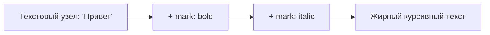

# Marks и Toolbar

## Что такое Mark

В терминологии ProseMirror/Tiptap документ состоит из двух типов сущностей: **nodes** (узлы — параграфы, заголовки, списки — то, что определяет _структуру_) и **marks** (марки — bold, italic, code, link — то, что определяет _оформление_ инлайн-текста, накладываемое поверх текстовых узлов).

Ключевое отличие: один и тот же текст может иметь **несколько marks одновременно** (жирный + курсив + ссылка), но при этом остаётся одним текстовым узлом с "довеском" из marks:



## Переключение marks: toggle-команды

Практически для каждой marks-extension есть команда `toggleX()`:

```tsx
editor.chain().focus().toggleBold().run()
editor.chain().focus().toggleItalic().run()
editor.chain().focus().toggleStrike().run()
editor.chain().focus().toggleCode().run()
```

Слово "toggle" здесь буквальное: если выделенный текст уже жирный — команда снимет форматирование, если нет — применит. Это отличается от `setBold()`/`unsetBold()`, которые всегда однозначно устанавливают или снимают mark, не проверяя текущее состояние.

## isActive(): подсвечиваем активную кнопку

Чтобы тулбар показывал, какое форматирование сейчас применено (кнопка "нажата"), используется `editor.isActive(name)`:

```tsx
editor.isActive('bold') // true, если весь курсор/выделение внутри bold-текста
editor.isActive('link', { href: 'https://example.com' }) // можно проверить и конкретные атрибуты mark
```

Типичный паттерн кнопки тулбара:

```tsx
<button
  onClick={() => editor.chain().focus().toggleBold().run()}
  className={editor.isActive('bold') ? 'is-active' : ''}
>
  Bold
</button>
```

📌 `isActive` — это не React state, а метод, который каждый раз заново читает текущее выделение. Чтобы UI кнопки обновлялся в реальном времени при движении курсора, компонент тулбара должен перерендериваться при каждом изменении selection — обычно для этого достаточно, что родительский компонент содержит `editor` и подписан на `onTransaction`/`onSelectionUpdate` (в связке с `useEditor` React уже сам обеспечивает перерендер тулбара при каждом апдейте редактора, если тулбар и `EditorContent` — часть одного компонента с этим `editor`).

## Link mark: mark с атрибутами и валидацией

`Link` — хороший пример mark с собственными атрибутами (`href`, `target`, `rel`). В Tiptap v3 `Link` уже входит в `StarterKit`, поэтому настраивается прямо через `configure()`, без отдельного импорта:

```tsx
useEditor({
  extensions: [
    StarterKit.configure({
      link: {
        openOnClick: false, // не открывать ссылку по клику внутри редактора
        autolink: true, // автоматически превращать URL в ссылки при вводе
      },
    }),
  ],
})
```

📌 Если нужна отдельная, более гибкая настройка (например, полностью своя логика валидации протоколов), `Link` можно выключить в `StarterKit` (`link: false`) и подключить отдельно из `@tiptap/extension-link`, как самостоятельный extension — точно так же, как с `Heading` на прошлом уровне.

Установка ссылки на выделенный текст:

```tsx
editor
  .chain()
  .focus()
  .extendMarkRange('link') // расширить выделение до границ существующего link, если курсор внутри него
  .setLink({ href: url })
  .run()
```

Удаление ссылки:

```tsx
editor.chain().focus().extendMarkRange('link').unsetLink().run()
```

## Построение панели инструментов

Toolbar — это обычный React-компонент, принимающий `editor` как проп и рендерящий кнопки, каждая из которых:

1. Вызывает нужную команду по клику
2. Подсвечивается через `isActive`
3. Может быть отключена (`disabled`), если команда сейчас недоступна (`!editor.can().toggleBold()`, подробнее — на уровне 5)

```tsx
function Toolbar({ editor }: { editor: Editor | null }) {
  if (!editor) return null

  return (
    <div className="toolbar">
      <button
        onClick={() => editor.chain().focus().toggleBold().run()}
        className={editor.isActive('bold') ? 'is-active' : ''}
      >
        B
      </button>
      {/* ...остальные кнопки */}
    </div>
  )
}
```

## ⚠️ Частые ошибки новичков

**Ошибка 1: setBold() вместо toggleBold() в кнопке-переключателе**

```tsx
// ❌ Плохо — кнопка всегда включает bold, никогда не выключает
<button onClick={() => editor.chain().focus().setBold().run()}>B</button>
```

```tsx
// ✅ Хорошо — toggle корректно переключает состояние туда-обратно
<button onClick={() => editor.chain().focus().toggleBold().run()}>B</button>
```

**Ошибка 2: обращение к isActive без учёта того, что editor может быть null**

```tsx
// ❌ Плохо — упадёт при editor === null
<button className={editor.isActive('bold') ? 'is-active' : ''}>B</button>
```

```tsx
// ✅ Хорошо — ранний return или опциональная цепочка
if (!editor) return null
// ...
<button className={editor.isActive('bold') ? 'is-active' : ''}>B</button>
```

**Ошибка 3: забыть extendMarkRange при редактировании существующей ссылки**

Без `extendMarkRange('link')` попытка изменить `href` у ссылки, когда курсор находится _внутри_ уже существующей ссылки без выделения текста, не подхватит границы существующего mark — можно создать вложенный/частичный mark вместо замены всего диапазона.

## 💡 Best practices

- Выносите Toolbar в отдельный переиспользуемый компонент, принимающий `editor` как проп
- Используйте `toggleX()` для кнопок-переключателей и `setX()`/`unsetX()` только когда нужно однозначное состояние (например, "снять всё форматирование")
- Для ссылок всегда используйте `extendMarkRange('link')` перед `setLink`/`unsetLink`
- Стройте панель инструментов декларативно — массив конфигураций `{ command, isActive, label }`, а не копипаста однотипных кнопок
