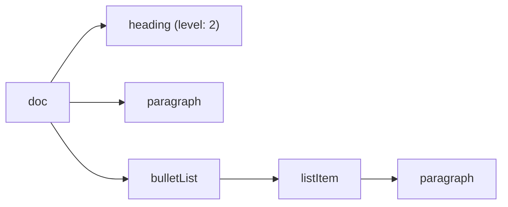
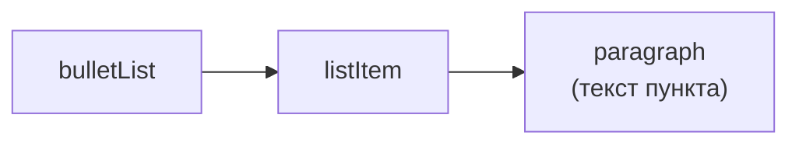
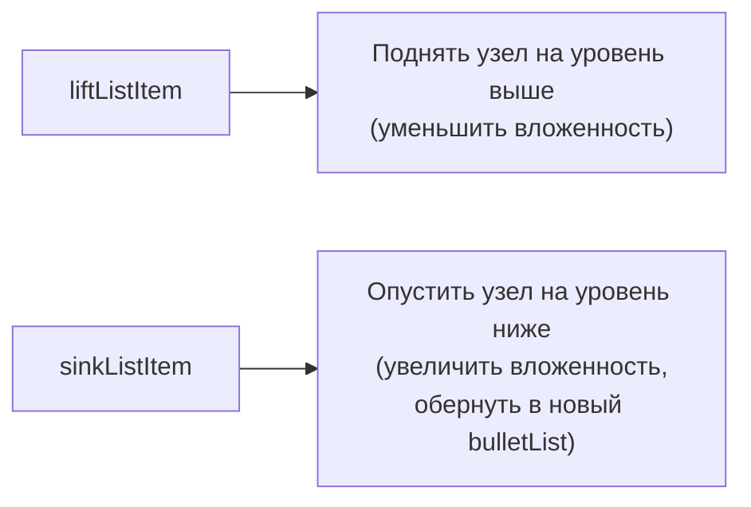

# Nodes

## Nodes vs Marks: напоминание

На прошлом уровне мы работали с marks (bold, italic, link) — оформлением текста. **Nodes** — это структурные строительные блоки документа: параграфы, заголовки, списки, цитаты, блоки кода. В отличие от marks, node — это отдельный узел дерева документа со своим положением, а не "довесок" к тексту.



### Почему это дерево, а не плоский список

Важно осознать, что документ ProseMirror — это именно **дерево**, а не последовательность "блоков подряд". Каждый node может содержать другие nodes внутри себя (список содержит элементы списка, элемент списка содержит параграф, параграф содержит текст с marks). Это прямое следствие того, как устроен HTML (`<ul><li><p>...</p></li></ul>`), но, в отличие от произвольного HTML, ProseMirror **жёстко ограничивает**, какое дерево вообще может существовать — через схему (уровень 7). Именно поэтому нельзя, например, вложить `heading` внутрь `heading` — схема просто не позволит такой команде выполниться.

## Heading: заголовки с атрибутом level

```tsx
editor.chain().focus().toggleHeading({ level: 2 }).run()
editor.isActive('heading', { level: 2 }) // true, если курсор внутри H2
```

`level` — это **атрибут** ноды `heading`, а не отдельный тип ноды. Именно поэтому все заголовки H1–H6 — это одна нода `heading` с разным значением `attrs.level`, а не шесть разных extensions.

### Почему такой дизайн лучше, чем шесть отдельных нод Heading1...Heading6

Представьте альтернативный дизайн: `Heading1`, `Heading2`, ..., `Heading6` — шесть разных extensions. Тогда любая логика, которая должна работать "со всеми заголовками одинаково" (например, генерация оглавления документа, или CSS-стилизация всех заголовков через общий класс), требовала бы либо дублирования кода шесть раз, либо явного перечисления всех шести имён нод в каждом месте. С единой нодой `heading` + атрибутом `level` такая логика пишется один раз: `doc.descendants(node => node.type.name === 'heading')` найдёт **все** заголовки, независимо от уровня, а стилизация конкретного уровня решается через CSS-селектор `[data-level="2"]` или похожим способом на основе рендеринга атрибута в `renderHTML`.

## Списки: BulletList, OrderedList, ListItem

Списки устроены как вложенная структура из трёх нод:



```tsx
editor.chain().focus().toggleBulletList().run() // маркированный
editor.chain().focus().toggleOrderedList().run() // нумерованный
```

Вложенные списки создаются через отступ (`Tab` внутри пункта списка), за что отвечает команда `sinkListItem('listItem')`, а выход из отступа — `liftListItem('listItem')`. Это встроено "из коробки" через клавиатурные шорткаты StarterKit.

### sink и lift: откуда такие названия

Названия команд взяты из терминологии ProseMirror и отражают операцию над деревом документа "визуально":



`sink` ("погрузить/утопить") оборачивает текущий `listItem` в новый вложенный `bulletList`/`orderedList` внутри родительского `listItem` — визуально текст "утопает" на один уровень глубже. `lift` ("поднять") делает обратное — вынимает `listItem` из вложенного списка обратно в родительский уровень. Эта пара команд не специфична только для списков — `liftListItem`/`sinkListItem` — частные случаи более общих команд ProseMirror `lift`/`wrapIn`, которые работают с произвольными вложенными структурами документа, не только со списками.

## Blockquote и HorizontalRule

```tsx
editor.chain().focus().toggleBlockquote().run() // цитата — блочная обёртка над параграфами
editor.chain().focus().setHorizontalRule().run() // разделитель — не toggle, просто вставка
```

📌 `HorizontalRule` — не toggle-команда: это не оформление, а разовая вставка узла-разделителя в позицию курсора, поэтому команда называется `set...`, а не `toggle...`.

## CodeBlock

```tsx
editor.chain().focus().toggleCodeBlock().run()
```

`CodeBlock` в `StarterKit` — простой блок кода без подсветки синтаксиса. Для подсветки используется отдельный extension `@tiptap/extension-code-block-lowlight`, который заменяет встроенный `codeBlock` (через `StarterKit.configure({ codeBlock: false })` + отдельное подключение):

```tsx
import { CodeBlockLowLight } from '@tiptap/extension-code-block-lowlight'
import { createLowlight } from 'lowlight'
import js from 'highlight.js/lib/languages/javascript'

const lowlight = createLowlight()
lowlight.register('js', js)

useEditor({
  extensions: [
    StarterKit.configure({ codeBlock: false }),
    CodeBlockLowLight.configure({ lowlight }),
  ],
})
```

Внутри блока кода часто важно, чтобы `Tab` вставлял отступ, а не переключал фокус на следующий элемент страницы — это тоже настраивается через `addKeyboardShortcuts` (уровень 12).

### Как CodeBlockLowLight подсвечивает синтаксис без перерисовки всего документа

Подсветка синтаксиса — интересный пример **декораций** (полноценно разберём на уровне 12): `lowlight` парсит текст внутри блока кода в дерево токенов (ключевые слова, строки, комментарии), а `CodeBlockLowLight` превращает это дерево в ProseMirror `Decoration`, добавляющие CSS-классы к соответствующим диапазонам текста (например, `hljs-keyword`, `hljs-string`). Важно: подсветка **не хранится** в самом документе как marks — она пересчитывается заново при каждом изменении содержимого блока кода, на основе чистого текста. Это значит, что если сохранить документ в JSON и загрузить его снова, подсветка восстановится автоматически из содержимого — не нужно отдельно сохранять "какие токены каким цветом покрашены".

## Как переключаются типы блочных нод друг в друга

Ключевая особенность блочных нод: они **взаимоисключающие** в рамках одной позиции курсора — параграф нельзя одновременно быть заголовком. Поэтому команды `toggleHeading`, `toggleBulletList` и другие toggle-команды для block-нод не просто добавляют/убирают, а **заменяют** тип текущего блока:

```
Параграф → toggleHeading({level: 2}) → Заголовок H2 → toggleHeading({level: 2}) снова → Параграф (обратно)
Параграф → toggleBulletList() → Элемент списка
```

### Разница между setNode и wrapIn на уровне механики транзакций

Под капотом toggle-команды для block-нод используют одну из двух базовых операций ProseMirror:

- **`setNode`** — заменяет тип текущего блока "на месте", сохраняя его содержимое (используется для `toggleHeading`, превращения параграфа в заголовок и обратно — оба они одноуровневые, "плоские" узлы).
- **`wrapIn`** (и обратная ей `lift`) — оборачивает текущий блок в новый родительский узел (используется для `toggleBlockquote`, `toggleBulletList` — потому что список/цитата это не замена типа параграфа, а добавление обёртки **вокруг** него).

Понимание этого различия объясняет, почему `toggleBulletList` на заголовке превращает его в элемент списка, **сохраняя** его текст как `listItem > paragraph`, а не просто меняет "тип" заголовка на "тип" списка — потому что список это структурная обёртка, а не альтернативный тип того же самого блока.

## ⚠️ Частые ошибки новичков

**Ошибка 1: попытка использовать HorizontalRule как toggle**

```tsx
// ❌ Плохо — такой команды нет
editor.chain().focus().toggleHorizontalRule().run()
```

```tsx
// ✅ Хорошо — это просто вставка
editor.chain().focus().setHorizontalRule().run()
```

**Ошибка 2: подключение CodeBlockLowLight без выключения встроенного codeBlock**

```tsx
// ❌ Плохо — конфликт имён: обе ноды называются 'codeBlock'
useEditor({
  extensions: [StarterKit, CodeBlockLowLight.configure({ lowlight })],
})
```

```tsx
// ✅ Хорошо
useEditor({
  extensions: [
    StarterKit.configure({ codeBlock: false }),
    CodeBlockLowLight.configure({ lowlight }),
  ],
})
```

**Ошибка 3: путать level заголовка с отдельными extensions**

Не существует `Heading1`, `Heading2` как раздельных extensions — есть одна нода `heading` с атрибутом `level`. Проверка активности всегда требует указания уровня: `isActive('heading', { level: 2 })`, а не просто `isActive('heading')` (последнее вернёт true для _любого_ уровня заголовка).

**Ошибка 4: ожидать, что sinkListItem сработает на верхнем пункте списка без предыдущего "соседа"**

Отступ первого элемента списка технически невозможен — не в кого его "вложить": `sinkListItem` перемещает текущий `listItem` внутрь **предыдущего** `listItem` того же уровня. Если пункт первый в списке, у него просто нет предыдущего соседа, и команда естественным образом окажется недоступной (`can().sinkListItem('listItem')` вернёт `false`).

**Ошибка 5: регистрация lowlight-языков после создания редактора**

```tsx
// ❌ Плохо — язык зарегистрирован ПОСЛЕ передачи lowlight в extension
const lowlight = createLowlight()
useEditor({ extensions: [CodeBlockLowLight.configure({ lowlight })] })
lowlight.register('js', js) // может не подхватиться для уже созданных блоков
```

```tsx
// ✅ Хорошо — сначала регистрируем все нужные языки, потом создаём редактор
const lowlight = createLowlight()
lowlight.register('js', js)
lowlight.register('ts', ts)
useEditor({ extensions: [CodeBlockLowLight.configure({ lowlight })] })
```

## 💡 Best practices

- Ограничивайте доступные уровни заголовков через `StarterKit.configure({ heading: { levels: [1, 2, 3] } })` — шесть уровней редко нужны в реальном UI
- Для code-блоков с подсветкой синтаксиса сразу используйте `CodeBlockLowLight`, а не встроенный `CodeBlock` — переключать extension "на лету" в продакшене избегайте, документы могут содержать данные, привязанные к конкретной схеме
- Стройте кнопки блочных нод так же декларативно, как toolbar для marks (уровень 3) — общий паттерн `{ label, isActive, onClick }`
- Помните про toggle-семантику: блочные toggle-команды переключают между "этот тип" и "обычный параграф", а не накапливают состояние
- Регистрируйте все нужные lowlight-языки заранее, единым модулем конфигурации, а не по требованию в рантайме
- Используйте `editor.can()` (уровень 5) для управления доступностью кнопок списков вместо ручного анализа структуры документа
