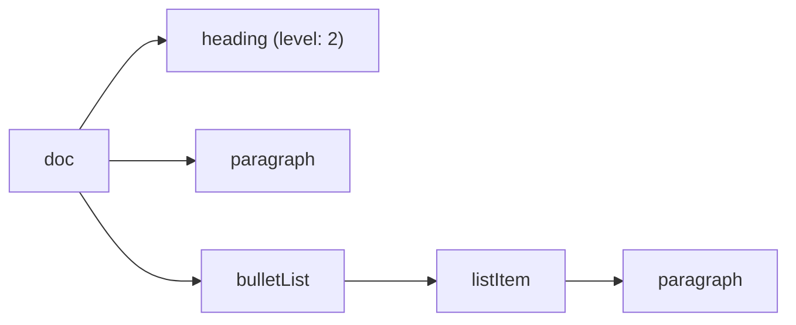
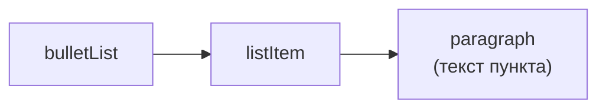

# Nodes

## Nodes vs Marks: напоминание

На прошлом уровне мы работали с marks (bold, italic, link) — оформлением текста. **Nodes** — это структурные строительные блоки документа: параграфы, заголовки, списки, цитаты, блоки кода. В отличие от marks, node — это отдельный узел дерева документа со своим положением, а не "довесок" к тексту.



## Heading: заголовки с атрибутом level

```tsx
editor.chain().focus().toggleHeading({ level: 2 }).run()
editor.isActive('heading', { level: 2 }) // true, если курсор внутри H2
```

`level` — это **атрибут** ноды `heading`, а не отдельный тип ноды. Именно поэтому все заголовки H1–H6 — это одна нода `heading` с разным значением `attrs.level`, а не шесть разных extensions.

## Списки: BulletList, OrderedList, ListItem

Списки устроены как вложенная структура из трёх нод:



```tsx
editor.chain().focus().toggleBulletList().run() // маркированный
editor.chain().focus().toggleOrderedList().run() // нумерованный
```

Вложенные списки создаются через отступ (`Tab` внутри пункта списка), за что отвечает команда `sinkListItem('listItem')`, а выход из отступа — `liftListItem('listItem')`. Это встроено "из коробки" через клавиатурные шорткаты StarterKit.

## Blockquote и HorizontalRule

```tsx
editor.chain().focus().toggleBlockquote().run() // цитата — блочная обёртка над параграфами
editor.chain().focus().setHorizontalRule().run() // разделитель — не toggle, просто вставка
```

📌 `HorizontalRule` — не toggle-команда: это не оформление, а разовая вставка узла-разделителя в позицию курсора, поэтому команда называется `set...`, а не `toggle...`.

## CodeBlock

```tsx
editor.chain().focus().toggleCodeBlock().run()
```

`CodeBlock` в `StarterKit` — простой блок кода без подсветки синтаксиса. Для подсветки используется отдельный extension `@tiptap/extension-code-block-lowlight`, который заменяет встроенный `codeBlock` (через `StarterKit.configure({ codeBlock: false })` + отдельное подключение):

```tsx
import { CodeBlockLowLight } from '@tiptap/extension-code-block-lowlight'
import { createLowlight } from 'lowlight'
import js from 'highlight.js/lib/languages/javascript'

const lowlight = createLowlight()
lowlight.register('js', js)

useEditor({
  extensions: [
    StarterKit.configure({ codeBlock: false }),
    CodeBlockLowLight.configure({ lowlight }),
  ],
})
```

Внутри блока кода часто важно, чтобы `Tab` вставлял отступ, а не переключал фокус на следующий элемент страницы — это тоже настраивается через `addKeyboardShortcuts` (уровень 12).

## Как переключаются типы блочных нод друг в друга

Ключевая особенность блочных нод: они **взаимоисключающие** в рамках одной позиции курсора — параграф нельзя одновременно быть заголовком. Поэтому команды `toggleHeading`, `toggleBulletList` и другие toggle-команды для block-нод не просто добавляют/убирают, а **заменяют** тип текущего блока:

```
Параграф → toggleHeading({level: 2}) → Заголовок H2 → toggleHeading({level: 2}) снова → Параграф (обратно)
Параграф → toggleBulletList() → Элемент списка
```

## ⚠️ Частые ошибки новичков

**Ошибка 1: попытка использовать HorizontalRule как toggle**

```tsx
// ❌ Плохо — такой команды нет
editor.chain().focus().toggleHorizontalRule().run()
```

```tsx
// ✅ Хорошо — это просто вставка
editor.chain().focus().setHorizontalRule().run()
```

**Ошибка 2: подключение CodeBlockLowLight без выключения встроенного codeBlock**

```tsx
// ❌ Плохо — конфликт имён: обе ноды называются 'codeBlock'
useEditor({
  extensions: [StarterKit, CodeBlockLowLight.configure({ lowlight })],
})
```

```tsx
// ✅ Хорошо
useEditor({
  extensions: [
    StarterKit.configure({ codeBlock: false }),
    CodeBlockLowLight.configure({ lowlight }),
  ],
})
```

**Ошибка 3: путать level заголовка с отдельными extensions**

Не существует `Heading1`, `Heading2` как раздельных extensions — есть одна нода `heading` с атрибутом `level`. Проверка активности всегда требует указания уровня: `isActive('heading', { level: 2 })`, а не просто `isActive('heading')` (последнее вернёт true для _любого_ уровня заголовка).

## 💡 Best practices

- Ограничивайте доступные уровни заголовков через `StarterKit.configure({ heading: { levels: [1, 2, 3] } })` — шесть уровней редко нужны в реальном UI
- Для code-блоков с подсветкой синтаксиса сразу используйте `CodeBlockLowLight`, а не встроенный `CodeBlock` — переключать extension "на лету" в продакшене избегайте, документы могут содержать данные, привязанные к конкретной схеме
- Стройте кнопки блочных нод так же декларативно, как toolbar для marks (уровень 3) — общий паттерн `{ label, isActive, onClick }`
- Помните про toggle-семантику: блочные toggle-команды переключают между "этот тип" и "обычный параграф", а не накапливают состояние
