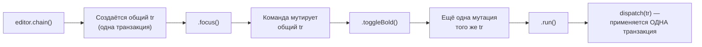
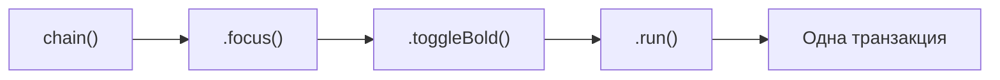

# Commands и chaining

## Три способа вызвать команду

В Tiptap есть три равнозначных синтаксиса для выполнения одной и той же команды:

```tsx
// 1. Одиночная команда
editor.commands.toggleBold()

// 2. Цепочка (chain) — несколько команд одной транзакцией
editor.chain().focus().toggleBold().run()

// 3. Проверка без выполнения
editor.can().toggleBold() // true/false, ничего не меняет
```

📌 `editor.commands.toggleBold()` тоже возвращает `boolean` (успешно ли применилась команда) и сразу выполняет её — в отличие от `chain()`, где команды _накапливаются_, а реально применяются только после `.run()`.

### Общая механика: команда — это функция, работающая с транзакцией

Полезно понимать, что все три синтаксиса — это разные "фасады" над одним и тем же: каждая Tiptap-команда внутри устроена как функция вида `(props) => (state, dispatch) => boolean`, получающая доступ к текущему `state` (состояние ProseMirror) и опциональному `dispatch` (функция, реально применяющая транзакцию). Если `dispatch` не передан — команда **не применяет** изменения, а только проверяет, была бы она успешна (это именно то, что происходит внутри `can()`). Если `dispatch` передан — команда модифицирует общую, разделяемую между всеми командами в цепочке транзакцию и вызывает `dispatch(tr)` в конце.



Именно эта архитектура объясняет, почему `chain()` даёт "одну транзакцию" — все команды в цепочке буквально работают с одним и тем же объектом транзакции, последовательно дописывая в него свои изменения, и только `.run()` реально "публикует" накопленный результат.

## Зачем нужен chain()

Главная причина использовать `chain()` вместо отдельных вызовов — **одна транзакция вместо нескольких**. Если сделать так:

```tsx
// ❌ Две отдельные транзакции — два события onUpdate, два шага истории undo
editor.commands.focus()
editor.commands.toggleBold()
```

То получится два отдельных изменения состояния (два шага в истории undo, два срабатывания `onUpdate`). А через `chain()`:

```tsx
// ✅ Одна транзакция — один шаг истории, один onUpdate
editor.chain().focus().toggleBold().run()
```



Команды в цепочке **накапливаются**, а не выполняются немедленно — реальное применение происходит только при вызове `.run()` в конце. Если не вызвать `.run()`, цепочка не окажет никакого эффекта.

### Почему "один шаг истории" важно не только для undo

Кроме удобства undo (пользователь ожидает, что одно действие "применить bold" отменяется одним Ctrl+Z, а не двумя), объединение в одну транзакцию важно и для **производительности**, и для **корректности совместного редактирования** (уровень 14). Каждая транзакция в ProseMirror вызывает пересчёт плагинов, decorations, и — при использовании Y.js — генерирует отдельное сетевое сообщение синхронизации. Если разбить логически единое действие на 5 отдельных транзакций, вы получите 5 сетевых пакетов вместо одного, и 5 промежуточных, "мигающих" состояний документа, которые увидят другие участники совместного редактирования.

## can(): проверка без побочных эффектов

`editor.can()` возвращает объект с теми же методами команд, что и обычный `editor`, но вызов любой команды через `can()` **не изменяет документ** — только проверяет, была бы она успешной:

```tsx
editor.can().toggleBold() // true, если можно применить bold сейчас
editor.can().undo() // true, если есть, что отменять
editor.can().chain().focus().toggleBold().run() // можно даже проверять целую цепочку
```

Это идеально подходит для управления `disabled` состоянием кнопок тулбара:

```tsx
<button
  disabled={!editor.can().chain().focus().toggleBold().run()}
  onClick={() => editor.chain().focus().toggleBold().run()}
>
  Bold
</button>
```

📌 Обратите внимание: `editor.can().chain()....run()` в контексте `can()` не выполняет транзакцию по-настоящему — `run()` внутри `can()`-цепочки означает "проверить, была бы вся цепочка выполнима", а не "выполнить".

### Как can() умеет "проверять, не выполняя"

Возвращаясь к сигнатуре команд `(state, dispatch) => boolean`: `can()` внутри вызывает те же самые функции команд, но **с `dispatch = undefined`**. Каждая корректно написанная Tiptap/ProseMirror команда обязана поддерживать этот режим — то есть проверить все свои условия (например, "разрешает ли схема mark в этой позиции", "есть ли выделение") и вернуть `true`/`false`, **не вызывая `dispatch`**, если он не передан. Это соглашение — не автоматическая магия фреймворка, а контракт, которого придерживаются авторы всех встроенных команд Tiptap (и должны придерживаться вы сами, если пишете свои, см. уровень 8-9).

## Возвращаемое значение run()

`.run()` возвращает `boolean` — успешно ли применилась цепочка команд. Некоторые команды могут "проваливаться" (например, `toggleBold()` в позиции, где marks запрещены схемой) — в этом случае `run()` вернёт `false`, и документ не изменится:

```tsx
const applied = editor.chain().focus().toggleBold().run()
if (!applied) {
  console.warn('Не удалось применить форматирование')
}
```

### Важная тонкость: одна неудачная команда в цепочке "роняет" всю цепочку

Если в цепочке `.chain().cmd1().cmd2().cmd3().run()` хотя бы одна из команд (`cmd1`, `cmd2` или `cmd3`) возвращает `false` при проверке (без dispatch), **вся цепочка целиком** считается невыполнимой, и `.run()` вернёт `false` — при этом **ни одна** из команд цепочки не применится, документ останется неизменным. Это "всё или ничего" — семантика, похожая на транзакции в базах данных: либо применяется весь набор изменений, либо ни одного. Такое поведение защищает документ от "половинчатых" изменений (например, применили bold, но не смогли применить нужный атрибут — лучше не применить ничего, чем оставить документ в неожиданном промежуточном состоянии).

## Своя простая команда через chain

Не любая логика форматирования требует полноценного кастомного extension (об этом — на уровне 8). Иногда достаточно **скомбинировать существующие команды** в цепочку внутри обычной JS/TS функции:

```tsx
function clearFormatting(editor: Editor) {
  editor.chain().focus().unsetAllMarks().clearNodes().run()
}
```

`unsetAllMarks()` снимает все marks с выделения, `clearNodes()` превращает все блоки в обычные параграфы — вместе это "команда очистки форматирования", хотя формально это не новый extension, а просто функция, комбинирующая встроенные команды.

## ⚠️ Частые ошибки новичков

**Ошибка 1: забыть вызвать .run() в конце цепочки**

```tsx
// ❌ Плохо — ничего не произойдёт, цепочка просто "накоплена" и отброшена
editor.chain().focus().toggleBold()
```

```tsx
// ✅ Хорошо
editor.chain().focus().toggleBold().run()
```

**Ошибка 2: несколько отдельных вызовов commands вместо одной цепочки**

```tsx
// ❌ Плохо — 3 отдельные транзакции подряд
editor.commands.focus()
editor.commands.toggleBold()
editor.commands.toggleItalic()
```

```tsx
// ✅ Хорошо — одна транзакция
editor.chain().focus().toggleBold().toggleItalic().run()
```

**Ошибка 3: считать, что can() сам вызывает команду**

```tsx
// ❌ Плохо — это не применит bold, только проверит! Автор ожидал применения
editor.can().toggleBold()
```

```tsx
// ✅ Хорошо — сначала проверка, потом (если нужно) реальный вызов
if (editor.can().toggleBold()) {
  editor.chain().focus().toggleBold().run()
}
```

**Ошибка 4: не проверять возвращаемое значение run() там, где это критично**

```tsx
// ❌ Плохо — молча "проглатывает" неудачу критичной операции (например, вставки шаблона)
editor.chain().focus().insertContent(templateHtml).run()
```

```tsx
// ✅ Хорошо — сообщаем пользователю, если операция не удалась
const success = editor.chain().focus().insertContent(templateHtml).run()
if (!success) {
  showToast('Не удалось вставить шаблон в текущей позиции')
}
```

**Ошибка 5: полагать, что одна "провалившаяся" команда в середине цепочки применит все команды до неё**

```tsx
// ❌ Неверное ожидание: "хотя бы focus() и toggleBold() применятся"
editor.chain().focus().toggleBold().someInvalidCommand().run()
// На самом деле: НИЧЕГО не применится, если someInvalidCommand() невыполнима
```

Цепочка — это всё-или-ничего. Если нужна гарантия "применить хотя бы часть, даже если остальное не сработает" — вызывайте команды отдельными транзакциями (`editor.commands.x()`), осознанно принимая цену в виде нескольких шагов истории.

## 💡 Best practices

- Всегда используйте `chain()` при более чем одной команде подряд — это уменьшает количество транзакций и шагов истории
- Используйте `can()` для управления `disabled`-состоянием интерактивных элементов, а не пытайтесь вручную предсказывать доступность команды
- Не забывайте `.focus()` первым звеном цепочки в обработчиках кликов на кнопках тулбара
- Оборачивайте часто повторяющиеся комбинации команд (например, "очистить форматирование") в обычные вспомогательные функции, принимающие `editor`
- Проверяйте возвращаемое значение `.run()` там, где неудача операции критична для UX (импорт шаблонов, программные вставки), и явно сообщайте об этом пользователю
- Помните про семантику "всё или ничего" при проектировании цепочек — не полагайтесь на частичное применение
