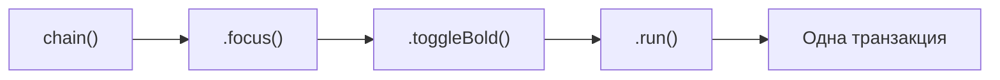

# Commands и chaining

## Три способа вызвать команду

В Tiptap есть три равнозначных синтаксиса для выполнения одной и той же команды:

```tsx
// 1. Одиночная команда
editor.commands.toggleBold()

// 2. Цепочка (chain) — несколько команд одной транзакцией
editor.chain().focus().toggleBold().run()

// 3. Проверка без выполнения
editor.can().toggleBold() // true/false, ничего не меняет
```

📌 `editor.commands.toggleBold()` тоже возвращает `boolean` (успешно ли применилась команда) и сразу выполняет её — в отличие от `chain()`, где команды _накапливаются_, а реально применяются только после `.run()`.

## Зачем нужен chain()

Главная причина использовать `chain()` вместо отдельных вызовов — **одна транзакция вместо нескольких**. Если сделать так:

```tsx
// ❌ Две отдельные транзакции — два события onUpdate, два шага истории undo
editor.commands.focus()
editor.commands.toggleBold()
```

То получится два отдельных изменения состояния (два шага в истории undo, два срабатывания `onUpdate`). А через `chain()`:

```tsx
// ✅ Одна транзакция — один шаг истории, один onUpdate
editor.chain().focus().toggleBold().run()
```



Команды в цепочке **накапливаются**, а не выполняются немедленно — реальное применение происходит только при вызове `.run()` в конце. Если не вызвать `.run()`, цепочка не окажет никакого эффекта.

## can(): проверка без побочных эффектов

`editor.can()` возвращает объект с теми же методами команд, что и обычный `editor`, но вызов любой команды через `can()` **не изменяет документ** — только проверяет, была бы она успешной:

```tsx
editor.can().toggleBold() // true, если можно применить bold сейчас
editor.can().undo() // true, если есть, что отменять
editor.can().chain().focus().toggleBold().run() // можно даже проверять целую цепочку
```

Это идеально подходит для управления `disabled` состоянием кнопок тулбара:

```tsx
<button
  disabled={!editor.can().chain().focus().toggleBold().run()}
  onClick={() => editor.chain().focus().toggleBold().run()}
>
  Bold
</button>
```

📌 Обратите внимание: `editor.can().chain()....run()` в контексте `can()` не выполняет транзакцию по-настоящему — `run()` внутри `can()`-цепочки означает "проверить, была бы вся цепочка выполнима", а не "выполнить".

## Возвращаемое значение run()

`.run()` возвращает `boolean` — успешно ли применилась цепочка команд. Некоторые команды могут "проваливаться" (например, `toggleBold()` в позиции, где marks запрещены схемой) — в этом случае `run()` вернёт `false`, и документ не изменится:

```tsx
const applied = editor.chain().focus().toggleBold().run()
if (!applied) {
  console.warn('Не удалось применить форматирование')
}
```

## Своя простая команда через chain

Не любая логика форматирования требует полноценного кастомного extension (об этом — на уровне 8). Иногда достаточно **скомбинировать существующие команды** в цепочку внутри обычной JS/TS функции:

```tsx
function clearFormatting(editor: Editor) {
  editor.chain().focus().unsetAllMarks().clearNodes().run()
}
```

`unsetAllMarks()` снимает все marks с выделения, `clearNodes()` превращает все блоки в обычные параграфы — вместе это "команда очистки форматирования", хотя формально это не новый extension, а просто функция, комбинирующая встроенные команды.

## ⚠️ Частые ошибки новичков

**Ошибка 1: забыть вызвать .run() в конце цепочки**

```tsx
// ❌ Плохо — ничего не произойдёт, цепочка просто "накоплена" и отброшена
editor.chain().focus().toggleBold()
```

```tsx
// ✅ Хорошо
editor.chain().focus().toggleBold().run()
```

**Ошибка 2: несколько отдельных вызовов commands вместо одной цепочки**

```tsx
// ❌ Плохо — 3 отдельные транзакции подряд
editor.commands.focus()
editor.commands.toggleBold()
editor.commands.toggleItalic()
```

```tsx
// ✅ Хорошо — одна транзакция
editor.chain().focus().toggleBold().toggleItalic().run()
```

**Ошибка 3: считать, что can() сам вызывает команду**

```tsx
// ❌ Плохо — это не применит bold, только проверит! Автор ожидал применения
editor.can().toggleBold()
```

```tsx
// ✅ Хорошо — сначала проверка, потом (если нужно) реальный вызов
if (editor.can().toggleBold()) {
  editor.chain().focus().toggleBold().run()
}
```

## 💡 Best practices

- Всегда используйте `chain()` при более чем одной команде подряд — это уменьшает количество транзакций и шагов истории
- Используйте `can()` для управления `disabled`-состоянием интерактивных элементов, а не пытайтесь вручную предсказывать доступность команды
- Не забывайте `.focus()` первым звеном цепочки в обработчиках кликов на кнопках тулбара
- Оборачивайте часто повторяющиеся комбинации команд (например, "очистить форматирование") в обычные вспомогательные функции, принимающие `editor`
