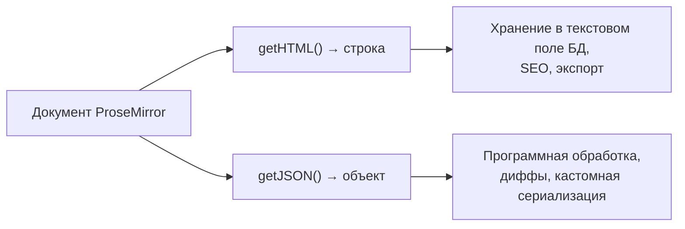
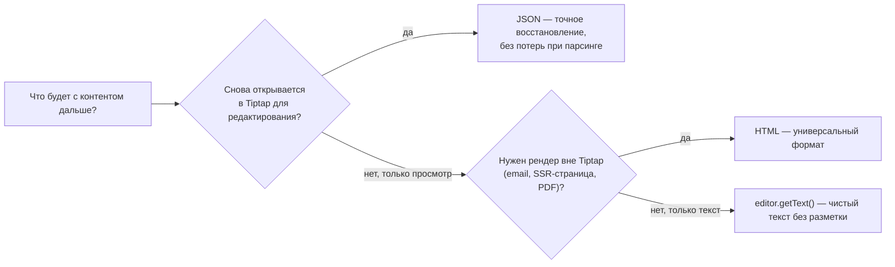
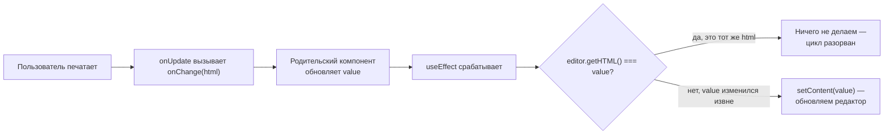

# Работа с контентом

## HTML vs JSON: два представления одного дерева

Мы уже пользовались `getHTML()` и `getJSON()` на уровне 1. Теперь разберём, когда какое представление выбирать.



**HTML** — универсальный, человекочитаемый, легко хранится как текст, легко превью без Tiptap (просто вставить в `dangerouslySetInnerHTML`). Минус: парсинг HTML обратно в схему ProseMirror не всегда однозначен — сложные вложенные структуры, нестандартные атрибуты могут "не долететь" точно.

**JSON** — точное, однозначное представление дерева документа: `{ type: 'doc', content: [...] }`. Каждый узел, каждый атрибут, каждый mark — явные поля объекта. Минус: менее читаемо человеком, требует Tiptap/ProseMirror для рендера обратно.

📌 Если контент нужно **хранить и потом снова редактировать** в Tiptap — предпочитайте JSON: он гарантированно восстановит документ 1-в-1. Если нужно **отобразить контент вне Tiptap** (например, в email-рассылке или на статической странице) — используйте HTML.

### Decision-диаграмма: что выбрать для хранения



### Почему парсинг HTML "не всегда однозначен"

Разберём на конкретном примере, почему round-trip через HTML не гарантирует идентичность. Допустим, у вас есть кастомная нода с несколькими атрибутами, и вы описали для неё `parseHTML()` с несколькими правилами совпадения (например, распознаёт и `<div data-callout>`, и старый формат `<aside class="callout">`) — это стандартная практика для обратной совместимости со старым контентом. При сериализации через `renderHTML()` получится только **один** из этих форматов (тот, что вы явно указали как выходной). Если затем этот HTML снова распарсить, а потом снова сериализовать — результат будет идентичен второму проходу, но не обязательно первому "историческому" варианту HTML, если он использовал устаревший формат. Для JSON такой проблемы нет в принципе — сериализация и десериализация JSON-дерева ProseMirror математически симметричны: `JSON.parse(JSON.stringify(doc.toJSON()))` восстанавливает структуру побитово точно, потому что нет промежуточного "человекочитаемого" слоя со своей неоднозначностью.

## setContent: программная замена содержимого

Чтобы заменить содержимое уже созданного редактора (а не только при инициализации через `content`), используется команда:

```tsx
editor.commands.setContent('<p>Новый контент</p>')
editor.commands.setContent({ type: 'doc', content: [...] }) // тоже работает с JSON
```

По умолчанию `setContent` не создаёт новую запись в истории undo (это можно настроить). В Tiptap v3 сигнатура принимает объект опций:

```tsx
editor.commands.setContent(html, {
  emitUpdate: true, // вызвать ли onUpdate после установки
})
```

### Что физически происходит при setContent

`setContent` — не "мягкое" изменение части документа, а буквально **замена всего дерева целиком**: старое содержимое отбрасывается, новое парсится с нуля (если это HTML) и вставляется на место всего документа одной транзакцией. Это важно понимать для последствий:

- Позиция курсора **сбрасывается** — ProseMirror не может "угадать", куда переместить курсор в совершенно новом дереве
- Все decorations, привязанные к конкретным позициям (например, подсветка поиска, уровень 15), нужно пересчитать заново после `setContent`
- Для больших документов операция относительно дорогая — весь HTML/JSON парсится и валидируется по схеме заново

Именно поэтому `setContent` не стоит вызывать "на каждый чих" — для точечных изменений содержимого (добавить абзац, вставить блок) гораздо эффективнее и UX-дружелюбнее `insertContent`/`insertContentAt`, которые модифицируют только затронутую часть дерева, сохраняя позицию курсора везде, где это возможно.

## insertContent: вставка в текущую позицию курсора

В отличие от `setContent` (полная замена всего документа), `insertContent` добавляет фрагмент в текущую позицию курсора, не трогая остальной документ:

```tsx
editor.chain().focus().insertContent('<p>Добавленный текст</p>').run()
editor.chain().focus().insertContentAt(5, '<p>Текст на позиции 5</p>').run() // на конкретную позицию
```

📌 В Tiptap v3 `insertContent` не разбивает окружающий текстовый узел без необходимости — старое поведение v2, когда вставка могла "разрубить" узел, было изменено, чтобы избежать неожиданных разрывов текста.

## Контролируемый контент: синхронизация с React state

Иногда редактор должен быть частью управляемой (`controlled`) React-формы — то есть значение редактора должно определяться внешним `state`, а изменения — сообщаться наружу через `onChange`.

```tsx
function ControlledEditor({
  value,
  onChange,
}: {
  value: string
  onChange: (html: string) => void
}) {
  const editor = useEditor({
    extensions: [StarterKit],
    content: value,
    onUpdate: ({ editor }) => onChange(editor.getHTML()),
  })

  // Синхронизация "снаружи внутрь": если value поменялся извне (не из-за ввода
  // пользователя в этом же редакторе), обновляем контент редактора
  useEffect(() => {
    if (!editor) return
    const isSame = editor.getHTML() === value
    if (!isSame) {
      editor.commands.setContent(value, { emitUpdate: false })
    }
  }, [value, editor])

  return <EditorContent editor={editor} />
}
```

⚠️ Здесь ключевая тонкость: если синхронизировать `value → editor` без проверки `isSame`, при каждом вводе пользователя (`onUpdate` → `onChange` → новый `value` → `useEffect` → `setContent`) редактор будет **пересоздавать содержимое на каждый символ**, что сбрасывает позицию курсора и делает ввод невозможным. Проверка `editor.getHTML() === value` разрывает этот цикл: обновление, которое пришло _из самого редактора_, не приводит к повторной установке того же контента.

### Диаграмма цикла "controlled editor" и где он рвётся



Именно шаг `E` — сердце всей схемы контролируемого редактора. Без него каждый круг диаграммы возвращался бы к `setContent`, вызывая новый `onUpdate` (если не передать `emitUpdate: false`) или как минимум сбрасывая курсор при каждом нажатии клавиши.

### Почему это сложнее, чем просто `<input value={value} onChange={...} />`

Обычный `<input>` — управляемый компонент "из коробки", потому что браузер полностью прозрачен для React: React каждый раз перерисовывает `value` атрибута, и это дёшево и безопасно, DOM `<input>` не имеет собственного сложного внутреннего состояния помимо текста и позиции курсора. Tiptap — принципиально другое: `Editor` — это тяжёлый, стейтфул объект с собственным деревом, историей undo, плагинами, decorations. "Просто перерисовать value" эквивалентно `setContent` — операции, которая теряет курсор, историю и производительно дорога. Поэтому Tiptap **намеренно не делает** редактор автоматически controlled — вы либо используете его в uncontrolled-режиме (полагаясь на `onUpdate` только для чтения, без обратной синхронизации), либо реализуете controlled-паттерн вручную с осторожной проверкой "источника" изменения, как показано выше.

## ⚠️ Частые ошибки новичков

**Ошибка 1: обновлять content-проп useEditor напрямую, ожидая реактивности**

```tsx
// ❌ Плохо — content используется только при инициализации, повторные рендеры
// с новым content не обновят уже существующий редактор
useEditor({ extensions: [StarterKit], content: value })
```

```tsx
// ✅ Хорошо — используйте setContent в useEffect для программного обновления
useEffect(() => {
  editor?.commands.setContent(value)
}, [value])
```

**Ошибка 2: бесконечный цикл setContent при контролируемом редакторе**

Описано выше — обязательно проверяйте, действительно ли текущее содержимое отличается от нового `value`, прежде чем вызывать `setContent`.

**Ошибка 3: использовать insertContent вместо setContent для "сброса" документа**

```tsx
// ❌ Плохо — добавит текст поверх существующего, а не заменит документ
editor.chain().focus().insertContent('<p>Новый документ</p>').run()
```

```tsx
// ✅ Хорошо — полная замена содержимого
editor.commands.setContent('<p>Новый документ</p>')
```

**Ошибка 4: сравнивать HTML-строки для контролируемого редактора без учёта нормализации**

```tsx
// ⚠️ Осторожно — editor.getHTML() может слегка отличаться от исходного value
// (например, self-closing теги, порядок атрибутов), даже если "по смыслу" это то же самое
const isSame = editor.getHTML() === value
```

На практике для большинства сценариев такое сравнение работает, потому что `getHTML()` детерминирован для одного и того же дерева. Но если `value` приходит из внешнего источника, который сериализует HTML иначе, чем ProseMirror (например, другой редактор или сервер с собственной нормализацией), сравнение строк может ложно решить, что "значения разные", и вызвать лишний `setContent` со сбросом курсора. Для таких случаев надёжнее сравнивать `getJSON()` со заранее распарсенным JSON, а не сырые строки HTML.

**Ошибка 5: забывать про emitUpdate при программных обновлениях**

```tsx
// ❌ Плохо — программное обновление снова вызовет onUpdate → onChange →
// потенциально новый цикл рендеров родителя
editor.commands.setContent(value)
```

```tsx
// ✅ Хорошо — явно указываем, что это программное обновление, не от пользователя
editor.commands.setContent(value, { emitUpdate: false })
```

## 💡 Best practices

- Храните "источник правды" данных в JSON, если планируете снова редактировать их в Tiptap — это избавляет от неоднозначностей парсинга HTML
- Для контролируемого редактора всегда защищайтесь от циклов через сравнение текущего и нового значения перед `setContent`
- Используйте `insertContent`/`insertContentAt` для точечных вставок (шаблоны, сниппеты, вставка изображения по клику), а `setContent` — только для полной замены документа
- Передавайте `{ emitUpdate: false }` в `setContent`, когда обновление контента программное (не от пользователя) и не должно порождать новый цикл `onUpdate`
- Для сравнения "изменилось ли содержимое реально" в сложных сценариях (внешний источник данных с иной сериализацией) сравнивайте `getJSON()`, а не сырые HTML-строки
- Избегайте частых вызовов `setContent` на больших документах — это ощутимо дороже точечных `insertContent`/`insertContentAt`
