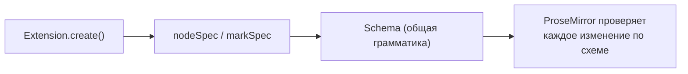
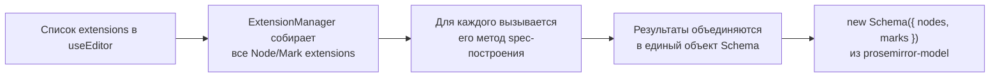
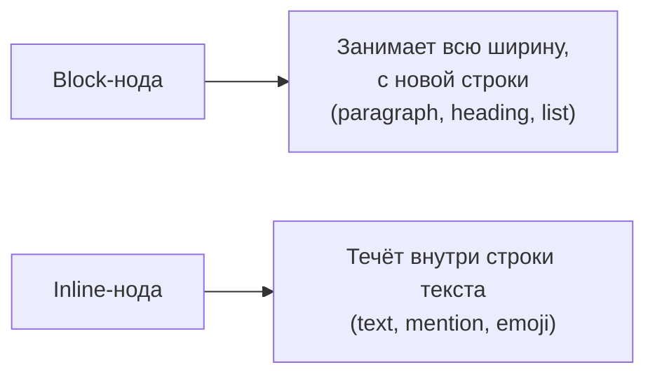

# Schema ProseMirror

## Что такое schema

**Schema** — это "грамматика" документа: формальное описание того, какие узлы и marks существуют, что может быть внутри чего, какие атрибуты допустимы. Каждый extension при регистрации добавляет свой кусочек в общую схему редактора.



Схема — не просто описание для документации, это **активно проверяемое ограничение**: ProseMirror не позволит вставить, например, параграф прямо внутрь другого параграфа или текстовый узел напрямую в `doc`, минуя блочный узел — если это не разрешено content-выражением.

### Аналогия: schema как схема базы данных

Полезно провести параллель с реляционной БД. Таблица в PostgreSQL описывает: какие колонки существуют, какого они типа, какие constraints действуют (`NOT NULL`, `FOREIGN KEY`, `CHECK`). Попытка вставить строку, нарушающую constraint, отклоняется на уровне СУБД, а не "как получится". Schema ProseMirror работает точно так же, но для дерева документа: она описывает "таблицы" (типы узлов), их "колонки" (атрибуты), и "constraints" (content-выражения, group, marks) — и любая транзакция, нарушающая эти правила, просто не может быть применена. Это принципиальное архитектурное решение: без строгой схемы документ мог бы легко оказаться в невалидном, непредсказуемом состоянии после серии программных манипуляций, что особенно опасно при совместном редактировании (уровень 14), где документ модифицируется сразу несколькими независимыми участниками.

## nodeSpec: описание узла

Каждый Node extension в итоге превращается в `nodeSpec` — объект вида:

```ts
{
  content: 'inline*',       // что может быть внутри
  group: 'block',           // к какой группе принадлежит узел
  attrs: { level: { default: 1 } }, // атрибуты
  parseHTML: () => [{ tag: 'p' }],  // как распознать при импорте HTML
  toDOM: (node) => ['p', 0],        // как отрендерить в DOM
}
```

Получить nodeSpec любой уже зарегистрированной ноды можно через схему редактора:

```tsx
editor.schema.nodes.paragraph.spec // { content: 'inline*', group: 'block', ... }
editor.schema.nodes.heading.spec
```

### Как Tiptap строит схему из ваших extensions

Полезно понимать порядок сборки схемы, чтобы отлаживать конфликты между extensions:



Именно на шаге D возникают конфликты имён (уровень 2, ошибка "два extension с одинаковым name") — `Schema` из `prosemirror-model` требует уникальных имён узлов и marks, поэтому Tiptap выбрасывает явную ошибку ещё до того, как редактор попытается что-либо отрендерить, если обнаруживает дублирование.

## content: правила вложенности

Поле `content` описывает, что может находиться внутри узла, в виде **выражения**, похожего на регулярное выражение:

| Выражение            | Значение                                                      |
| --------------------- | -------------------------------------------------------------- |
| `'inline*'`           | Ноль или более инлайн-узлов (текст, изображения)               |
| `'block+'`            | Один или более блочных узлов                                   |
| `'paragraph block*'`  | Ровно один параграф, затем ноль или более любых блочных узлов  |
| `'(paragraph\|heading)+'` | Один или более параграфов или заголовков подряд             |

Например, у `doc` (корневого узла) обычно `content: 'block+'` — документ состоит из одного или более блочных элементов. У `paragraph` — `content: 'inline*'` — параграф содержит инлайн-контент (текст, marks), но не может содержать другой параграф внутри себя.

### Разбор синтаксиса content-выражений по частям

Стоит относиться к content-выражению именно как к мини-регулярному-языку над "алфавитом" из имён узлов/групп:

- `x` — ровно один узел типа/группы `x`
- `x*` — ноль или более `x` подряд
- `x+` — один или более `x` подряд
- `x?` — ноль или один `x`
- `x y` — сначала ровно `x`, затем ровно `y` (конкатенация, порядок важен!)
- `(x | y)` — либо `x`, либо `y` — группировка через скобки для приоритета
- `x{2,4}` — от 2 до 4 повторений `x` подряд

Например, выражение `'heading paragraph+'` означает: документ этого типа обязан начинаться **ровно с одного** заголовка, за которым следует **один или более** параграфов — и ничего больше. Это может пригодиться, скажем, для схемы "структурированной статьи", где первый блок обязан быть заголовком.

## group: группировка узлов

`group` позволяет ссылаться на _набор_ узлов одним именем в content-выражениях других нод, а не перечислять их поимённо:

```ts
// heading использует группу 'block', а не перечисляет paragraph|heading|bulletList|...
{
  group: 'block'
}

// doc позволяет любой узел из группы block
{
  content: 'block+'
}
```

Стандартные группы в Tiptap: `block` (параграфы, заголовки, списки, цитаты — блочные элементы) и `inline` (текст и другие инлайн-узлы вроде упоминаний). Своя нода может присоединиться к существующей группе, просто указав `group: 'block'`, и сразу окажется разрешена везде, где ожидается `block`.

### Узел может принадлежать нескольким группам одновременно

`group` — это строка с именами групп через пробел, а не единственное значение:

```ts
{
  group: 'block special', // одновременно и 'block', и своя кастомная группа 'special'
}
```

Это открывает мощный паттерн: если вы хотите разрешить какую-то ноду только в определённых, более узких контекстах (например, "callout можно вставить только внутри секции документа, но не внутри таблицы"), вы можете создать собственную группу `sectionContent` и использовать её вместо общей `block` в content-выражении секции — не трогая при этом глобальную группу `block`, от которой могут зависеть другие части схемы.

## inline vs block: фундаментальное различие



- **block** узлы образуют "вертикальную" структуру документа — один за другим сверху вниз
- **inline** узлы существуют только внутри блочных узлов, "текут" горизонтально внутри строки, как обычный текст

Указывается через `group: 'block'` или `group: 'inline'`, а также через флаг `inline: true` у самой ноды.

## marks: где разрешены

У блочных узлов есть поле `marks`, определяющее, какие marks разрешены внутри их инлайн-контента:

```ts
{
  content: 'inline*',
  marks: 'bold italic', // разрешены только bold и italic внутри этого узла
  // marks: '',           // marks запрещены полностью
  // marks не указан       // разрешены все зарегистрированные marks (по умолчанию)
}
```

Это используется, например, чтобы запретить форматирование текста внутри блока кода — `CodeBlock` обычно имеет `marks: ''`, поэтому bold/italic физически не могут быть применены внутри него.

## ⚠️ Частые ошибки новичков

**Ошибка 1: путать content-выражение с обычным списком разрешённых типов**

```ts
// ❌ Неверное понимание: "или" здесь не значит "любой из них в любом порядке"
content: 'paragraph heading' // это значит: РОВНО параграф, а ПОТОМ ровно заголовок — и всё
```

```ts
// ✅ Для "ноль или более любых из группы" используйте group + квантификатор
content: 'block+' // один или более узлов из группы block, в любом порядке
```

**Ошибка 2: забыть про группу при создании кастомной ноды, из-за чего её нельзя вставить туда, где ожидается 'block'**

Если кастомная block-нода не помечена `group: 'block'`, её нельзя будет вставить в документ, чей `content: 'block+'` — попытка окончится тихим отказом команды (см. уровень 5, `can()`).

**Ошибка 3: разрешать marks там, где семантически они не нужны**

Например, если не указать `marks: ''` для блока кода, пользователь сможет случайно применить bold внутри программного кода — а моноширинный шрифт с жирными фрагментами обычно не то, что ожидается от блока кода.

**Ошибка 4: проектировать слишком жёсткое content-выражение "с запасом"**

```ts
// ❌ Слишком жёстко: РОВНО один заголовок и РОВНО один параграф — и всё,
// нельзя добавить список, картинку или второй параграф
content: 'heading paragraph'
```

```ts
// ✅ Обычно достаточно гибче: заголовок обязателен, дальше — что угодно из block
content: 'heading block*'
```

Излишне строгая схема быстро становится источником "необъяснимых" отказов команд для пользователей — они пытаются добавить обычный список после заголовка и натыкаются на то, что вставка просто не срабатывает без внятной ошибки в UI (если явно не показывать причину).

**Ошибка 5: не глядя на существующую схему, изобретать параллельные структуры**

Прежде чем создавать свой `group: 'myBlocks'`, стоит проверить `editor.schema.nodes` — возможно, нужная группировка (`block`, `inline`, `listItem`) уже существует, и создание параллельной, дублирующей группы только усложнит совместимость с уже написанными extensions (например, с `Gapcursor`, который ориентируется на стандартные группы).

## 💡 Best practices

- Изучайте существующую схему через `editor.schema.nodes`/`editor.schema.marks` перед проектированием своих нод — велик шанс, что похожая структура уже есть
- Явно указывайте `group` для кастомных нод, чтобы они корректно встраивались в существующие content-выражения
- Ограничивайте `marks` там, где форматирование семантически неуместно (код, футноты с фиксированным стилем)
- Думайте о content-выражении как о грамматике, а не просто списке "что разрешено" — порядок и квантификаторы (`*`, `+`, `?`) имеют значение
- Проектируйте content-выражения с запасом гибкости (`block*` вместо перечисления конкретных типов), если нет строгой бизнес-причины ограничивать структуру жёстче
- Используйте собственные, узкоспециализированные группы (`group: 'sectionContent'`) вместо расширения общих `block`/`inline`, когда правило действительно локально для одной части документа
