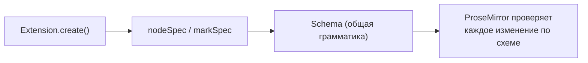
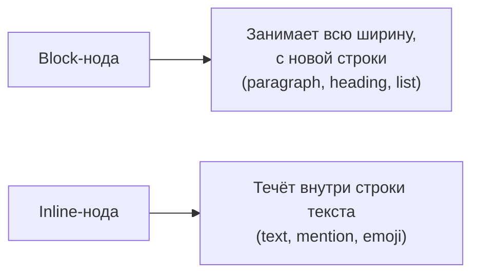

# Schema ProseMirror

## Что такое schema

**Schema** — это "грамматика" документа: формальное описание того, какие узлы и marks существуют, что может быть внутри чего, какие атрибуты допустимы. Каждый extension при регистрации добавляет свой кусочек в общую схему редактора.



Схема — не просто описание для документации, это **активно проверяемое ограничение**: ProseMirror не позволит вставить, например, параграф прямо внутрь другого параграфа или текстовый узел напрямую в `doc`, минуя блочный узел — если это не разрешено content-выражением.

## nodeSpec: описание узла

Каждый Node extension в итоге превращается в `nodeSpec` — объект вида:

```ts
{
  content: 'inline*',       // что может быть внутри
  group: 'block',           // к какой группе принадлежит узел
  attrs: { level: { default: 1 } }, // атрибуты
  parseHTML: () => [{ tag: 'p' }],  // как распознать при импорте HTML
  toDOM: (node) => ['p', 0],        // как отрендерить в DOM
}
```

Получить nodeSpec любой уже зарегистрированной ноды можно через схему редактора:

```tsx
editor.schema.nodes.paragraph.spec // { content: 'inline*', group: 'block', ... }
editor.schema.nodes.heading.spec
```

## content: правила вложенности

Поле `content` описывает, что может находиться внутри узла, в виде **выражения**, похожего на регулярное выражение:

| Выражение            | Значение                                                      |
| -------------------- | ------------------------------------------------------------- | ----------------------------------------------- |
| `'inline*'`          | Ноль или более инлайн-узлов (текст, изображения)              |
| `'block+'`           | Один или более блочных узлов                                  |
| `'paragraph block*'` | Ровно один параграф, затем ноль или более любых блочных узлов |
| `'(paragraph         | heading)+'`                                                   | Один или более параграфов или заголовков подряд |

Например, у `doc` (корневого узла) обычно `content: 'block+'` — документ состоит из одного или более блочных элементов. У `paragraph` — `content: 'inline*'` — параграф содержит инлайн-контент (текст, marks), но не может содержать другой параграф внутри себя.

## group: группировка узлов

`group` позволяет ссылаться на _набор_ узлов одним именем в content-выражениях других нод, а не перечислять их поимённо:

```ts
// heading использует группу 'block', а не перечисляет paragraph|heading|bulletList|...
{
  group: 'block'
}

// doc позволяет любой узел из группы block
{
  content: 'block+'
}
```

Стандартные группы в Tiptap: `block` (параграфы, заголовки, списки, цитаты — блочные элементы) и `inline` (текст и другие инлайн-узлы вроде упоминаний). Своя нода может присоединиться к существующей группе, просто указав `group: 'block'`, и сразу окажется разрешена везде, где ожидается `block`.

## inline vs block: фундаментальное различие



- **block** узлы образуют "вертикальную" структуру документа — один за другим сверху вниз
- **inline** узлы существуют только внутри блочных узлов, "текут" горизонтально внутри строки, как обычный текст

Указывается через `group: 'block'` или `group: 'inline'`, а также через флаг `inline: true` у самой ноды.

## marks: где разрешены

У блочных узлов есть поле `marks`, определяющее, какие marks разрешены внутри их инлайн-контента:

```ts
{
  content: 'inline*',
  marks: 'bold italic', // разрешены только bold и italic внутри этого узла
  // marks: '',           // marks запрещены полностью
  // marks не указан       // разрешены все зарегистрированные marks (по умолчанию)
}
```

Это используется, например, чтобы запретить форматирование текста внутри блока кода — `CodeBlock` обычно имеет `marks: ''`, поэтому bold/italic физически не могут быть применены внутри него.

## ⚠️ Частые ошибки новичков

**Ошибка 1: путать content-выражение с обычным списком разрешённых типов**

```ts
// ❌ Неверное понимание: "или" здесь не значит "любой из них в любом порядке"
content: 'paragraph heading' // это значит: РОВНО параграф, а ПОТОМ ровно заголовок — и всё
```

```ts
// ✅ Для "ноль или более любых из группы" используйте group + квантификатор
content: 'block+' // один или более узлов из группы block, в любом порядке
```

**Ошибка 2: забыть про группу при создании кастомной ноды, из-за чего её нельзя вставить туда, где ожидается 'block'**

Если кастомная block-нода не помечена `group: 'block'`, её нельзя будет вставить в документ, чей `content: 'block+'` — попытка окончится тихим отказом команды (см. уровень 5, `can()`).

**Ошибка 3: разрешать marks там, где семантически они не нужны**

Например, если не указать `marks: ''` для блока кода, пользователь сможет случайно применить bold внутри программного кода — а моноширинный шрифт с жирными фрагментами обычно не то, что ожидается от блока кода.

## 💡 Best practices

- Изучайте существующую схему через `editor.schema.nodes`/`editor.schema.marks` перед проектированием своих нод — velike шанс, что похожая структура уже есть
- Явно указывайте `group` для кастомных нод, чтобы они корректно встраивались в существующие content-выражения
- Ограничивайте `marks` там, где форматирование семантически неуместно (код, футноты с фиксированным стилем)
- Думайте о content-выражении как о грамматике, а не просто списке "что разрешено" — порядок и квантификаторы (`*`, `+`, `?`) имеют значение
