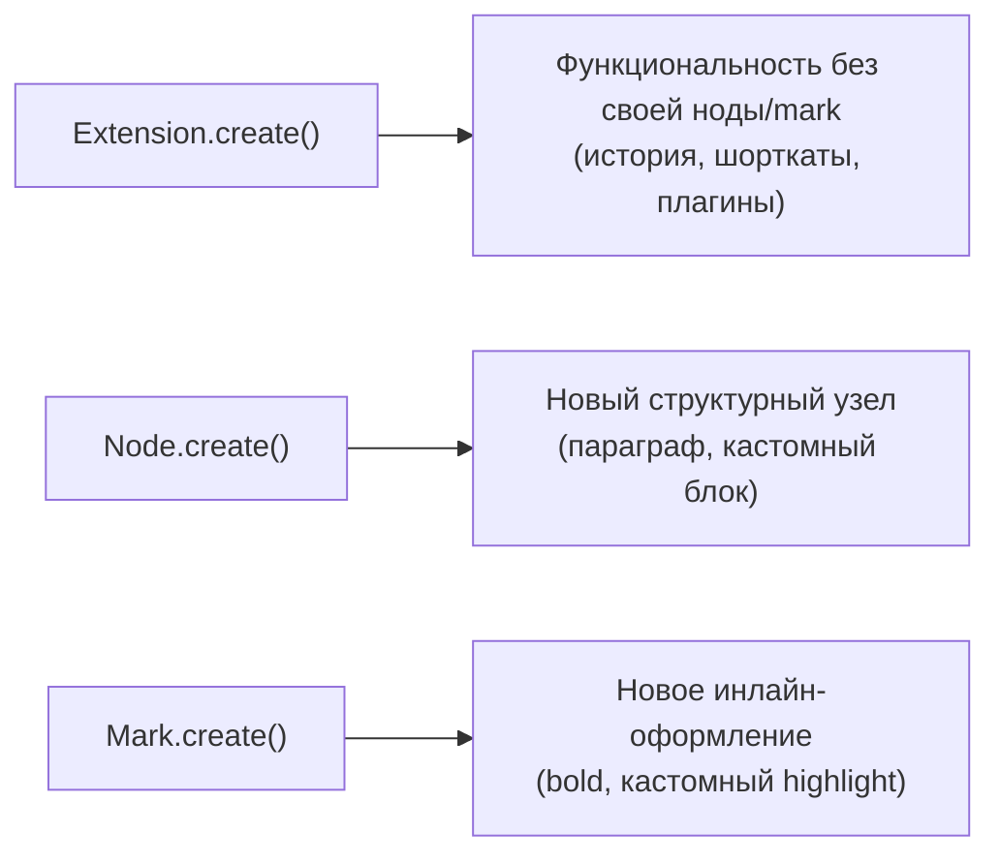

# Кастомные Extensions

## Три типа extensions

Всё в Tiptap — extension. Их три базовых типа-конструктора:



На этом уровне разберём именно `Extension.create()` — "чистую функциональность" без собственного узла в схеме документа. `Node.create()`/`Mark.create()` — на следующем уровне.

### Три конструктора — один общий фундамент

Важно понимать: `Extension`, `Node` и `Mark` — не три независимые системы, а три специализации **одного и того же** базового механизма. Все они реализуют общий набор "точек расширения" (`addOptions`, `addStorage`, `addCommands`, `addKeyboardShortcuts`, `addProseMirrorPlugins`, `addInputRules`, колбэки жизненного цикла). Разница лишь в том, что `Node` и `Mark` **обязаны** дополнительно предоставить описание своей записи в схеме (`nodeSpec`/`markSpec` — `group`, `content`, `parseHTML`, `renderHTML`), а `Extension` — нет, потому что не добавляет собственного узла/mark в схему документа. Если провести аналогию с ООП, `Extension` — это как абстрактный класс с общей функциональностью, а `Node`/`Mark` — его "потомки", добавляющие обязательные поля.

## Extension.create(): минимальный пример

```tsx
import { Extension } from '@tiptap/core'

const MyExtension = Extension.create({
  name: 'myExtension', // уникальное имя — обязательно

  addOptions() {
    return {
      someOption: 'default value',
    }
  },
})
```

`name` обязателен и должен быть уникальным среди всех extensions в редакторе — по нему Tiptap идентифицирует extension внутри `extensionManager`.

## addOptions(): настраиваемые параметры

`addOptions()` определяет параметры, доступные через `.configure({...})` снаружи — точно так же, как мы конфигурировали `StarterKit` на уровне 2:

```tsx
interface FontSizeOptions {
  defaultSize: string
  types: string[]
}

const FontSize = Extension.create<FontSizeOptions>({
  name: 'fontSize',

  addOptions() {
    return {
      defaultSize: '16px',
      types: ['textStyle'],
    }
  },
})

// Снаружи:
useEditor({
  extensions: [FontSize.configure({ defaultSize: '18px' })],
})
```

Внутри самого extension текущие опции доступны через `this.options`:

```tsx
addGlobalAttributes() {
  console.log(this.options.defaultSize) // '18px', если сконфигурировано
}
```

### Дженерик Extension.create<Options, Storage>: что означают оба параметра

Обратите внимание на `Extension.create<FontSizeOptions>({...})` — это дженерик-параметр, дающий TypeScript типизацию для `this.options` внутри всех методов extension и для аргумента `.configure()` снаружи. У `Extension.create` (как и у `Node.create`/`Mark.create`) на самом деле **два** типовых параметра:

```tsx
Extension.create<MyOptions, MyStorage>({...})
```

Первый (`MyOptions`) типизирует `addOptions()`/`this.options`/аргумент `.configure()`. Второй, опциональный (`MyStorage`), типизирует `addStorage()`/`this.storage` — увидим его ниже. Если storage не нужен, второй параметр можно опустить — TypeScript выведет его как `Record<string, never>` по умолчанию.

## addStorage(): изменяемое состояние extension

В отличие от `options` (статичная конфигурация, задаётся один раз при подключении), `storage` — это **изменяемое состояние**, которое extension может обновлять во время работы (например, счётчики, кэш):

```tsx
interface WordCountStorage {
  words: number
}

const WordCount = Extension.create<Record<string, never>, WordCountStorage>({
  name: 'wordCount',

  addStorage() {
    return {
      words: 0,
    }
  },

  onUpdate() {
    const text = this.editor.getText()
    this.storage.words = text.split(/\s+/).filter(Boolean).length
  },
})
```

Снаружи `storage` читается через `editor.storage.<name>`:

```tsx
editor.storage.wordCount.words // актуальное число слов
```

📌 `storage` — обычный JS-объект, доступный и изменяемый в любой момент. Это НЕ реактивное состояние React — чтобы React перерендерился при его изменении, всё равно нужен привычный паттерн `onUpdate` + `useState` (уровень 1), где вы просто читаете `editor.storage...` внутри колбэка.

📌 Чтобы TypeScript знал о существовании `editor.storage.wordCount` (а не жаловался на отсутствие такого свойства), нужна декларация расширения модуля — этот же приём использует сам Tiptap для встроенных extensions вроде `CharacterCount`:

```ts
declare module '@tiptap/core' {
  interface Storage {
    wordCount: WordCountStorage
  }
}
```

Без такой декларации доступ к `editor.storage.wordCount` потребует приведения типа (`as WordCountStorage`), чего стоит избегать.

### Аналогия: options — это конфиг сервиса, storage — его runtime-состояние

Полезная параллель для тех, кто пишет бэкенд: `options` — это как переменные окружения (`.env`) сервиса: заданы один раз при старте, определяют поведение, редко меняются на лету. `storage` — это как in-memory кэш или счётчики того же сервиса: живут пока сервис работает, постоянно мутируют в ответ на входящие запросы. Смешивать их — то же самое, что хранить счётчик активных соединений в переменной окружения: технически возможно, но архитектурно неправильно и сбивает с толку следующего разработчика, читающего код.

## addGlobalAttributes(): атрибуты для существующих нод

`addGlobalAttributes()` позволяет добавить новый атрибут сразу нескольким существующим типам узлов, не переопределяя их с нуля:

```tsx
const CustomId = Extension.create({
  name: 'customId',

  addGlobalAttributes() {
    return [
      {
        types: ['paragraph', 'heading'], // к каким нодам добавляем атрибут
        attributes: {
          id: {
            default: null,
            parseHTML: element => element.getAttribute('id'),
            renderHTML: attributes => {
              if (!attributes.id) return {}
              return { id: attributes.id }
            },
          },
        },
      },
    ]
  },
})
```

Это удобно, например, для системы якорных ссылок (каждый заголовок получает свой `id` для навигации `#section-1`) без необходимости расширять (`.extend()`) каждую ноду по отдельности.

### Как это соотносится с прямым .extend() каждой ноды по отдельности

Логичный вопрос: почему не написать просто `Heading.extend({ addAttributes() {...} })` и `Paragraph.extend({ addAttributes() {...} })` отдельно? Технически это тоже сработает, но `addGlobalAttributes` предпочтительнее по нескольким причинам:

1. **Один источник правды** — логика атрибута `id` описана один раз, а не дублируется в каждом `.extend()`
2. **Расширяемость без модификации существующего кода** — если позже понадобится добавить `id` ещё и к `blockquote`, достаточно дописать `'blockquote'` в массив `types`, а не создавать третий `.extend()`
3. **Явная точка входа** — все "кросс-нодовые" атрибуты видны в одном месте (`addGlobalAttributes` вашего extension), а не разбросаны по определениям каждой отдельной ноды

## Жизненный цикл extension

У любого extension (`Extension`, `Node`, `Mark`) доступны хуки жизненного цикла:

- `onCreate()` — когда редактор создан
- `onUpdate()` — на каждое изменение документа
- `onSelectionUpdate()` — на изменение выделения
- `onDestroy()` — при уничтожении редактора (полезно для очистки подписок/таймеров)

Внутри всех этих хуков доступен `this.editor` — ссылка на текущий инстанс редактора.

### Почему onDestroy критичен для extensions с внешними ресурсами

Если ваш extension заводит что-то "снаружи" самого редактора — `setInterval`, `WebSocket`-соединение, подписку на глобальное событие DOM (`window.addEventListener`) — обязательно освобождайте это в `onDestroy()`. Без этого при каждом монтировании/размонтировании React-компонента, использующего `useEditor` (например, редактор в модальном окне, которое открывается многократно), будут накапливаться "осиротевшие" интервалы и обработчики, которые продолжают работать в фоне даже после того, как редактор давно уничтожен — классическая утечка памяти и источник трудноуловимых багов ("почему счётчик тикает даже когда редактора нет на экране?").

```tsx
const AutoSave = Extension.create({
  name: 'autoSave',
  onCreate() {
    this.storage.intervalId = setInterval(() => {
      saveToServer(this.editor.getJSON())
    }, 5000)
  },
  onDestroy() {
    clearInterval(this.storage.intervalId) // обязательная очистка
  },
})
```

## ⚠️ Частые ошибки новичков

**Ошибка 1: путать options и storage**

```tsx
// ❌ Плохо — попытка изменить options во время работы (options — только для чтения)
addOptions() {
  return { count: 0 }
},
onUpdate() {
  this.options.count++ // не предназначено для изменения в рантайме
},
```

```tsx
// ✅ Хорошо — изменяемое состояние живёт в storage
addStorage() {
  return { count: 0 }
},
onUpdate() {
  this.storage.count++
},
```

**Ошибка 2: забыть уникальное имя extension**

```tsx
// ❌ Плохо — конфликт, если уже есть extension с именем 'bold'
Extension.create({ name: 'bold' /* случайно совпало со встроенным */ })
```

```tsx
// ✅ Хорошо — уникальное, специфичное имя
Extension.create({ name: 'myCustomBoldHelper' })
```

**Ошибка 3: ожидать, что изменение storage вызовет перерендер React само по себе**

`editor.storage` — не React state. Чтобы UI обновился при изменении `storage`, нужно синхронизировать значение через `onUpdate` в отдельный `useState`, как и для любого другого производного значения редактора.

**Ошибка 4: не очищать внешние ресурсы (таймеры, подписки) в onDestroy**

Как показано выше — `setInterval`/`addEventListener`/сетевые подписки без парной очистки в `onDestroy()` приводят к утечкам памяти, которые особенно заметны в SPA с часто монтируемыми/размонтируемыми редакторами (модалки, вкладки).

**Ошибка 5: пытаться получить this.editor в addOptions()**

```tsx
// ❌ Плохо — на момент вызова addOptions() редактор ещё не существует
addOptions() {
  return { currentText: this.editor.getText() } // упадёт или вернёт undefined
}
```

```tsx
// ✅ Хорошо — доступ к this.editor только внутри методов жизненного цикла
// (onCreate, onUpdate и т.д.), которые вызываются ПОСЛЕ инициализации editor
onCreate() {
  console.log(this.editor.getText())
}
```

`addOptions()`/`addStorage()` вызываются на этапе **сборки схемы**, до того как `Editor`/`EditorView` полностью инициализированы — обращение к `this.editor` там либо вернёт `undefined`, либо приведёт к ошибке.

## 💡 Best practices

- Используйте `addOptions` для того, что задаётся один раз при подключении и не меняется в процессе работы (пороги, флаги поведения, дефолтные значения)
- Используйте `addStorage` для того, что меняется во время редактирования (счётчики, кэши, промежуточные вычисления)
- Давайте extensions специфичные, не конфликтующие имена (`myApp/wordCount`, а не просто `count`)
- Оборачивайте кросс-нодовую логику атрибутов в `addGlobalAttributes`, а не дублируйте её в каждом `Node.extend()` по отдельности
- Всегда очищайте внешние ресурсы (таймеры, подписки, соединения), заведённые в `onCreate`, в парном `onDestroy`
- Указывайте оба типовых параметра `Extension.create<Options, Storage>`, если extension использует и то, и другое — это даёт полную типобезопасность `this.options`/`this.storage` и внешнего `editor.storage`
