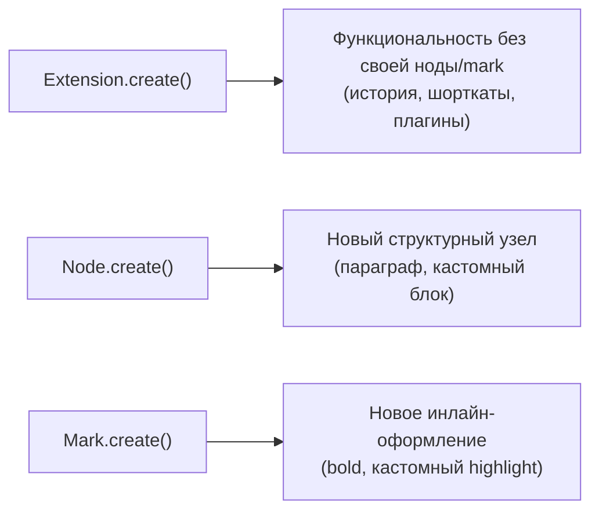

# Кастомные Extensions

## Три типа extensions

Всё в Tiptap — extension. Их три базовых типа-конструктора:



На этом уровне разберём именно `Extension.create()` — "чистую функциональность" без собственного узла в схеме документа. `Node.create()`/`Mark.create()` — на следующем уровне.

## Extension.create(): минимальный пример

```tsx
import { Extension } from '@tiptap/core'

const MyExtension = Extension.create({
  name: 'myExtension', // уникальное имя — обязательно

  addOptions() {
    return {
      someOption: 'default value',
    }
  },
})
```

`name` обязателен и должен быть уникальным среди всех extensions в редакторе — по нему Tiptap идентифицирует extension внутри `extensionManager`.

## addOptions(): настраиваемые параметры

`addOptions()` определяет параметры, доступные через `.configure({...})` снаружи — точно так же, как мы конфигурировали `StarterKit` на уровне 2:

```tsx
interface FontSizeOptions {
  defaultSize: string
  types: string[]
}

const FontSize = Extension.create<FontSizeOptions>({
  name: 'fontSize',

  addOptions() {
    return {
      defaultSize: '16px',
      types: ['textStyle'],
    }
  },
})

// Снаружи:
useEditor({
  extensions: [FontSize.configure({ defaultSize: '18px' })],
})
```

Внутри самого extension текущие опции доступны через `this.options`:

```tsx
addGlobalAttributes() {
  console.log(this.options.defaultSize) // '18px', если сконфигурировано
}
```

## addStorage(): изменяемое состояние extension

В отличие от `options` (статичная конфигурация, задаётся один раз при подключении), `storage` — это **изменяемое состояние**, которое extension может обновлять во время работы (например, счётчики, кэш):

```tsx
interface WordCountStorage {
  words: number
}

const WordCount = Extension.create<Record<string, never>, WordCountStorage>({
  name: 'wordCount',

  addStorage() {
    return {
      words: 0,
    }
  },

  onUpdate() {
    const text = this.editor.getText()
    this.storage.words = text.split(/\s+/).filter(Boolean).length
  },
})
```

Снаружи `storage` читается через `editor.storage.<name>`:

```tsx
editor.storage.wordCount.words // актуальное число слов
```

📌 `storage` — обычный JS-объект, доступный и изменяемый в любой момент. Это НЕ реактивное состояние React — чтобы React перерендерился при его изменении, всё равно нужен привычный паттерн `onUpdate` + `useState` (уровень 1), где вы просто читаете `editor.storage...` внутри колбэка.

📌 Чтобы TypeScript знал о существовании `editor.storage.wordCount` (а не жаловался на отсутствие такого свойства), нужна декларация расширения модуля — этот же приём использует сам Tiptap для встроенных extensions вроде `CharacterCount`:

```ts
declare module '@tiptap/core' {
  interface Storage {
    wordCount: WordCountStorage
  }
}
```

Без такой декларации доступ к `editor.storage.wordCount` потребует приведения типа (`as WordCountStorage`), чего стоит избегать.

## addGlobalAttributes(): атрибуты для существующих нод

`addGlobalAttributes()` позволяет добавить новый атрибут сразу нескольким существующим типам узлов, не переопределяя их с нуля:

```tsx
const CustomId = Extension.create({
  name: 'customId',

  addGlobalAttributes() {
    return [
      {
        types: ['paragraph', 'heading'], // к каким нодам добавляем атрибут
        attributes: {
          id: {
            default: null,
            parseHTML: element => element.getAttribute('id'),
            renderHTML: attributes => {
              if (!attributes.id) return {}
              return { id: attributes.id }
            },
          },
        },
      },
    ]
  },
})
```

Это удобно, например, для системы якорных ссылок (каждый заголовок получает свой `id` для навигации `#section-1`) без необходимости расширять (`.extend()`) каждую ноду по отдельности.

## Жизненный цикл extension

У любого extension (`Extension`, `Node`, `Mark`) доступны хуки жизненного цикла:

- `onCreate()` — когда редактор создан
- `onUpdate()` — на каждое изменение документа
- `onSelectionUpdate()` — на изменение выделения
- `onDestroy()` — при уничтожении редактора (полезно для очистки подписок/таймеров)

Внутри всех этих хуков доступен `this.editor` — ссылка на текущий инстанс редактора.

## ⚠️ Частые ошибки новичков

**Ошибка 1: путать options и storage**

```tsx
// ❌ Плохо — попытка изменить options во время работы (options — только для чтения)
addOptions() {
  return { count: 0 }
},
onUpdate() {
  this.options.count++ // не предназначено для изменения в рантайме
},
```

```tsx
// ✅ Хорошо — изменяемое состояние живёт в storage
addStorage() {
  return { count: 0 }
},
onUpdate() {
  this.storage.count++
},
```

**Ошибка 2: забыть уникальное имя extension**

```tsx
// ❌ Плохо — конфликт, если уже есть extension с именем 'bold'
Extension.create({ name: 'bold' /* случайно совпало со встроенным */ })
```

```tsx
// ✅ Хорошо — уникальное, специфичное имя
Extension.create({ name: 'myCustomBoldHelper' })
```

**Ошибка 3: ожидать, что изменение storage вызовет перерендер React само по себе**

`editor.storage` — не React state. Чтобы UI обновился при изменении `storage`, нужно синхронизировать значение через `onUpdate` в отдельный `useState`, как и для любого другого производного значения редактора.

## 💡 Best practices

- Используйте `addOptions` для того, что задаётся один раз при подключении и не меняется в процессе работы (пороги, флаги поведения, дефолтные значения)
- Используйте `addStorage` для того, что меняется во время редактирования (счётчики, кэши, промежуточные вычисления)
- Давайте extensions специфичные, не конфликтующие имена (`myApp/wordCount`, а не просто `count`)
- Оборачивайте кросс-нодовую логику атрибутов в `addGlobalAttributes`, а не дублируйте её в каждом `Node.extend()` по отдельности
