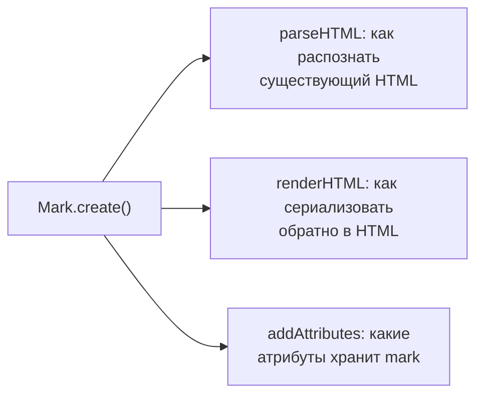

# Кастомные Nodes и Marks

## Node.create и Mark.create: та же анатомия, что и Extension

`Node.create()` и `Mark.create()` устроены очень похоже на `Extension.create()` с прошлого уровня — те же `addOptions`, `addStorage`, `name` — но добавляют дополнительные обязательные для схемы поля: `group`, `content`/`inline`/`marks` (для nodes), и обязательно `parseHTML`/`renderHTML`.



### Import/Export: думайте о ноде как о формате файла с двумя конвертерами

Полезная ментальная модель для `parseHTML`/`renderHTML`: представьте, что вы пишете модуль для конвертации между двумя форматами файлов, как `.docx ↔ .md`. `parseHTML()` — это ваш **импортёр**: "если видишь вот такой кусок чужого HTML — распознай его как эту ноду". `renderHTML()` — это ваш **экспортёр**: "а вот как мою ноду выразить в HTML при сохранении/отображении". Эти две функции не обязаны быть зеркальным отражением друг друга — можно распознавать несколько исторических вариантов HTML при импорте (для обратной совместимости), но всегда экспортировать в один, канонический формат.

## Кастомный Mark: Highlight с цветом

```tsx
import { Mark } from '@tiptap/core'

interface HighlightOptions {
  HTMLAttributes: Record<string, unknown>
}

const Highlight = Mark.create<HighlightOptions>({
  name: 'highlight',

  addOptions() {
    return { HTMLAttributes: {} }
  },

  addAttributes() {
    return {
      color: {
        default: '#fff3a3',
        parseHTML: element => element.getAttribute('data-color'),
        renderHTML: attributes => ({
          'data-color': attributes.color,
          style: `background-color: ${attributes.color}`,
        }),
      },
    }
  },

  parseHTML() {
    return [{ tag: 'mark' }]
  },

  renderHTML({ HTMLAttributes }) {
    return ['mark', HTMLAttributes, 0]
  },

  addCommands() {
    return {
      setHighlight:
        (color?: string) =>
        ({ commands }) =>
          commands.setMark(this.name, { color }),
      unsetHighlight:
        () =>
        ({ commands }) =>
          commands.unsetMark(this.name),
    }
  },
})
```

`parseHTML()` возвращает массив правил распознавания: при импорте HTML (или вставке из буфера обмена) Tiptap ищет совпадающие теги/атрибуты и превращает их в mark. `renderHTML()` возвращает **ProseMirror DOM-спецификацию** — массив вида `[tag, attrs, contentHole]`, где `0` означает "сюда вставляется дочерний контент узла/mark".

### Разбор DOM-спецификации `['mark', HTMLAttributes, 0]` по частям

Этот формат массива — стандарт ProseMirror, называемый "DOM outline"/"toDOM spec", и стоит разобрать его буквально по позициям:

| Позиция | Значение | Пример |
|---|---|---|
| `[0]` | Имя тега, который будет создан | `'mark'`, `'div'`, `'span'` |
| `[1]` | Объект атрибутов тега (необязателен) | `{ 'data-color': '#fff3a3', class: 'x' }` |
| `[2]` | "Дырка" для дочернего контента: число `0` или вложенный массив | `0` — сюда вставится содержимое узла |

Если вместо `0` указать вложенный массив без дырки, например `['mark', {}, ['span', {}, 'fixed text']]` — получится структура с фиксированным текстом внутри и **без** дырки для реального содержимого узла. Это используется редко, обычно для декоративных обёрток вокруг атомарных leaf-узлов, у которых нет собственного изменяемого содержимого (см. `Badge` ниже).

## Кастомный блочный Node: Callout

```tsx
import { Node, mergeAttributes } from '@tiptap/core'

const Callout = Node.create({
  name: 'callout',
  group: 'block',
  content: 'block+', // может содержать другие блочные ноды (параграфы и т.д.)

  addAttributes() {
    return {
      type: {
        default: 'info',
        parseHTML: element => element.getAttribute('data-callout-type'),
        renderHTML: attributes => ({ 'data-callout-type': attributes.type }),
      },
    }
  },

  parseHTML() {
    return [{ tag: 'div[data-callout]' }]
  },

  renderHTML({ HTMLAttributes }) {
    return ['div', mergeAttributes(HTMLAttributes, { 'data-callout': '' }), 0]
  },
})
```

`mergeAttributes` — вспомогательная функция из `@tiptap/core`, аккуратно объединяющая несколько объектов атрибутов (например, пришедшие из `HTMLAttributes` опции и заданные вручную), избегая перезаписи `class` (классы конкатенируются, а не заменяют друг друга).

### Почему parseHTML использует CSS-селектор, а не просто имя тега

Обратите внимание: `parseHTML()` для `Callout` возвращает `{ tag: 'div[data-callout]' }` — это не просто `'div'`, а CSS-селектор с атрибутом. Это принципиально: тег `div` сам по себе слишком общий — в документе будут сотни обычных `div`, которые не должны становиться callout-нодами. Атрибут-маркер (`data-callout`) — стандартный паттерн для однозначного распознавания "это именно моя кастомная нода, а не просто обёртка". Правило может быть ещё сложнее — например, проверять содержимое или несколько атрибутов через функцию `getAttrs`:

```tsx
parseHTML() {
  return [
    {
      tag: 'div[data-callout]',
      getAttrs: element => {
        // Дополнительная проверка/извлечение данных перед тем, как принять совпадение
        if (!(element instanceof HTMLElement)) return false
        return { type: element.getAttribute('data-callout-type') ?? 'info' }
      },
    },
  ]
}
```

Возврат `false` из `getAttrs` говорит ProseMirror "на самом деле это не совпадение, ищи дальше" — полезно, когда простого CSS-селектора недостаточно для однозначного решения.

## addAttributes: полный набор полей

```tsx
addAttributes() {
  return {
    myAttr: {
      default: null,               // значение по умолчанию
      parseHTML: (element) => ..., // как прочитать атрибут из HTML при импорте
      renderHTML: (attributes) => ..., // как записать атрибут при экспорте в HTML
      keepOnSplit: true,           // сохранять ли атрибут при разделении узла (например, Enter в середине заголовка)
      rendered: true,              // false — атрибут хранится в документе, но не попадает в HTML
    },
  }
},
```

### keepOnSplit и rendered — тонкие, но важные флаги

`keepOnSplit` решает конкретную практическую проблему: если пользователь нажимает Enter в середине заголовка H2, ProseMirror разбивает один узел `heading` на два. Должен ли второй, новый узел унаследовать `level: 2` от первого, или откатиться к дефолтному значению атрибута? По умолчанию `keepOnSplit: true` — второй узел сохраняет тот же уровень заголовка (интуитивно ожидаемое поведение). Для некоторых атрибутов это нежелательно — например, уникальный `id` якоря точно не должен дублироваться в обеих половинах после разбиения, поэтому для таких атрибутов стоит явно ставить `keepOnSplit: false`.

`rendered: false` полезен для атрибутов, которые нужны только для внутренней логики (например, временный флаг "этот блок только что вставлен, подсветить анимацией"), но не должны "утекать" в сериализованный HTML — их значение хранится в документе (доступно через `node.attrs`), но полностью игнорируется на этапе `renderHTML`.

## Atom / leaf-ноды: неделимые инлайн-элементы

**Atom** (или **leaf**) нода — это узел, который не имеет редактируемого содержимого внутри себя и воспринимается курсором как единое целое (нельзя поставить курсор "внутрь" него, только до или после). Типичный пример — эмодзи-бейдж, упоминание пользователя, или разделитель:

```tsx
const Badge = Node.create({
  name: 'badge',
  group: 'inline',
  inline: true,
  atom: true, // ключевой флаг — делает ноду неделимой

  addAttributes() {
    return {
      label: { default: 'NEW' },
    }
  },

  parseHTML() {
    return [{ tag: 'span[data-badge]' }]
  },

  renderHTML({ HTMLAttributes, node }) {
    return ['span', mergeAttributes(HTMLAttributes, { 'data-badge': '' }), node.attrs.label]
  },
})
```

`atom: true` вместе с `inline: true` — стандартная комбинация для "неделимых инлайн-виджетов". Без `atom: true` ProseMirror попытался бы разрешить курсору заходить внутрь ноды, что для неё бессмысленно (у неё нет собственного текстового содержимого для навигации).

### Почему это называется "atom" — аналогия с химией и с NodeSelection

Название не случайно — как атом в химии считается неделимой единицей вещества, `atom`-нода — неделимая единица документа с точки зрения курсора и выделения. Практическое следствие: когда пользователь пытается выделить atom-ноду (например, кликом или через `Shift+стрелка`), ProseMirror использует специальный тип выделения — `NodeSelection` (в отличие от обычного `TextSelection` для текста). `NodeSelection` выделяет **весь узел целиком**, а не диапазон внутри него — именно поэтому Backspace на atom-ноде удаляет её целиком одним нажатием, а не "стирает по кусочку", как это было бы с обычным текстом.

## ⚠️ Частые ошибки новичков

**Ошибка 1: забыть group у кастомной ноды**

```tsx
// ❌ Плохо — без group ноду нельзя вставить туда, где ожидается 'block' или 'inline'
Node.create({ name: 'callout', content: 'block+' })
```

```tsx
// ✅ Хорошо
Node.create({ name: 'callout', group: 'block', content: 'block+' })
```

**Ошибка 2: renderHTML без учёта HTMLAttributes (атрибуты теряются при сериализации)**

```tsx
// ❌ Плохо — HTMLAttributes (в т.ч. кастомные атрибуты из addAttributes) игнорируются
renderHTML() {
  return ['div', 0]
}
```

```tsx
// ✅ Хорошо
renderHTML({ HTMLAttributes }) {
  return ['div', mergeAttributes(HTMLAttributes), 0]
}
```

**Ошибка 3: atom-нода без inline: true, когда она задумана как инлайн-элемент**

Без явного `inline: true` нода по умолчанию блочная — атомарный инлайн-бейдж, оставшийся блочным, будет каждый раз начинаться с новой строки вместо того, чтобы "течь" в тексте.

**Ошибка 4: слишком общий CSS-селектор в parseHTML, "перехватывающий" чужую разметку**

```tsx
// ❌ Плохо — любой div в импортируемом HTML станет callout-нодой,
// даже если это просто обёртка стороннего виджета
parseHTML() {
  return [{ tag: 'div' }]
}
```

```tsx
// ✅ Хорошо — уникальный атрибут-маркер, однозначно идентифицирующий именно вашу ноду
parseHTML() {
  return [{ tag: 'div[data-callout]' }]
}
```

**Ошибка 5: путать content: '' (пусто) с отсутствием content вовсе у leaf-ноды**

```tsx
// ⚠️ Для atom/leaf-нод content обычно вообще не указывают —
// это неявно означает "нет содержимого"
const Badge = Node.create({
  name: 'badge',
  atom: true,
  content: '', // избыточно и может смущать; обычно просто не указывают content
})
```

Для настоящих leaf-нод (без дочернего содержимого вообще, как `Badge` выше или встроенный `HorizontalRule`) поле `content` обычно не указывается вовсе — его отсутствие и означает "эта нода не содержит других узлов". Явное `content: ''` формально валидно, но избыточно и реже используется в реальных extensions.

## 💡 Best practices

- Используйте `mergeAttributes` в `renderHTML`, а не собирайте объект атрибутов вручную — это защищает от потери данных и правильно объединяет классы
- Для marks с атрибутами (`color`, `href`) всегда реализуйте и `parseHTML`, и `renderHTML` для соответствующего атрибута, иначе он не переживёт пересохранение через HTML
- Помечайте инлайн-виджеты без редактируемого содержимого как `atom: true` — это ожидаемое поведение пользователя (курсор "перепрыгивает" через них)
- Добавляйте собственные команды (`addCommands`) сразу вместе с нодой/mark, чтобы включение/выключение форматирования не требовало прямой работы с транзакциями снаружи
- Используйте уникальные атрибуты-маркеры (`data-*`) в CSS-селекторах `parseHTML`, а не голые имена тегов, чтобы не "перехватывать" чужую разметку при импорте стороннего HTML
- Явно задавайте `keepOnSplit: false` для атрибутов, которые должны быть уникальными и не дублироваться при разбиении узла (id, уникальные ключи)
