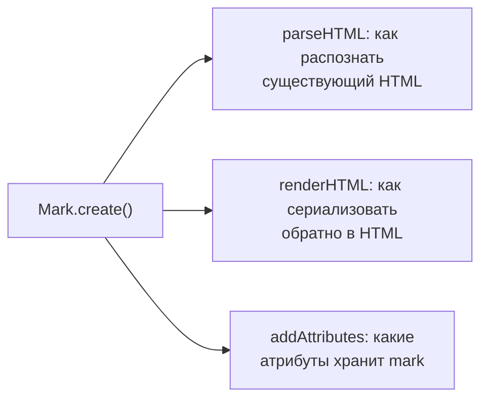

# Кастомные Nodes и Marks

## Node.create и Mark.create: та же анатомия, что и Extension

`Node.create()` и `Mark.create()` устроены очень похоже на `Extension.create()` с прошлого уровня — те же `addOptions`, `addStorage`, `name` — но добавляют дополнительные обязательные для схемы поля: `group`, `content`/`inline`/`marks` (для nodes), и обязательно `parseHTML`/`renderHTML`.



## Кастомный Mark: Highlight с цветом

```tsx
import { Mark } from '@tiptap/core'

interface HighlightOptions {
  HTMLAttributes: Record<string, unknown>
}

const Highlight = Mark.create<HighlightOptions>({
  name: 'highlight',

  addOptions() {
    return { HTMLAttributes: {} }
  },

  addAttributes() {
    return {
      color: {
        default: '#fff3a3',
        parseHTML: element => element.getAttribute('data-color'),
        renderHTML: attributes => ({
          'data-color': attributes.color,
          style: `background-color: ${attributes.color}`,
        }),
      },
    }
  },

  parseHTML() {
    return [{ tag: 'mark' }]
  },

  renderHTML({ HTMLAttributes }) {
    return ['mark', HTMLAttributes, 0]
  },

  addCommands() {
    return {
      setHighlight:
        (color?: string) =>
        ({ commands }) =>
          commands.setMark(this.name, { color }),
      unsetHighlight:
        () =>
        ({ commands }) =>
          commands.unsetMark(this.name),
    }
  },
})
```

`parseHTML()` возвращает массив правил распознавания: при импорте HTML (или вставке из буфера обмена) Tiptap ищет совпадающие теги/атрибуты и превращает их в mark. `renderHTML()` возвращает **ProseMirror DOM-спецификацию** — массив вида `[tag, attrs, contentHole]`, где `0` означает "сюда вставляется дочерний контент узла/mark".

## Кастомный блочный Node: Callout

```tsx
import { Node, mergeAttributes } from '@tiptap/core'

const Callout = Node.create({
  name: 'callout',
  group: 'block',
  content: 'block+', // может содержать другие блочные ноды (параграфы и т.д.)

  addAttributes() {
    return {
      type: {
        default: 'info',
        parseHTML: element => element.getAttribute('data-callout-type'),
        renderHTML: attributes => ({ 'data-callout-type': attributes.type }),
      },
    }
  },

  parseHTML() {
    return [{ tag: 'div[data-callout]' }]
  },

  renderHTML({ HTMLAttributes }) {
    return ['div', mergeAttributes(HTMLAttributes, { 'data-callout': '' }), 0]
  },
})
```

`mergeAttributes` — вспомогательная функция из `@tiptap/core`, аккуратно объединяющая несколько объектов атрибутов (например, пришедшие из `HTMLAttributes` опции и заданные вручную), избегая перезаписи `class` (классы конкатенируются, а не заменяют друг друга).

## addAttributes: полный набор полей

```tsx
addAttributes() {
  return {
    myAttr: {
      default: null,               // значение по умолчанию
      parseHTML: (element) => ..., // как прочитать атрибут из HTML при импорте
      renderHTML: (attributes) => ..., // как записать атрибут при экспорте в HTML
      keepOnSplit: true,           // сохранять ли атрибут при разделении узла (например, Enter в середине заголовка)
      rendered: true,              // false — атрибут хранится в документе, но не попадает в HTML
    },
  }
},
```

## Atom / leaf-ноды: неделимые инлайн-элементы

**Atom** (или **leaf**) нода — это узел, который не имеет редактируемого содержимого внутри себя и воспринимается курсором как единое целое (нельзя поставить курсор "внутрь" него, только до или после). Типичный пример — эмодзи-бейдж, упоминание пользователя, или разделитель:

```tsx
const Badge = Node.create({
  name: 'badge',
  group: 'inline',
  inline: true,
  atom: true, // ключевой флаг — делает ноду неделимой

  addAttributes() {
    return {
      label: { default: 'NEW' },
    }
  },

  parseHTML() {
    return [{ tag: 'span[data-badge]' }]
  },

  renderHTML({ HTMLAttributes, node }) {
    return ['span', mergeAttributes(HTMLAttributes, { 'data-badge': '' }), node.attrs.label]
  },
})
```

`atom: true` вместе с `inline: true` — стандартная комбинация для "неделимых инлайн-виджетов". Без `atom: true` ProseMirror попытался бы разрешить курсору заходить внутрь ноды, что для неё бессмысленно (у неё нет собственного текстового содержимого для навигации).

## ⚠️ Частые ошибки новичков

**Ошибка 1: забыть group у кастомной ноды**

```tsx
// ❌ Плохо — без group ноду нельзя вставить туда, где ожидается 'block' или 'inline'
Node.create({ name: 'callout', content: 'block+' })
```

```tsx
// ✅ Хорошо
Node.create({ name: 'callout', group: 'block', content: 'block+' })
```

**Ошибка 2: renderHTML без учёта HTMLAttributes (атрибуты теряются при сериализации)**

```tsx
// ❌ Плохо — HTMLAttributes (в т.ч. кастомные атрибуты из addAttributes) игнорируются
renderHTML() {
  return ['div', 0]
}
```

```tsx
// ✅ Хорошо
renderHTML({ HTMLAttributes }) {
  return ['div', mergeAttributes(HTMLAttributes), 0]
}
```

**Ошибка 3: atom-нода без inline: true, когда она задумана как инлайн-элемент**

Без явного `inline: true` нода по умолчанию блочная — атомарный инлайн-бейдж, оставшийся блочным, будет каждый раз начинаться с новой строки вместо того, чтобы "течь" в тексте.

## 💡 Best practices

- Используйте `mergeAttributes` в `renderHTML`, а не собирайте объект атрибутов вручную — это защищает от потери данных и правильно объединяет классы
- Для marks с атрибутами (`color`, `href`) всегда реализуйте и `parseHTML`, и `renderHTML` для соответствующего атрибута, иначе он не переживёт пересохранение через HTML
- Помечайте инлайн-виджеты без редактируемого содержимого как `atom: true` — это ожидаемое поведение пользователя (курсор "перепрыгивает" через них)
- Добавляйте собственные команды (`addCommands`) сразу вместе с нодой/mark, чтобы включение/выключение форматирования не требовало прямой работы с транзакциями снаружи
