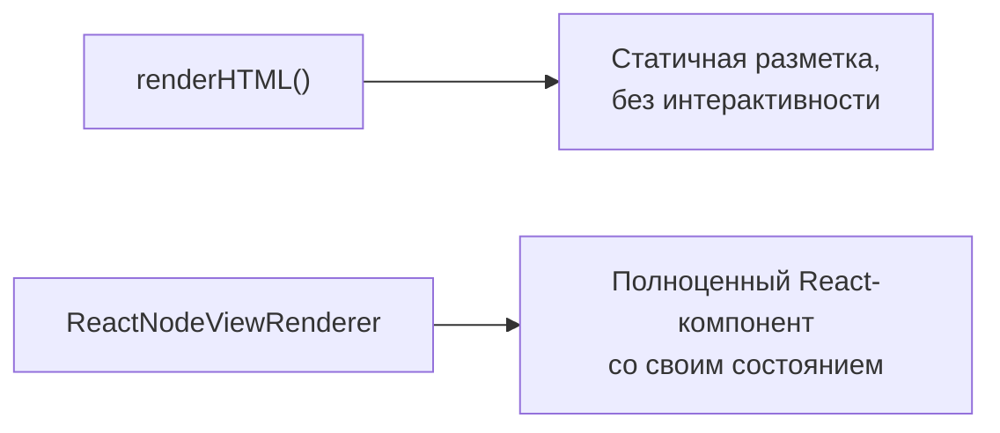
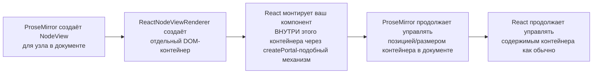
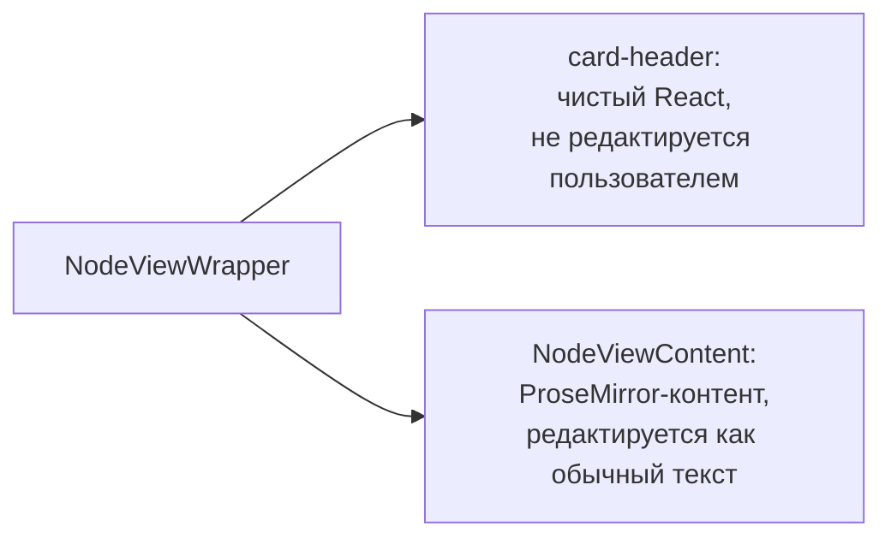

# NodeView в React

## Проблема: renderHTML — это статичная разметка

`renderHTML()` (уровень 9) отлично подходит для сериализации, но у него есть ограничение: он описывает **статичный** DOM, без интерактивности. А что если ваша нода должна быть полноценным React-компонентом — со своим `useState`, обработчиками кликов, анимациями, вложенными хуками?

Для этого существует **NodeView** — механизм ProseMirror, позволяющий полностью заменить DOM-рендер узла на произвольный, управляемый вручную (или, в нашем случае, React-компонентом).



### Аналогия: renderHTML — это ``, NodeView — это `<iframe>`

Полезная параллель: `renderHTML()` — как обычный `` тег: статичное отображение, вы не можете "кликнуть внутрь" картинки и получить интерактивность средствами самой картинки. `NodeView` — как `<iframe>`, встраивающий полноценное независимое приложение внутрь страницы: у него своя внутренняя логика, свои обработчики событий, свой жизненный цикл. NodeView в Tiptap идёт ещё дальше — это не изолированный iframe, а полноценный React-компонент, который живёт в том же React-дереве, что и остальное приложение, и может пользоваться контекстом, темой, глобальным состоянием вашего приложения — просто он "приклеен" к конкретной позиции в документе ProseMirror.

## ReactNodeViewRenderer: подключаем React-компонент к ноде

```tsx
import { Node } from '@tiptap/core'
import { ReactNodeViewRenderer } from '@tiptap/react'

const Counter = Node.create({
  name: 'counter',
  group: 'block',
  atom: true,

  addAttributes() {
    return { count: { default: 0 } }
  },

  parseHTML() {
    return [{ tag: 'div[data-counter]' }]
  },

  renderHTML({ HTMLAttributes }) {
    return ['div', HTMLAttributes] // fallback для случаев, когда React ещё не подключился
  },

  addNodeView() {
    return ReactNodeViewRenderer(CounterComponent)
  },
})
```

`addNodeView()` — метод, который переопределяет способ рендера ноды. `ReactNodeViewRenderer(Component)` возвращает специальный `NodeViewRenderer`, который монтирует переданный React-компонент внутрь ProseMirror-дерева через отдельный `ReactRenderer`.

### Под капотом: как ReactNodeViewRenderer встраивает React в чужой DOM-мир

Это самый концептуально сложный момент уровня, и стоит разобрать его по шагам, потому что он объясняет многие последующие правила (например, зачем нужен `NodeViewWrapper`):



Ключевая идея: происходит "разделение обязанностей" — ProseMirror **не знает и не заботится** о том, что внутри контейнера рендерится React; он видит просто DOM-узел на своей позиции в документе, который надо перемещать/удалять по мере изменения документа. React, в свою очередь, **не знает**, что его корневой DOM-узел находится внутри ProseMirror-документа — он просто рендерит переданные пропсы как обычно. Эта изоляция и есть причина, почему NodeView-компонент должен начинаться именно с `NodeViewWrapper` — это специальный "адаптер", договаривающийся с обеими сторонами о том, какие DOM-атрибуты и поведение должны быть у корневого элемента, чтобы обе системы (ProseMirror и React) не конфликтовали друг с другом.

## NodeViewProps: что получает компонент

Компонент, переданный в `ReactNodeViewRenderer`, получает специальный набор пропсов `NodeViewProps`:

```tsx
import type { NodeViewProps } from '@tiptap/core'
import { NodeViewWrapper } from '@tiptap/react'

function CounterComponent({ node, updateAttributes, deleteNode }: NodeViewProps) {
  const count = node.attrs.count as number

  return (
    <NodeViewWrapper className="counter-node">
      <button onClick={() => updateAttributes({ count: count - 1 })}>-</button>
      <span>{count}</span>
      <button onClick={() => updateAttributes({ count: count + 1 })}>+</button>
      <button onClick={() => deleteNode()}>×</button>
    </NodeViewWrapper>
  )
}
```

Ключевые пропсы:

- **`node`** — сам узел ProseMirror, `node.attrs` содержит текущие атрибуты
- **`updateAttributes(attrs)`** — обновляет атрибуты узла (создаёт транзакцию), аналог `editor.commands.updateAttributes` изнутри NodeView
- **`deleteNode()`** — удаляет узел из документа
- **`selected`** — булево, выделена ли нода целиком (через `NodeSelection`)
- **`editor`** — ссылка на инстанс редактора, если нужен полный доступ к командам

### Полный список NodeViewProps и когда что использовать

Помимо перечисленных выше, стоит знать про остальные пропсы, которые пригодятся для более сложных NodeView:

| Проп | Назначение |
|---|---|
| `getPos()` | Функция, возвращающая текущую позицию узла в документе (меняется при редактировании!) |
| `decorations` | Массив decorations (уровень 12), затрагивающих этот узел |
| `extension` | Ссылка на сам extension — доступ к `options`/`storage` изнутри компонента |
| `updateAttributes(attrs)` | Обновление атрибутов узла транзакцией |
| `deleteNode()` | Удаление узла целиком |

`getPos()` — не число, а **функция**, потому что позиция узла в документе не статична: если пользователь вставит текст выше вашей ноды, её числовая позиция сдвинется. Вызывать `getPos()` нужно каждый раз заново непосредственно перед использованием результата (например, перед `editor.commands.insertContentAt(getPos(), ...)`), а не кэшировать значение в переменной — иначе легко получить устаревшую, "протухшую" позицию.

## NodeViewWrapper: обязательная обёртка

`NodeViewWrapper` — специальный компонент, который **обязательно** должен быть корневым элементом вашего NodeView-компонента. Он синхронизирует React-дерево с DOM-узлом, который ожидает ProseMirror (устанавливает нужные атрибуты вроде `data-node-view-wrapper`, обрабатывает contentEditable-поведение обёртки).

```tsx
// ❌ Плохо — без NodeViewWrapper ProseMirror не сможет правильно отслеживать позицию узла
function BadComponent() {
  return <div>...</div>
}

// ✅ Хорошо
function GoodComponent() {
  return <NodeViewWrapper>...</NodeViewWrapper>
}
```

## NodeViewContent: редактируемая зона внутри NodeView

Если ваша нода должна содержать **редактируемый** текст ProseMirror внутри React-обёртки (например, карточка с редактируемым заголовком), используется `NodeViewContent`:

```tsx
function CardComponent() {
  return (
    <NodeViewWrapper className="card">
      <div className="card-header">📇 Карточка</div>
      <NodeViewContent className="card-body" />
    </NodeViewWrapper>
  )
}
```

`NodeViewContent` — это "дырка" (аналог `0` в `renderHTML`), куда ProseMirror монтирует свой стандартный редактируемый DOM для дочернего контента ноды. Всё, что находится внутри `NodeViewContent`, редактируется штатными механизмами ProseMirror (можно печатать текст, применять marks), а всё, что снаружи (например, `card-header`) — это чистый React, не редактируемый пользователем напрямую.

### Смешанная модель редактирования: где заканчивается React и начинается ProseMirror



Эта комбинация — то, что делает NodeView мощным инструментом: вы получаете "лучшее из двух миров". Статичная/интерактивная-но-не-текстовая часть UI (заголовок карточки, кнопки, иконки, dropdown-меню) рендерится обычным React с полным доступом к `useState`, `useEffect`, контексту приложения. А часть, которая должна быть настоящим редактируемым текстом внутри общего документа (сохраняется в `getJSON()`, поддерживает undo, marks, копирование) — рендерится через `NodeViewContent`, оставаясь частью единого ProseMirror-дерева.

## ⚠️ Частые ошибки новичков

**Ошибка 1: забыть NodeViewWrapper как корневой элемент**

Без `NodeViewWrapper` ProseMirror не сможет корректно отслеживать позицию и границы узла — курсор и выделение могут работать некорректно.

**Ошибка 2: пытаться редактировать node.attrs напрямую**

```tsx
// ❌ Плохо — прямая мутация node.attrs не создаёт транзакцию, ProseMirror "не узнает" об изменении
node.attrs.count = count + 1
```

```tsx
// ✅ Хорошо — updateAttributes создаёт полноценную транзакцию
updateAttributes({ count: count + 1 })
```

**Ошибка 3: не указывать content в схеме ноды, если используете NodeViewContent**

Если нода задумана с редактируемым дочерним контентом, не забудьте задать соответствующий `content` (например, `'inline*'`) в спецификации ноды — иначе `NodeViewContent` не будет знать, что туда монтировать.

**Ошибка 4: кэшировать результат getPos() в переменной вместо повторного вызова**

```tsx
// ❌ Плохо — позиция может устареть к моменту клика, если документ изменился между рендерами
function Component({ getPos }: NodeViewProps) {
  const pos = getPos() // вычислено один раз при рендере
  return <button onClick={() => editor.commands.deleteRange({ from: pos, to: pos + 1 })}>×</button>
}
```

```tsx
// ✅ Хорошо — вызываем getPos() непосредственно в обработчике, на актуальный момент
function Component({ getPos }: NodeViewProps) {
  return (
    <button
      onClick={() => {
        const pos = getPos()
        editor.commands.deleteRange({ from: pos, to: pos + 1 })
      }}
    >
      ×
    </button>
  )
}
```

**Ошибка 5: тяжёлые вычисления/сетевые запросы прямо в теле NodeView-компонента без мемоизации**

NodeView-компонент перерендеривается при каждом изменении узла (например, при каждом изменении атрибутов через `updateAttributes`), а иногда и при изменениях соседних частей документа. Тяжёлые операции (форматирование дат, сложные вычисления, запросы к API) внутри такого компонента без `useMemo`/`useCallback` могут ощутимо просаживать производительность ввода текста во всём документе, особенно если в документе много экземпляров такой ноды одновременно.

## 💡 Best practices

- Всегда оборачивайте NodeView-компонент в `NodeViewWrapper` как корневой элемент
- Используйте `updateAttributes` вместо прямой мутации для любых изменений состояния, хранящегося в документе (атрибутах узла)
- Для действительно локального UI-состояния (не влияющего на документ, например "открыт ли dropdown") можно использовать обычный React `useState` внутри NodeView-компонента — это не обязано быть частью документа
- Комбинируйте `NodeViewContent` с обычной React-разметкой вокруг неё — это позволяет строить сложные интерактивные блоки (карточки, todo-элементы, встраиваемые виджеты) с частично редактируемым, частично статичным содержимым
- Вызывайте `getPos()` непосредственно перед использованием, а не заранее — позиция узла в документе может измениться между рендерами
- Оборачивайте тяжёлые вычисления внутри NodeView-компонентов в `useMemo`, особенно если в документе может быть много экземпляров одной и той же кастомной ноды
