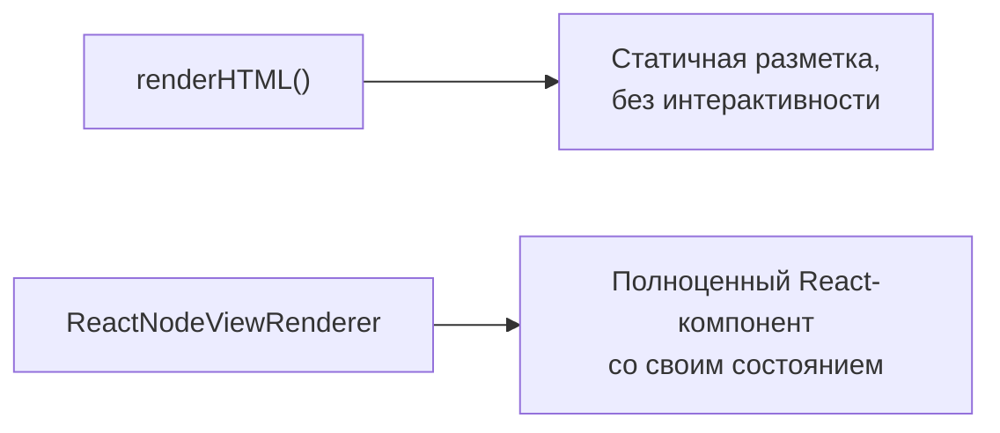

# NodeView в React

## Проблема: renderHTML — это статичная разметка

`renderHTML()` (уровень 9) отлично подходит для сериализации, но у него есть ограничение: он описывает **статичный** DOM, без интерактивности. А что если ваша нода должна быть полноценным React-компонентом — со своим `useState`, обработчиками кликов, анимациями, вложенными хуками?

Для этого существует **NodeView** — механизм ProseMirror, позволяющий полностью заменить DOM-рендер узла на произвольный, управляемый вручную (или, в нашем случае, React-компонентом).



## ReactNodeViewRenderer: подключаем React-компонент к ноде

```tsx
import { Node } from '@tiptap/core'
import { ReactNodeViewRenderer } from '@tiptap/react'

const Counter = Node.create({
  name: 'counter',
  group: 'block',
  atom: true,

  addAttributes() {
    return { count: { default: 0 } }
  },

  parseHTML() {
    return [{ tag: 'div[data-counter]' }]
  },

  renderHTML({ HTMLAttributes }) {
    return ['div', HTMLAttributes] // fallback для случаев, когда React ещё не подключился
  },

  addNodeView() {
    return ReactNodeViewRenderer(CounterComponent)
  },
})
```

`addNodeView()` — метод, который переопределяет способ рендера ноды. `ReactNodeViewRenderer(Component)` возвращает специальный `NodeViewRenderer`, который монтирует переданный React-компонент внутрь ProseMirror-дерева через отдельный `ReactRenderer`.

## NodeViewProps: что получает компонент

Компонент, переданный в `ReactNodeViewRenderer`, получает специальный набор пропсов `NodeViewProps`:

```tsx
import type { NodeViewProps } from '@tiptap/core'
import { NodeViewWrapper } from '@tiptap/react'

function CounterComponent({ node, updateAttributes, deleteNode }: NodeViewProps) {
  const count = node.attrs.count as number

  return (
    <NodeViewWrapper className="counter-node">
      <button onClick={() => updateAttributes({ count: count - 1 })}>-</button>
      <span>{count}</span>
      <button onClick={() => updateAttributes({ count: count + 1 })}>+</button>
      <button onClick={() => deleteNode()}>×</button>
    </NodeViewWrapper>
  )
}
```

Ключевые пропсы:

- **`node`** — сам узел ProseMirror, `node.attrs` содержит текущие атрибуты
- **`updateAttributes(attrs)`** — обновляет атрибуты узла (создаёт транзакцию), аналог `editor.commands.updateAttributes` изнутри NodeView
- **`deleteNode()`** — удаляет узел из документа
- **`selected`** — булево, выделена ли нода целиком (через `NodeSelection`)
- **`editor`** — ссылка на инстанс редактора, если нужен полный доступ к командам

## NodeViewWrapper: обязательная обёртка

`NodeViewWrapper` — специальный компонент, который **обязательно** должен быть корневым элементом вашего NodeView-компонента. Он синхронизирует React-дерево с DOM-узлом, который ожидает ProseMirror (устанавливает нужные атрибуты вроде `data-node-view-wrapper`, обрабатывает contentEditable-поведение обёртки).

```tsx
// ❌ Плохо — без NodeViewWrapper ProseMirror не сможет правильно отслеживать позицию узла
function BadComponent() {
  return <div>...</div>
}

// ✅ Хорошо
function GoodComponent() {
  return <NodeViewWrapper>...</NodeViewWrapper>
}
```

## NodeViewContent: редактируемая зона внутри NodeView

Если ваша нода должна содержать **редактируемый** текст ProseMirror внутри React-обёртки (например, карточка с редактируемым заголовком), используется `NodeViewContent`:

```tsx
function CardComponent() {
  return (
    <NodeViewWrapper className="card">
      <div className="card-header">📇 Карточка</div>
      <NodeViewContent className="card-body" />
    </NodeViewWrapper>
  )
}
```

`NodeViewContent` — это "дырка" (аналог `0` в `renderHTML`), куда ProseMirror монтирует свой стандартный редактируемый DOM для дочернего контента ноды. Всё, что находится внутри `NodeViewContent`, редактируется штатными механизмами ProseMirror (можно печатать текст, применять marks), а всё, что снаружи (например, `card-header`) — это чистый React, не редактируемый пользователем напрямую.

## ⚠️ Частые ошибки новичков

**Ошибка 1: забыть NodeViewWrapper как корневой элемент**

Без `NodeViewWrapper` ProseMirror не сможет корректно отслеживать позицию и границы узла — курсор и выделение могут работать некорректно.

**Ошибка 2: пытаться редактировать node.attrs напрямую**

```tsx
// ❌ Плохо — прямая мутация node.attrs не создаёт транзакцию, ProseMirror "не узнает" об изменении
node.attrs.count = count + 1
```

```tsx
// ✅ Хорошо — updateAttributes создаёт полноценную транзакцию
updateAttributes({ count: count + 1 })
```

**Ошибка 3: не указывать content в схеме ноды, если используете NodeViewContent**

Если нода задумана с редактируемым дочерним контентом, не забудьте задать соответствующий `content` (например, `'inline*'`) в спецификации ноды — иначе `NodeViewContent` не будет знать, что туда монтировать.

## 💡 Best practices

- Всегда оборачивайте NodeView-компонент в `NodeViewWrapper` как корневой элемент
- Используйте `updateAttributes` вместо прямой мутации для любых изменений состояния, хранящегося в документе (атрибутах узла)
- Для действительно локального UI-состояния (не влияющего на документ, например "открыт ли dropdown") можно использовать обычный React `useState` внутри NodeView-компонента — это не обязано быть частью документа
- Комбинируйте `NodeViewContent` с обычной React-разметкой вокруг неё — это позволяет строить сложные интерактивные блоки (карточки, todo-элементы, встраиваемые виджеты) с частично редактируемым, частично статичным содержимым
