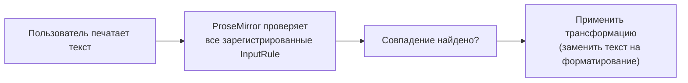

# Input rules и Paste rules

## Markdown-подобный ввод: откуда берётся магия "## → заголовок"

Заметили, что если напечатать `## ` в начале строки, StarterKit сам превращает блок в заголовок H2? Или `**текст**` автоматически становится жирным? Это не какая-то отдельная markdown-библиотека — это **input rules**, встроенные прямо в extensions StarterKit.



### Почему это устроено именно как "правило на каждый ввод символа", а не глобальный парсер markdown

Логичный вопрос: почему бы не написать один общий markdown-парсер, который целиком анализирует текст и конвертирует его в разметку? Причина — UX. Input rules реагируют **сразу в момент набора конкретного символа**, который "завершает" паттерн (например, пробел после `##`), и мгновенно превращают только что напечатанный текст в разметку. Пользователь видит эффект немедленно, ещё до того, как закончит печатать весь абзац. Глобальный парсер потребовал бы либо анализировать весь документ на каждое нажатие клавиши (дорого), либо ждать явного триггера (например, потери фокуса) — что убивает "магический", мгновенный отклик, ради которого эта фича вообще существует.

## addInputRules(): подключаем свои правила

```tsx
import { textblockTypeInputRule, wrappingInputRule, markInputRule } from '@tiptap/core'

const CustomHeading = Heading.extend({
  addInputRules() {
    return [
      // "## " в начале строки → heading level 2
      textblockTypeInputRule({
        find: /^(#{2})\s$/,
        type: this.type,
        getAttributes: { level: 2 },
      }),
    ]
  },
})
```

Готовые фабрики правил из `@tiptap/core`:

| Функция                  | Назначение                                                        |
| ------------------------ | ------------------------------------------------------------------ |
| `textblockTypeInputRule` | Меняет тип текущего текстового блока (параграф → заголовок)       |
| `wrappingInputRule`      | Оборачивает текущий блок в новый узел (параграф → элемент списка) |
| `markInputRule`          | Применяет mark к совпавшему тексту (`**text**` → bold)            |
| `nodeInputRule`          | Вставляет узел на месте совпадения                                |
| `textInputRule`          | Заменяет совпавший текст на другой текст                          |

Каждая принимает `find` (регулярное выражение — по соглашению начинается с `^`, чтобы совпадение проверялось только в начале текстового блока) и `type` (тип ноды/mark, к которому применяется правило).

### Полный разбор regex `/^(#{2})\s$/` по частям

Разберём это выражение символ за символом, потому что для новичков regex внутри input rules часто выглядит "магией":

| Часть | Значение |
|---|---|
| `^` | Начало строки (точнее — начало текстового блока в ProseMirror) |
| `(` `)` | Группа захвата — её содержимое доступно в `match[1]` внутри обработчика правила |
| `#{2}` | Ровно два символа `#` подряд |
| `\s` | Один произвольный пробельный символ (обычный пробел, таб) |
| `$` | Конец строки — то есть именно то, что напечатано **прямо сейчас**, курсор находится ровно здесь |

Вместе: "с начала блока — ровно два `#`, затем один пробел, и курсор прямо сейчас находится сразу после этого пробела". Именно `$` в конце гарантирует, что правило сработает **в момент набора пробела** — то есть ровно тогда, когда пользователь напечатал последний недостающий символ паттерна, а не когда-то позже.

Для сравнения — `wrappingInputRule` для списков использует похожий, но более общий паттерн:

```tsx
wrappingInputRule({
  find: /^\s*([-+*])\s$/, // "- " или "+ " или "* " в начале строки → элемент списка
  type: this.type,
})
```

Здесь `\s*` перед группой разрешает необязательный отступ (пробелы) перед маркером списка — то есть вложенный список можно "запустить" даже если перед `-` уже стоят пробелы табуляции.

## Как выглядит встроенное правило bold в StarterKit

```tsx
markInputRule({
  find: /(?:^|\s)((?:\*\*)((?:[^*]+))(?:\*\*))$/,
  type: this.type,
})
```

Regex проверяет, что пользователь только что напечатал `**текст**` — и тут же (без ожидания отдельной команды) применяет bold mark к найденному фрагменту, одновременно убирая сами звёздочки `**`.

### Ещё более детальный разбор этого regex

Этот паттерн сложнее предыдущего, разберём по кусочкам:

- `(?:^|\s)` — незахватывающая группа: "либо начало строки, либо один пробельный символ перед совпадением" (не даёт правилу сработать в середине слова вроде `foo**bar**baz`)
- `(` внешняя группа захвата — `match[1]`, весь фрагмент вместе со звёздочками
- `(?:\*\*)` — незахватывающая группа: буквально два символа `*` (экранированы `\*`, потому что `*` — спецсимвол regex)
- `((?:[^*]+))` — вложенная группа захвата `match[2]`, сам текст между звёздочками: один или более любых символов, кроме `*` (это не даёт правилу "жадно" захватить несколько пар звёздочек сразу)
- `(?:\*\*)` — снова закрывающие `**`
- `$` — конец строки: правило срабатывает ровно на вводе второй закрывающей звёздочки

## Paste rules: то же самое, но при вставке

**Paste rules** работают по тому же принципу, что input rules, но срабатывают не на ввод с клавиатуры, а на **вставку контента** (Ctrl+V):

```tsx
import { markPasteRule } from '@tiptap/core'

const AutoLink = Mark.create({
  name: 'link',
  addPasteRules() {
    return [
      markPasteRule({
        find: /https?:\/\/[^\s]+/g,
        type: this.type,
        getAttributes: match => ({ href: match[0] }),
      }),
    ]
  },
})
```

Это именно тот механизм, который стоит за `autolink`/вставкой URL из уровня 3 — при вставке текста, содержащего ссылки, они автоматически оборачиваются в `link` mark.

### Разбор `/https?:\/\/[^\s]+/g`

- `https?` — буква `s` необязательна (`?`) — совпадает и с `http`, и с `https`
- `:\/\/` — буквально `://` (слэши экранированы, потому что в некоторых контекстах regex имеют специальное значение — здесь просто по традиции разделителя литерала)
- `[^\s]+` — один или более **любых** символов, кроме пробельных — то есть "всё, что не пробел, до конца URL"
- `g` — глобальный флаг: искать **все** совпадения во вставленном тексте, а не только первое (важно для paste rules — вставленный фрагмент может содержать сразу несколько ссылок)

Обратите внимание на отсутствие `^`/`$` — в отличие от input rules, paste rules обычно не привязаны к границам строки, потому что вставляемый текст может быть произвольного размера и содержать ссылки где угодно внутри себя.

## Свой input rule "с нуля"

Иногда встроенных фабрик недостаточно, и нужен полный контроль над трансформацией — тогда используется низкоуровневый класс `InputRule`:

```tsx
import { InputRule } from '@tiptap/core'

const SmileyInputRule = Extension.create({
  name: 'smileyInputRule',

  addInputRules() {
    return [
      new InputRule({
        find: /:\)$/,
        handler: ({ state, range, match }) => {
          const { tr } = state
          tr.replaceWith(range.from, range.to, state.schema.text('🙂'))
        },
      }),
    ]
  },
})
```

`handler` получает `state` (текущее состояние ProseMirror), `range` (диапазон совпавшего текста) и `match` (результат regex) — и должен сам сформировать транзакцию, заменяющую совпавший фрагмент на нужный результат.

## ⚠️ Частые ошибки новичков

**Ошибка 1: забыть `^` в начале regex для textblockTypeInputRule/wrappingInputRule**

```tsx
// ❌ Плохо — сработает даже в середине строки, что обычно не то, что ожидается
find: /(#{2})\s$/
```

```tsx
// ✅ Хорошо — сработает только в начале текстового блока
find: /^(#{2})\s$/
```

**Ошибка 2: путать input rules с paste rules**

Input rule срабатывает на **набор текста посимвольно**, paste rule — на **вставку** готового фрагмента. Если реализовать только input rule для авто-ссылок, вставка URL из буфера обмена не сработает — понадобится отдельный paste rule.

**Ошибка 3: не экранировать спецсимволы в регулярном выражении**

Символы вроде `*`, `.`, `(` имеют специальное значение в regex — при формировании правила для символов вроде `**bold**` их нужно явно экранировать (`\*\*`), иначе правило будет матчить не то, что задумано.

**Ошибка 4: забыть флаг `g` в paste rule, из-за чего сработает только первое совпадение**

```tsx
// ❌ Плохо — если вставлен текст с двумя ссылками, оживёт только первая
find: /https?:\/\/[^\s]+/
```

```tsx
// ✅ Хорошо
find: /https?:\/\/[^\s]+/g
```

**Ошибка 5: не проверять границы совпадения, из-за чего правило срабатывает "внутри" слова**

```tsx
// ❌ Плохо — сработает даже посреди "foo**bar" превратив это в форматирование неожиданно
find: /\*\*([^*]+)\*\*$/
```

```tsx
// ✅ Хорошо — требуем начало строки или пробел перед совпадением
find: /(?:^|\s)\*\*([^*]+)\*\*$/
```

## 💡 Best practices

- Используйте готовые фабрики (`markInputRule`, `wrappingInputRule` и др.) вместо низкоуровневого `InputRule`, когда сценарий укладывается в их API
- Всегда тестируйте regex на граничных случаях (текст в середине строки, повторное срабатывание, отмена через `Backspace` сразу после применения — она поддерживается автоматически большинством фабрик через опцию `undoable`)
- Добавляйте paste rules там, где есть input rules с похожей семантикой (автоссылки, авто-упоминания) — иначе поведение будет неполным и удивит пользователя
- Держите regex максимально специфичными, привязывая к началу (`^`) или концу (`$`) строки там, где это уместно, чтобы избежать случайных срабатываний
- Не забывайте флаг `g` в paste rules, если вставляемый фрагмент может содержать несколько совпадений
- Пишите юнит-тесты именно на regex отдельно от Tiptap-интеграции — regex гораздо проще протестировать изолированно, чем через полноценный редактор
