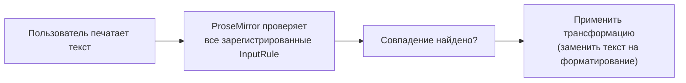

# Input rules и Paste rules

## Markdown-подобный ввод: откуда берётся магия "## → заголовок"

Заметили, что если напечатать `## ` в начале строки, StarterKit сам превращает блок в заголовок H2? Или `**текст**` автоматически становится жирным? Это не какая-то отдельная markdown-библиотека — это **input rules**, встроенные прямо в extensions StarterKit.



## addInputRules(): подключаем свои правила

```tsx
import { textblockTypeInputRule, wrappingInputRule, markInputRule } from '@tiptap/core'

const CustomHeading = Heading.extend({
  addInputRules() {
    return [
      // "## " в начале строки → heading level 2
      textblockTypeInputRule({
        find: /^(#{2})\s$/,
        type: this.type,
        getAttributes: { level: 2 },
      }),
    ]
  },
})
```

Готовые фабрики правил из `@tiptap/core`:

| Функция                  | Назначение                                                        |
| ------------------------ | ----------------------------------------------------------------- |
| `textblockTypeInputRule` | Меняет тип текущего текстового блока (параграф → заголовок)       |
| `wrappingInputRule`      | Оборачивает текущий блок в новый узел (параграф → элемент списка) |
| `markInputRule`          | Применяет mark к совпавшему тексту (`**text**` → bold)            |
| `nodeInputRule`          | Вставляет узел на месте совпадения                                |
| `textInputRule`          | Заменяет совпавший текст на другой текст                          |

Каждая принимает `find` (регулярное выражение — по соглашению начинается с `^`, чтобы совпадение проверялось только в начале текстового блока) и `type` (тип ноды/mark, к которому применяется правило).

## Как выглядит встроенное правило bold в StarterKit

```tsx
markInputRule({
  find: /(?:^|\s)((?:\*\*)((?:[^*]+))(?:\*\*))$/,
  type: this.type,
})
```

Regex проверяет, что пользователь только что напечатал `**текст**` — и тут же (без ожидания отдельной команды) применяет bold mark к найденному фрагменту, одновременно убирая сами звёздочки `**`.

## Paste rules: то же самое, но при вставке

**Paste rules** работают по тому же принципу, что input rules, но срабатывают не на ввод с клавиатуры, а на **вставку контента** (Ctrl+V):

```tsx
import { markPasteRule } from '@tiptap/core'

const AutoLink = Mark.create({
  name: 'link',
  addPasteRules() {
    return [
      markPasteRule({
        find: /https?:\/\/[^\s]+/g,
        type: this.type,
        getAttributes: match => ({ href: match[0] }),
      }),
    ]
  },
})
```

Это именно тот механизм, который стоит за `autolink`/вставкой URL из уровня 3 — при вставке текста, содержащего ссылки, они автоматически оборачиваются в `link` mark.

## Свой input rule "с нуля"

Иногда встроенных фабрик недостаточно, и нужен полный контроль над трансформацией — тогда используется низкоуровневый класс `InputRule`:

```tsx
import { InputRule } from '@tiptap/core'

const SmileyInputRule = Extension.create({
  name: 'smileyInputRule',

  addInputRules() {
    return [
      new InputRule({
        find: /:\)$/,
        handler: ({ state, range, match }) => {
          const { tr } = state
          tr.replaceWith(range.from, range.to, state.schema.text('🙂'))
        },
      }),
    ]
  },
})
```

`handler` получает `state` (текущее состояние ProseMirror), `range` (диапазон совпавшего текста) и `match` (результат regex) — и должен сам сформировать транзакцию, заменяющую совпавший фрагмент на нужный результат.

## ⚠️ Частые ошибки новичков

**Ошибка 1: забыть `^` в начале regex для textblockTypeInputRule/wrappingInputRule**

```tsx
// ❌ Плохо — сработает даже в середине строки, что обычно не то, что ожидается
find: /(#{2})\s$/
```

```tsx
// ✅ Хорошо — сработает только в начале текстового блока
find: /^(#{2})\s$/
```

**Ошибка 2: путать input rules с paste rules**

Input rule срабатывает на **набор текста посимвольно**, paste rule — на **вставку** готового фрагмента. Если реализовать только input rule для авто-ссылок, вставка URL из буфера обмена не сработает — понадобится отдельный paste rule.

**Ошибка 3: не экранировать спецсимволы в регулярном выражении**

Символы вроде `*`, `.`, `(` имеют специальное значение в regex — при формировании правила для символов вроде `**bold**` их нужно явно экранировать (`\*\*`), иначе правило будет матчить не то, что задумано.

## 💡 Best practices

- Используйте готовые фабрики (`markInputRule`, `wrappingInputRule` и др.) вместо низкоуровневого `InputRule`, когда сценарий укладывается в их API
- Всегда тестируйте regex на граничных случаях (текст в середине строки, повторное срабатывание, отмена через `Backspace` сразу после применения — она поддерживается автоматически большинством фабрик через опцию `undoable`)
- Добавляйте paste rules там, где есть input rules с похожей семантикой (автоссылки, авто-упоминания) — иначе поведение будет неполным и удивит пользователя
- Держите regex максимально специфичными, привязывая к началу (`^`) или концу (`$`) строки там, где это уместно, чтобы избежать случайных срабатываний
