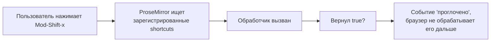
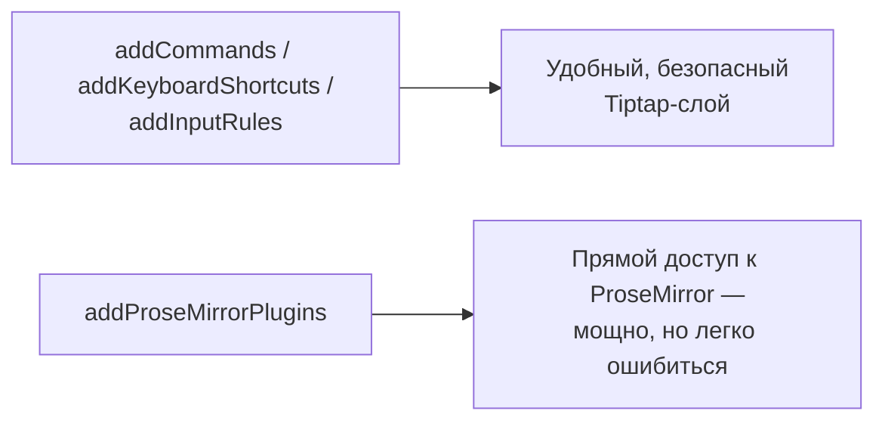

# Keyboard shortcuts и ProseMirror-плагины

## addKeyboardShortcuts: свои горячие клавиши

Любой extension может зарегистрировать собственные keyboard shortcuts:

```tsx
const MyExtension = Extension.create({
  name: 'myExtension',

  addKeyboardShortcuts() {
    return {
      'Mod-Shift-x': () => {
        return this.editor.chain().focus().toggleStrike().run()
      },
    }
  },
})
```

`Mod` — кроссплатформенный алиас: `Ctrl` на Windows/Linux, `Cmd` на macOS. Обработчик должен вернуть `true`, если событие обработано (что и делает результат `.run()` — `boolean`), либо `false`/`undefined`, чтобы позволить событию продолжить своё стандартное поведение (например, если условие не выполнено).



📌 Если два extensions регистрируют один и тот же shortcut, срабатывает тот, что зарегистрирован **позже** в списке `extensions` (последний "выигрывает"). Это стоит учитывать при подключении сторонних extensions вместе со своими.

### Почему именно "последний выигрывает", а не "первый"

Это следствие того, как ProseMirror внутри объединяет обработчики клавиатуры от разных плагинов — они выстраиваются в цепочку, аналогичную middleware в Express или обработчикам событий DOM с bubbling: каждый последующий имеет возможность **перехватить** событие раньше предыдущих, если хочет. Практическое следствие: если вы хотите **переопределить** поведение какого-то встроенного shortcut StarterKit (например, изменить, что делает `Mod-b`), ваш собственный extension с этим shortcut должен быть добавлен в массив `extensions` **после** `StarterKit`, а не до него.

## addProseMirrorPlugins: прямой доступ к ProseMirror

Иногда возможностей команд и input rules недостаточно — нужен полный контроль на уровне ProseMirror. Для этого — `addProseMirrorPlugins()`, возвращающий массив "сырых" ProseMirror `Plugin`:

```tsx
import { Plugin, PluginKey } from '@tiptap/pm/state'

const MyPluginExtension = Extension.create({
  name: 'myPlugin',

  addProseMirrorPlugins() {
    return [
      new Plugin({
        key: new PluginKey('myPlugin'),
        props: {
          handleClick(view, pos, event) {
            console.log('Клик в позиции', pos)
            return false // false — не "проглатывать" событие, дать сработать стандартной логике дальше
          },
        },
      }),
    ]
  },
})
```

`PluginKey` — уникальный идентификатор плагина, по которому можно получить доступ к его состоянию из других мест: `myPluginKey.getState(editor.state)`.

### Где заканчивается Tiptap и начинается "чистый" ProseMirror

Стоит осознать: `addProseMirrorPlugins` — это буквально **дверь в подвал**, ведущая от удобного мира Tiptap-абстракций прямо к низкоуровневому API `prosemirror-state`/`prosemirror-view`, на котором сам Tiptap и построен. Всё, что вы могли бы написать на голом ProseMirror без Tiptap вообще, можно вставить сюда как есть. Это самый мощный, но и самый "сырой" механизм расширения — здесь нет никакой защиты от ошибок типа неправильных позиций документа, и API здесь куда менее дружелюбен, чем `addCommands`/`addInputRules`. Разумное правило: пробуйте сначала решить задачу командами/input rules/keyboard shortcuts, и только если не получается — спускайтесь на уровень ProseMirror-плагинов.



### Жизненный цикл плагина: props vs state

У `Plugin` есть два принципиально разных способа хранить и предоставлять поведение:

- **`props`** — "хуки" для взаимодействия с DOM-событиями и рендерингом (`handleClick`, `handleKeyDown`, `decorations`, `handleDOMEvents`) — не хранят состояния сами по себе, вызываются "по запросу"
- **`state`** — собственное, привязанное к транзакциям состояние плагина: `init()` задаёт начальное значение, `apply(tr, prevState)` вычисляет новое состояние на основе транзакции

Мы используем `state` активно на уровне 15 (поиск по документу) — там состояние плагина (текущий поисковый запрос) должно "переживать" между транзакциями и обновляться через `tr.setMeta()`.

## Decorations: визуальные "накладки" без изменения документа

**Decoration** — способ визуально изменить отображение документа (подсветка, рамка, замена контента), **не изменяя сам документ**. Это принципиально важно: decorations существуют только в представлении (view), а не в данных — их не видно в `getJSON()`/`getHTML()`.

```tsx
import { Plugin, PluginKey } from '@tiptap/pm/state'
import { Decoration, DecorationSet } from '@tiptap/pm/view'

const HighlightTodoPlugin = Extension.create({
  name: 'highlightTodo',

  addProseMirrorPlugins() {
    return [
      new Plugin({
        key: new PluginKey('highlightTodo'),
        props: {
          decorations(state) {
            const decorations: Decoration[] = []
            state.doc.descendants((node, pos) => {
              if (!node.isText) return
              const regex = /TODO/g
              let match
              while ((match = regex.exec(node.text ?? ''))) {
                const from = pos + match.index
                const to = from + match[0].length
                decorations.push(Decoration.inline(from, to, { class: 'todo-highlight' }))
              }
            })
            return DecorationSet.create(state.doc, decorations)
          },
        },
      }),
    ]
  },
})
```

`state.doc.descendants((node, pos) => {...})` обходит все узлы документа с их позициями — стандартный способ найти нужные фрагменты текста для декорирования. `Decoration.inline(from, to, attrs)` создаёт инлайн-декорацию (добавляет CSS-класс/атрибуты к тексту в диапазоне), не трогая сами данные документа.

### Три типа Decoration

`Decoration.inline` — не единственный вид декораций, стоит знать о существовании и двух других:

| Тип | Назначение |
|---|---|
| `Decoration.inline(from, to, attrs)` | Добавляет атрибуты/класс к существующему инлайн-диапазону (подсветка текста) |
| `Decoration.widget(pos, domOrRenderFn)` | Вставляет произвольный DOM-элемент "рядом" с позицией, не являющийся частью документа (иконка, кнопка-подсказка) |
| `Decoration.node(from, to, attrs)` | Добавляет атрибуты к целому узлу-блоку (например, подсветить весь параграф целиком) |

`Decoration.widget` особенно полезен для UI-элементов, которые визуально "привязаны" к позиции в документе, но не должны быть частью редактируемого текста — например, маленькая иконка предупреждения рядом со строкой с ошибкой валидации.

## Ключевая разница: mark vs decoration

|                                | Mark                                   | Decoration                                                                     |
| ------------------------------ | --------------------------------------- | -------------------------------------------------------------------------------- |
| Хранится в документе           | Да (`getJSON()` покажет)               | Нет, только в runtime view                                                     |
| Переживает сохранение/загрузку | Да                                     | Нет — пересчитывается заново из содержимого                                    |
| Типичное применение            | Постоянное форматирование (bold, link) | Временная подсветка (найденный поиском текст, TODO-маркеры, ошибки орфографии) |

### Продакшен-пример: как совмещать оба механизма для проверки орфографии

Показательный реальный сценарий, объединяющий оба механизма: редактор с проверкой орфографии обычно **не хранит** информацию об ошибках как marks (иначе она "засоряла" бы сохранённый документ и оставалась бы актуальной только на момент проверки, устаревая при каждом изменении текста). Вместо этого типичная архитектура — отдельный ProseMirror-плагин, который на каждое изменение документа (debounced, чтобы не гонять проверку на каждый символ) прогоняет текст через словарь, находит ошибки и **пересчитывает** decorations с классом `spelling-error`. При сохранении документа никакой информации об ошибках в `getJSON()` не остаётся — при следующей загрузке проверка просто выполнится заново.

## ⚠️ Частые ошибки новичков

**Ошибка 1: возвращать true из props.handleClick/handleKeyDown, даже когда не нужно "глотать" событие**

```tsx
// ❌ Плохо — блокирует стандартную обработку клика для ВСЕХ кликов
handleClick() {
  console.log('click')
  return true // событие никогда не дойдёт до остальной логики
}
```

```tsx
// ✅ Хорошо — возвращаем true только когда реально обработали событие сами
handleClick(view, pos, event) {
  if (!isSpecialCase) return false
  doSomething()
  return true
}
```

**Ошибка 2: путать decoration и mark для постоянного форматирования**

Если данные должны сохраниться и восстановиться при следующей загрузке документа — нужен mark, а не decoration. Decorations пересчитываются каждый раз заново на основе текущего содержимого и не являются частью сохраняемых данных.

**Ошибка 3: забыть про производительность в decorations() при больших документах**

Функция `decorations(state)` вызывается при каждом обновлении состояния — обход всего документа регулярными выражениями на каждое изменение может быть дорогим для больших документов. На практике стоит ограничивать область пересчёта или использовать мемоизацию там, где возможно.

**Ошибка 4: хранить состояние плагина в замыкании вместо plugin state**

```tsx
// ❌ Плохо — обычная переменная не синхронизирована с транзакциями/undo
let highlightedWord = ''
new Plugin({ props: { decorations: state => computeDecorations(state.doc, highlightedWord) } })
```

```tsx
// ✅ Хорошо — состояние живёт внутри плагина, синхронизировано транзакциями
const key = new PluginKey<{ word: string }>('highlight')
new Plugin({
  key,
  state: { init: () => ({ word: '' }), apply(tr, prev) { return tr.getMeta(key) ?? prev } },
  props: { decorations(state) { return computeDecorations(state.doc, key.getState(state)!.word) } },
})
```

Подробнее этот паттерн разберём на уровне 15 — но важно взять за правило уже сейчас: любое состояние ProseMirror-плагина, которое должно быть согласовано с undo/redo и совместным редактированием, обязано жить в `state.init/apply`, а не во внешней JS-переменной.

**Ошибка 5: не давать PluginKey уникальное имя**

```tsx
// ❌ Плохо — несколько плагинов с одинаковым ключом 'plugin' затрудняют отладку
new Plugin({ key: new PluginKey('plugin'), ... })
```

```tsx
// ✅ Хорошо — специфичное, узнаваемое имя
new Plugin({ key: new PluginKey('todoHighlight'), ... })
```

## 💡 Best practices

- Используйте `addKeyboardShortcuts` для быстрого доступа к часто используемым командам, но избегайте конфликтов со стандартными браузерными шорткатами
- Используйте `Plugin`/`PluginKey` из `@tiptap/pm/state`, когда нужен доступ к низкоуровневым ProseMirror-хукам (`handleClick`, `handleKeyDown`, `decorations`, `appendTransaction`)
- Выбирайте decorations для всего временного/вычисляемого (подсветка поиска, индикаторы валидации), а marks — для того, что должно быть частью сохраняемого документа
- Давайте плагинам уникальные `PluginKey` — это упрощает отладку (видно в devtools ProseMirror) и позволяет читать состояние плагина извне
- Сначала пробуйте решить задачу командами/input rules/keyboard shortcuts, и только когда их возможностей действительно не хватает — спускайтесь на уровень `addProseMirrorPlugins`
- Для дорогих вычислений внутри `decorations()` (парсинг, regex по всему документу) применяйте debounce/throttle на уровне вызывающей логики, а не пересчитывайте на каждую транзакцию вслепую
