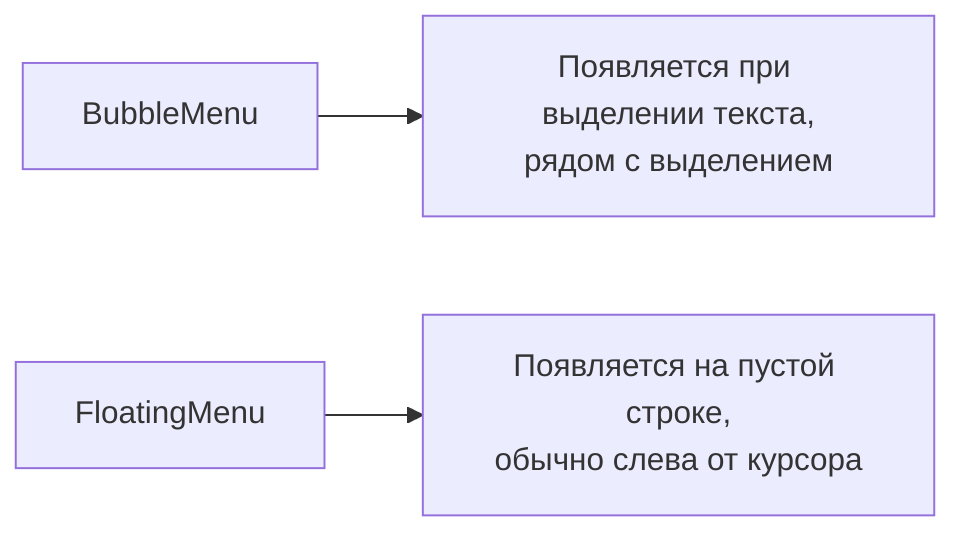
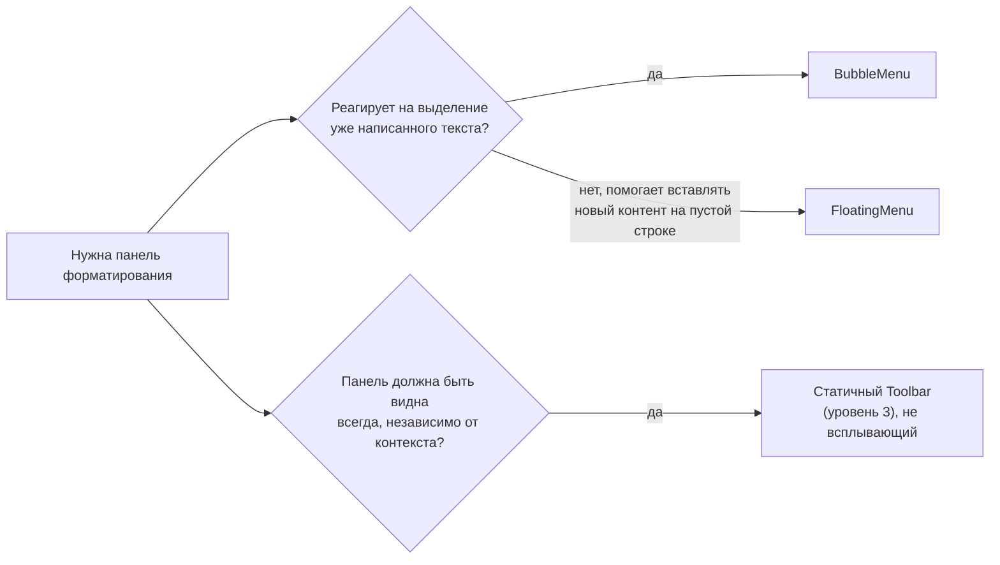

# BubbleMenu и FloatingMenu

## Два вида контекстных меню

Tiptap предоставляет два готовых паттерна всплывающих панелей инструментов:



- **BubbleMenu** — классический паттерн "выделил текст → появилась панель форматирования" (как в Medium, Notion при выделении)
- **FloatingMenu** — панель, появляющаяся на **пустой строке**, обычно предлагающая вставить блок (заголовок, список, изображение) — как в Notion при нажатии на пустую строку

📌 В Tiptap v3 позиционирование обоих меню построено на **floating-ui** (пришедшей на смену tippy.js из v2) — библиотеке для умного позиционирования всплывающих элементов с учётом границ экрана.

### Зачем вообще два разных компонента, а не один универсальный

На первый взгляд может показаться, что достаточно одного "умного" всплывающего меню с гибкими условиями показа. Но у BubbleMenu и FloatingMenu принципиально разная **семантика намерения пользователя**:

- Когда пользователь **выделяет текст** — он, скорее всего, хочет что-то с ним **сделать** (отформатировать, добавить ссылку) — контекст уже есть, реагировать нужно на существующее содержимое
- Когда курсор стоит на **пустой строке** — пользователь ещё ничего не написал и, возможно, ищет подсказку "что вообще можно вставить сюда" — контекста ещё нет, меню предлагает **начать** что-то

Разделение на два компонента с разной логикой показа по умолчанию избавляет разработчика от необходимости каждый раз вручную реализовывать эти два разных, но очень частых UX-паттерна с нуля.

## Установка

Оба компонента — React-обёртки, импортируемые из отдельного подпакета `@tiptap/react/menus` (чтобы `floating-ui` оставался опциональной зависимостью для тех, кто не использует эти меню):

```bash
npm install @tiptap/extension-bubble-menu @tiptap/extension-floating-menu
```

```tsx
import { BubbleMenu, FloatingMenu } from '@tiptap/react/menus'
```

### Почему это именно отдельный подпакет, а не часть @tiptap/react

Это осознанное архитектурное решение авторов Tiptap v3, и стоит понимать его мотивацию: `floating-ui` — не самая маленькая зависимость, и она нужна далеко не всем пользователям Tiptap (многие редакторы вообще не используют всплывающие меню, полагаясь на статичный тулбар сверху). Если бы `BubbleMenu`/`FloatingMenu` жили прямо в `@tiptap/react`, `floating-ui` попадал бы в бандл **каждого** проекта на Tiptap, даже если он этими компонентами не пользуется. Вынос в отдельный подпуть `@tiptap/react/menus` — стандартный паттерн "opt-in" зависимостей в современных библиотеках: тянется в бандл только тогда, когда реально импортируется.

## BubbleMenu: панель при выделении

```tsx
import { EditorContent, useEditor } from '@tiptap/react'
import { BubbleMenu } from '@tiptap/react/menus'
import StarterKit from '@tiptap/starter-kit'

function Editor() {
  const editor = useEditor({ extensions: [StarterKit] })

  return (
    <>
      {editor && (
        <BubbleMenu editor={editor}>
          <button onClick={() => editor.chain().focus().toggleBold().run()}>B</button>
          <button onClick={() => editor.chain().focus().toggleItalic().run()}>I</button>
        </BubbleMenu>
      )}
      <EditorContent editor={editor} />
    </>
  )
}
```

`BubbleMenu` рендерит `children` в `<div>`, который автоматически появляется рядом с текущим выделением и скрывается, когда выделения нет. Позиционированием (появление сверху/снизу выделения с учётом границ окна) занимается floating-ui автоматически.

### Как floating-ui вычисляет позицию "рядом с выделением"

Полезно понимать общий принцип работы floating-ui (не углубляясь во внутреннюю реализацию): он получает координаты "якоря" (в данном случае — прямоугольник, охватывающий текущее выделение текста, вычисленный через `Selection.getRangeAt(0).getBoundingClientRect()` браузерного API) и координаты "плавающего" элемента (самого меню), а затем вычисляет оптимальное положение с учётом:

- Предпочитаемого расположения (`placement: 'top'` — сверху над выделением, значение по умолчанию)
- Границ viewport — если сверху не хватает места (выделение у самого верха экрана), floating-ui автоматически "переворачивает" меню и показывает его снизу
- Отступа (`offset`) — небольшого зазора между выделением и меню, чтобы они не накладывались друг на друга

Этот же движок (floating-ui) широко используется и вне Tiptap — в множестве других UI-библиотек для тултипов, поповеров, дропдаунов — так что знания, полученные здесь, переносимы на другие проекты.

## FloatingMenu: панель на пустой строке

```tsx
import { FloatingMenu } from '@tiptap/react/menus'

function Editor() {
  const editor = useEditor({ extensions: [StarterKit] })

  return (
    <>
      {editor && (
        <FloatingMenu editor={editor}>
          <button onClick={() => editor.chain().focus().toggleHeading({ level: 2 }).run()}>
            H2
          </button>
          <button onClick={() => editor.chain().focus().toggleBulletList().run()}>• Список</button>
        </FloatingMenu>
      )}
      <EditorContent editor={editor} />
    </>
  )
}
```

По умолчанию `FloatingMenu` показывается только когда курсор находится на **пустом** текстовом блоке (пустой параграф) — это встроенная логика "показывать меню только когда есть что предложить вставить".

## shouldShow: своя логика показа

Оба компонента принимают проп `shouldShow`, позволяющий полностью переопределить условие показа:

```tsx
<BubbleMenu
  editor={editor}
  shouldShow={({ editor, state }) => {
    // Показывать bubble menu только когда выделен текст ВНУТРИ заголовка
    const { from, to } = state.selection
    const isTextSelected = from !== to
    return isTextSelected && editor.isActive('heading')
  }}
>
  ...
</BubbleMenu>
```

`shouldShow` получает объект с `editor`, `state`, `from`, `to` и должен вернуть `boolean`. Это открывает сценарии вроде: "показывать разные меню для разных типов контента", "не показывать меню внутри блока кода" и т.п.

### Decision-диаграмма: BubbleMenu vs FloatingMenu vs статичный Toolbar



Часто в реальных приложениях используют **комбинацию**: статичный Toolbar сверху (всегда видимые основные действия) + BubbleMenu (быстрый доступ к форматированию прямо у выделения, без необходимости "тянуться" мышью до верхней панели) — это типичный UX современных редакторов вроде Notion.

## options: позиционирование через floating-ui

Проп `options` пробрасывается напрямую в `floating-ui` и позволяет настроить, например, предпочтительное положение меню:

```tsx
<BubbleMenu editor={editor} options={{ placement: 'top', offset: 8 }}>
  ...
</BubbleMenu>
```

## ⚠️ Частые ошибки новичков

**Ошибка 1: рендерить BubbleMenu/FloatingMenu до того, как editor создан**

```tsx
// ❌ Плохо — упадёт, потому что editor может быть null на первом рендере
<BubbleMenu editor={editor}>...</BubbleMenu>
```

```tsx
// ✅ Хорошо — условный рендер
{
  editor && <BubbleMenu editor={editor}>...</BubbleMenu>
}
```

**Ошибка 2: ожидать, что FloatingMenu появится при любом выделении**

FloatingMenu по умолчанию — это меню для **пустой строки**, не для выделения текста (для этого есть BubbleMenu). Если нужно показать оба меню в разных сценариях в одном редакторе — используйте оба компонента одновременно с их разной, взаимоисключающей логикой показа.

**Ошибка 3: забыть про shouldShow при кастомизации поведения, вместо этого пытаться скрывать через CSS**

```tsx
// ❌ Плохо — меню всё равно монтируется/позиционируется, просто визуально скрыто,
// это не отменяет лишнюю работу по позиционированию
<BubbleMenu editor={editor} className={shouldHide ? 'hidden' : ''}>
  ...
</BubbleMenu>
```

```tsx
// ✅ Хорошо — используйте встроенный механизм показа/скрытия
<BubbleMenu editor={editor} shouldShow={props => !shouldHideCondition(props)}>
  ...
</BubbleMenu>
```

**Ошибка 4: рендерить внутри BubbleMenu тяжёлые компоненты без мемоизации**

`shouldShow` вызывается очень часто (на каждое изменение выделения — то есть почти на каждое движение курсора). Если содержимое меню — тяжёлый, несмемоизированный компонент, частые пересчёты позиции и видимости могут ощутимо нагружать рендеринг. Оборачивайте содержимое меню в `React.memo`, если оно достаточно сложное.

**Ошибка 5: забывать, что клик по кнопке внутри BubbleMenu снимает выделение до срабатывания onClick**

Как и с обычным тулбаром (уровень 3), клик по кнопке внутри всплывающего меню технически может увести фокус из редактора до применения команды. Решение то же самое — первым звеном цепочки команд всегда `.focus()`, который возвращает фокус и гарантирует, что команда применится именно к тому выделению, ради которого меню и появилось.

## 💡 Best practices

- Всегда оборачивайте `BubbleMenu`/`FloatingMenu` в условный рендер `{editor && ...}`, так как `editor` может быть `null` на первом рендере
- Используйте `shouldShow` для тонкой настройки условий показа, а не CSS-классы для скрытия — это избавляет от лишней работы позиционирования
- Не дублируйте всю логику toolbar внутри BubbleMenu — переиспользуйте общий компонент кнопок форматирования (например, тот же `Toolbar` из уровня 3), передавая туда `editor`
- Настраивайте `options.placement`/`offset` под конкретный UX вашего приложения, а не полагайтесь только на значения по умолчанию
- Комбинируйте статичный Toolbar и BubbleMenu в одном редакторе, если хотите одновременно и всегда видимую панель, и быстрый контекстный доступ к форматированию
- Мемоизируйте содержимое всплывающих меню, если оно достаточно тяжёлое — `shouldShow` пересчитывается очень часто
