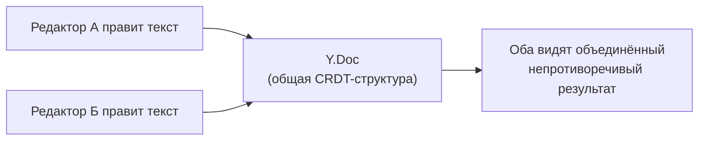
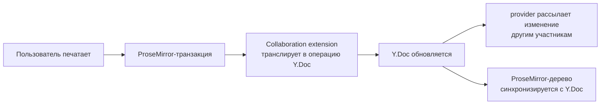

# Collaboration

## Проблема совместного редактирования

Как синхронизировать документ, который одновременно редактируют несколько человек? Наивный подход "просто отправлять весь текст на сервер при каждом изменении" ломается на конфликтах: если два человека печатают одновременно в разных местах документа, чей вариант "победит"?

Tiptap решает это через **Y.js** — библиотеку, реализующую **CRDT** (Conflict-free Replicated Data Type) — структуру данных, которая математически гарантирует, что независимые изменения от разных участников всегда сходятся к одному и тому же результату, без "перезаписи" чужих правок.



### Наивный подход "последний записавший побеждает" и почему он не работает

Прежде чем разбирать CRDT, стоит явно проговорить, почему более простые решения не подходят. Представим два подхода "в лоб":

1. **"Отправлять весь документ целиком при каждом изменении"** — если Алиса и Боб оба печатают одновременно, сервер получит два полных снимка документа, и один из них (тот, что пришёл позже) полностью **перезапишет** правки другого — Боб откроет документ и увидит, что его абзац исчез.
2. **"Блокировка документа на время редактирования"** — пока один человек редактирует, остальные видят read-only режим. Технически работает, но убивает саму идею совместной работы в реальном времени — GitHub, Figma, Google Docs специально избегают такого подхода ради живого, одновременного соавторства.

CRDT решает задачу принципиально иначе: вместо того чтобы "мержить строки текста" (что структурно сложно и часто неоднозначно — классическая задача трёхстороннего diff/merge в git), Y.js представляет документ как структуру, где **каждый символ** имеет уникальный, стабильный идентификатор, привязанный к своему "происхождению" (кто и когда его вставил, после какого символа). Операции вставки/удаления коммутативны — их можно применять в любом порядке, и результат всегда сойдётся к одному и тому же дереву. Это математическое свойство и называется "conflict-free": конфликтов на уровне алгоритма попросту не возникает, в отличие от git-подобных merge-конфликтов, требующих ручного разрешения человеком.

## Y.Doc: общий документ

```tsx
import * as Y from 'yjs'

const ydoc = new Y.Doc()
```

`Y.Doc` — контейнер для всех совместно редактируемых данных. Именно `Y.Doc`, а не сам Tiptap-документ, является "источником правды" при совместном редактировании — Tiptap синхронизирует своё внутреннее состояние с `Y.Doc` через extension `Collaboration`.

### Инверсия источника правды: непривычная, но ключевая идея

Это самая концептуально сложная часть уровня, и стоит проговорить её явно. До этого момента в курсе мы считали "источником правды" внутреннее дерево ProseMirror (`editor.state.doc`) — именно оно определяло, что видит пользователь, а `getHTML()`/`getJSON()` были лишь его снимками. При включении Collaboration это меняется: теперь **`Y.Doc`** — независимая от ProseMirror структура данных — является настоящим источником правды, а дерево ProseMirror **пересчитывается** из `Y.Doc` при каждом изменении (своём или чужом). Это работает в обе стороны: когда вы печатаете в редакторе, `Collaboration` extension транслирует ваше изменение в операцию над `Y.Doc`; когда другой участник печатает у себя, его изменение приходит через provider, применяется к вашему локальному `Y.Doc`, и уже оттуда автоматически отражается в ProseMirror-дереве вашего редактора — без прямого вызова `setContent` или подобных команд с вашей стороны.



## Collaboration extension: подключаем Y.Doc к редактору

```tsx
import Collaboration from '@tiptap/extension-collaboration'

const editor = useEditor({
  extensions: [
    StarterKit.configure({ undoRedo: false }), // важно! своя история через Y.js
    Collaboration.configure({ document: ydoc }),
  ],
})
```

📌 Обратите внимание на `undoRedo: false`: при совместном редактировании историю изменений (undo/redo) должен вести не встроенный ProseMirror-плагин истории, а сам `Collaboration` extension через Y.js — иначе Undo одного пользователя может неожиданно откатить изменения другого. `Collaboration` регистрирует свои собственные команды `undo`/`redo`.

Если создать **два независимых редактора**, указывающих на **один и тот же** `ydoc`, они будут автоматически синхронизированы — изменение в одном мгновенно отражается в другом, без сервера, потому что оба работают с общим `Y.Doc` в памяти.

### Почему обычный undo/redo ломается при совместном редактировании

Разберём конкретный сценарий, объясняющий, почему `undoRedo: false` — не просто "рекомендация", а необходимость. Представим стандартный undo ProseMirror: он хранит **линейную** историю транзакций именно этого локального редактора и умеет "откатить последнюю транзакцию". Теперь представим: Алиса печатает "Привет", затем Боб (на своей машине) печатает "мир" сразу после — эти изменения синхронизируются через provider и попадают в редактор Алисы как **чужая** транзакция. Если Алиса нажимает Ctrl+Z, обычный ProseMirror-undo откатит **последнюю примененную к её редактору транзакцию** — а это может оказаться правка Боба, а не её собственная! Специализированный undo/redo от `Collaboration` (реализованный поверх Y.js `UndoManager`) решает это, отслеживая **авторство** каждой операции и откатывая только изменения текущего пользователя, игнорируя чужие.

## y-webrtc: синхронизация между вкладками/устройствами

Чтобы синхронизировать `Y.Doc` между разными вкладками браузера (или устройствами), нужен **provider** — механизм передачи изменений. `y-webrtc` — один из простейших: соединяет пиры напрямую (peer-to-peer) через WebRTC, используя сигнальные серверы только для первоначального "знакомства" пиров.

```tsx
import { WebrtcProvider } from 'y-webrtc'

const ydoc = new Y.Doc()
const provider = new WebrtcProvider('my-room-name', ydoc)
```

Все клиенты, подключившиеся с одинаковым `roomName`, синхронизируют один и тот же `ydoc`. Важная деталь: `y-webrtc` умеет синхронизироваться и **между вкладками одного браузера** через `BroadcastChannel` API — это работает даже без интернета/сигнального сервера, что удобно для локальной разработки и тестирования collaboration-функций.

### Провайдеры как взаимозаменяемые "транспорты" — сравнение вариантов

`Y.Doc` и `Collaboration` extension вообще не знают, **как именно** данные передаются между участниками — это ответственность отдельного слоя, провайдера. Это архитектурно похоже на то, как HTTP-клиент не знает, идёт ли трафик через Wi-Fi или Ethernet — провайдер абстрагирует транспорт.

| Provider | Транспорт | Когда уместен |
|---|---|---|
| `y-webrtc` | Peer-to-peer через WebRTC | Прототипы, локальная разработка, небольшие закрытые группы без выделенного сервера |
| `y-websocket` | WebSocket через ваш сервер | Полноценный продакшен с контролем доступа, персистентностью на сервере |
| Hocuspocus | WebSocket-сервер от команды Tiptap, с расширениями (auth, персистентность, webhooks) | Продакшен-collaboration "из коробки", если не хочется писать сервер синхронизации самому |

Для реального продакшен-приложения `y-webrtc` обычно не используют — peer-to-peer плохо масштабируется на много участников и не даёт единой точки для персистентного хранения документа на сервере. Именно поэтому команда Tiptap развивает собственный сервер **Hocuspocus** — специализированное решение для продакшен-collaboration поверх Y.js с поддержкой аутентификации, хранения истории и вебхуков.

## CollaborationCaret: курсоры соавторов

Помимо синхронизации текста, полезно видеть, где находятся курсоры других участников — за это отвечает `CollaborationCaret`:

```tsx
import CollaborationCaret from '@tiptap/extension-collaboration-caret'

const editor = useEditor({
  extensions: [
    StarterKit.configure({ undoRedo: false }),
    Collaboration.configure({ document: ydoc }),
    CollaborationCaret.configure({
      provider, // тот же provider, что и для синхронизации
      user: { name: 'Алиса', color: '#f783ac' },
    }),
  ],
})
```

`CollaborationCaret` использует **awareness** — отдельный от документа канал y-webrtc/Hocuspocus для передачи эфемерных данных (позиция курсора, имя, цвет), которые не нужно хранить постоянно в CRDT-документе. Список текущих активных пользователей доступен через `editor.storage.collaborationCaret.users`.

### Почему awareness — отдельный канал, а не часть Y.Doc

Логичный вопрос: почему бы не хранить позицию курсора прямо в `Y.Doc`, раз он уже синхронизирует данные? Ответ — принципиальное разное **время жизни** этих данных. Содержимое документа должно сохраняться персистентно и переживать перезагрузку страницы, отключение участника, перезапуск сервера. Позиция курсора, наоборот, теряет смысл в тот момент, когда пользователь закрывает вкладку — хранить её в постоянной CRDT-структуре означало бы, что документ обрастал бы "мёртвыми" метаданными от давно ушедших участников. Awareness-протокол Y.js спроектирован специально для таких **эфемерных** данных: он автоматически "истекает" при разрыве соединения участника, не требует персистентности и синхронизируется отдельно, более "лёгким" механизмом, чем полноценные CRDT-операции над документом.

## Offline-first: почему это "бесплатно" достаётся от CRDT

Поскольку Y.js гарантирует сходимость независимо от **порядка** применения изменений, пользователь может редактировать документ **офлайн** — все его изменения накапливаются локально в `Y.Doc`, а когда соединение восстанавливается, они автоматически и бесконфликтно сливаются с изменениями остальных участников. Это принципиальное архитектурное преимущество CRDT перед подходами вроде Operational Transformation (используется, например, в Google Docs), которые обычно требуют централизованного сервера для разрешения конфликтов в правильном порядке.

## ⚠️ Частые ошибки новичков

**Ошибка 1: не отключить встроенный undoRedo при использовании Collaboration**

```tsx
// ❌ Плохо — два независимых механизма истории будут конфликтовать
useEditor({ extensions: [StarterKit, Collaboration.configure({ document: ydoc })] })
```

```tsx
// ✅ Хорошо
useEditor({
  extensions: [
    StarterKit.configure({ undoRedo: false }),
    Collaboration.configure({ document: ydoc }),
  ],
})
```

**Ошибка 2: передавать content в useEditor вместе с Collaboration**

Когда используется `Collaboration`, начальное содержимое документа должно приходить из `Y.Doc` (либо будет пустым, либо загружено через provider с сервера), а не из пропса `content` — они могут конфликтовать. Обычно `content` при использовании Collaboration не указывают вовсе.

**Ошибка 3: забыть уничтожить provider/Y.Doc при размонтировании компонента**

```tsx
// ✅ Хорошо — обязательная очистка в useEffect
useEffect(() => {
  return () => {
    provider.destroy()
    ydoc.destroy()
  }
}, [])
```

Без этого при повторных монтированиях компонента будут накапливаться "зомби"-соединения и утечки памяти.

**Ошибка 4: использовать y-webrtc в продакшене как единственный транспорт**

Peer-to-peer соединение через `y-webrtc` плохо масштабируется при большом числе одновременных участников (каждый пир должен поддерживать соединение с каждым) и не гарантирует персистентное хранение документа на сервере — если все участники разошлись, а документ не был явно сохранён отдельно, данные могут быть потеряны. Для продакшена рассмотрите `y-websocket` с собственным сервером или Hocuspocus.

**Ошибка 5: путать awareness-данные (курсор, имя) с содержимым документа**

```tsx
// ❌ Плохо — попытка хранить эфемерные данные (имя пользователя) прямо в тексте документа
editor.commands.insertContent(`<span>${userName} печатает...</span>`)
```

```tsx
// ✅ Хорошо — awareness-канал специально предназначен для таких временных, не персистентных данных
CollaborationCaret.configure({ provider, user: { name: userName, color } })
```

## 💡 Best practices

- Всегда отключайте встроенный `undoRedo` StarterKit при использовании `Collaboration`
- Создавайте `Y.Doc` и `provider` вне React-рендера (например, через `useState(() => new Y.Doc())` с ленивой инициализацией) или в `useEffect`, а не заново на каждый рендер
- Обязательно очищайте провайдеры и документы при размонтировании
- Используйте `CollaborationCaret` вместе с `Collaboration` — курсоры соавторов резко улучшают UX совместного редактирования, давая понять, "кто где сейчас находится"
- Для продакшена выбирайте `y-websocket`/Hocuspocus вместо чистого `y-webrtc` — это даёт контроль доступа, серверную персистентность и лучшую масштабируемость
- Не пытайтесь хранить эфемерные UI-данные (курсоры, статусы "печатает") в самом документе — используйте awareness-канал провайдера, для этого он и создан
