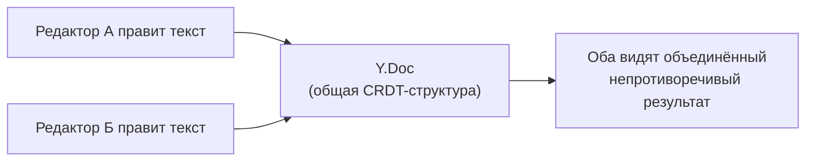

# Collaboration

## Проблема совместного редактирования

Как синхронизировать документ, который одновременно редактируют несколько человек? Наивный подход "просто отправлять весь текст на сервер при каждом изменении" ломается на конфликтах: если два человека печатают одновременно в разных местах документа, чей вариант "победит"?

Tiptap решает это через **Y.js** — библиотеку, реализующую **CRDT** (Conflict-free Replicated Data Type) — структуру данных, которая математически гарантирует, что независимые изменения от разных участников всегда сходятся к одному и тому же результату, без "перезаписи" чужих правок.



## Y.Doc: общий документ

```tsx
import * as Y from 'yjs'

const ydoc = new Y.Doc()
```

`Y.Doc` — контейнер для всех совместно редактируемых данных. Именно `Y.Doc`, а не сам Tiptap-документ, является "источником правды" при совместном редактировании — Tiptap синхронизирует своё внутреннее состояние с `Y.Doc` через extension `Collaboration`.

## Collaboration extension: подключаем Y.Doc к редактору

```tsx
import Collaboration from '@tiptap/extension-collaboration'

const editor = useEditor({
  extensions: [
    StarterKit.configure({ undoRedo: false }), // важно! своя история через Y.js
    Collaboration.configure({ document: ydoc }),
  ],
})
```

📌 Обратите внимание на `undoRedo: false`: при совместном редактировании историю изменений (undo/redo) должен вести не встроенный ProseMirror-плагин истории, а сам `Collaboration` extension через Y.js — иначе Undo одного пользователя может неожиданно откатить изменения другого. `Collaboration` регистрирует свои собственные команды `undo`/`redo`.

Если создать **два независимых редактора**, указывающих на **один и тот же** `ydoc`, они будут автоматически синхронизированы — изменение в одном мгновенно отражается в другом, без сервера, потому что оба работают с общим `Y.Doc` в памяти.

## y-webrtc: синхронизация между вкладками/устройствами

Чтобы синхронизировать `Y.Doc` между разными вкладками браузера (или устройствами), нужен **provider** — механизм передачи изменений. `y-webrtc` — один из простейших: соединяет пиры напрямую (peer-to-peer) через WebRTC, используя сигнальные серверы только для первоначального "знакомства" пиров.

```tsx
import { WebrtcProvider } from 'y-webrtc'

const ydoc = new Y.Doc()
const provider = new WebrtcProvider('my-room-name', ydoc)
```

Все клиенты, подключившиеся с одинаковым `roomName`, синхронизируют один и тот же `ydoc`. Важная деталь: `y-webrtc` умеет синхронизироваться и **между вкладками одного браузера** через `BroadcastChannel` API — это работает даже без интернета/сигнального сервера, что удобно для локальной разработки и тестирования collaboration-функций.

## CollaborationCaret: курсоры соавторов

Помимо синхронизации текста, полезно видеть, где находятся курсоры других участников — за это отвечает `CollaborationCaret`:

```tsx
import CollaborationCaret from '@tiptap/extension-collaboration-caret'

const editor = useEditor({
  extensions: [
    StarterKit.configure({ undoRedo: false }),
    Collaboration.configure({ document: ydoc }),
    CollaborationCaret.configure({
      provider, // тот же provider, что и для синхронизации
      user: { name: 'Алиса', color: '#f783ac' },
    }),
  ],
})
```

`CollaborationCaret` использует **awareness** — отдельный от документа канал y-webrtc/Hocuspocus для передачи эфемерных данных (позиция курсора, имя, цвет), которые не нужно хранить постоянно в CRDT-документе. Список текущих активных пользователей доступен через `editor.storage.collaborationCaret.users`.

## Offline-first: почему это "бесплатно" достаётся от CRDT

Поскольку Y.js гарантирует сходимость независимо от **порядка** применения изменений, пользователь может редактировать документ **офлайн** — все его изменения накапливаются локально в `Y.Doc`, а когда соединение восстанавливается, они автоматически и бесконфликтно сливаются с изменениями остальных участников. Это принципиальное архитектурное преимущество CRDT перед подходами вроде Operational Transformation (используется, например, в Google Docs), которые обычно требуют централизованного сервера для разрешения конфликтов в правильном порядке.

## ⚠️ Частые ошибки новичков

**Ошибка 1: не отключить встроенный undoRedo при использовании Collaboration**

```tsx
// ❌ Плохо — два независимых механизма истории будут конфликтовать
useEditor({ extensions: [StarterKit, Collaboration.configure({ document: ydoc })] })
```

```tsx
// ✅ Хорошо
useEditor({
  extensions: [
    StarterKit.configure({ undoRedo: false }),
    Collaboration.configure({ document: ydoc }),
  ],
})
```

**Ошибка 2: передавать content в useEditor вместе с Collaboration**

Когда используется `Collaboration`, начальное содержимое документа должно приходить из `Y.Doc` (либо будет пустым, либо загружено через provider с сервера), а не из пропса `content` — они могут конфликтовать. Обычно `content` при использовании Collaboration не указывают вовсе.

**Ошибка 3: забыть уничтожить provider/Y.Doc при размонтировании компонента**

```tsx
// ✅ Хорошо — обязательная очистка в useEffect
useEffect(() => {
  return () => {
    provider.destroy()
    ydoc.destroy()
  }
}, [])
```

Без этого при повторных монтированиях компонента будут накапливаться "зомби"-соединения и утечки памяти.

## 💡 Best practices

- Всегда отключайте встроенный `undoRedo` StarterKit при использовании `Collaboration`
- Создавайте `Y.Doc` и `provider` вне React-рендера (например, через `useState(() => new Y.Doc())` с ленивой инициализацией) или в `useEffect`, а не заново на каждый рендер
- Обязательно очищайте провайдеры и документы при размонтировании
- Используйте `CollaborationCaret` вместе с `Collaboration` — курсоры соавторов резко улучшают UX совместного редактирования, давая понять, "кто где сейчас находится"
