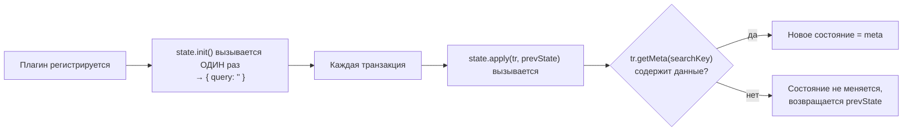

# Продвинутое

Этот уровень — сборник продвинутых техник, которые не укладываются в отдельную большую тему, но регулярно встречаются в реальных проектах на Tiptap. Здесь мы во многом опираемся на механику ProseMirror-плагинов и decorations, разобранную на уровне 12 — если что-то из терминологии кажется незнакомым, стоит вернуться туда.

## Decorations поверх поиска и подсветки

Мы уже видели `Decoration` на уровне 12 (подсветка "TODO"). Ту же технику можно применить для **live-поиска по документу**:

```tsx
function searchDecorations(doc: ProseMirrorNode, query: string): DecorationSet {
  if (!query) return DecorationSet.empty
  const decorations: Decoration[] = []
  doc.descendants((node, pos) => {
    if (!node.isText) return
    let index = 0
    const text = node.text ?? ''
    while ((index = text.indexOf(query, index)) !== -1) {
      decorations.push(
        Decoration.inline(pos + index, pos + index + query.length, { class: 'search-match' })
      )
      index += query.length
    }
  })
  return DecorationSet.create(doc, decorations)
}
```

Отличие от статичного плагина уровня 12: здесь состояние (поисковый запрос) должно передаваться в плагин **извне**, а не быть захардкожено. Для этого используют `PluginKey` + `setMeta`/`getMeta` транзакции:

```tsx
const searchKey = new PluginKey<{ query: string }>('search')

new Plugin({
  key: searchKey,
  state: {
    init: () => ({ query: '' }),
    apply(tr, prev) {
      const meta = tr.getMeta(searchKey)
      return meta ? { query: meta.query } : prev
    },
  },
  props: {
    decorations(state) {
      const { query } = searchKey.getState(state) ?? { query: '' }
      return searchDecorations(state.doc, query)
    },
  },
})

// Снаружи, чтобы обновить запрос:
editor.view.dispatch(editor.state.tr.setMeta(searchKey, { query: 'привет' }))
```

Это классический паттерн ProseMirror: **плагин с собственным состоянием**, обновляемым через `tr.setMeta(key, payload)` и читаемым через `key.getState(state)`.

### Разбор жизненного цикла plugin state по шагам

Стоит буквально проследить, как эти три части (`init`, `apply`, `setMeta`) взаимодействуют между собой, потому что этот паттерн будет встречаться в любом достаточно сложном ProseMirror-плагине:



Ключевая деталь: `apply()` вызывается **на каждую** транзакцию во всём редакторе, даже те, что вообще не связаны с поиском (обычный ввод текста пользователем). Именно поэтому внутри `apply` обязательна проверка `tr.getMeta(searchKey)` — без данных в meta состояние плагина остаётся прежним (`prevState`), и обычный ввод текста никак не сбрасывает текущий поисковый запрос.

### setMeta/getMeta — единственный официальный канал "снаружи внутрь"

Важно подчеркнуть: `tr.setMeta(key, payload)` — это не "хак", а официальный, задокументированный механизм ProseMirror для передачи произвольных данных **вместе с транзакцией**, которые не являются частью документа, но должны быть видны плагину при обработке этой конкретной транзакции. Это универсальный паттерн, применимый далеко не только для поиска — например, `Collaboration` extension (уровень 14) использует ровно тот же механизм внутри себя, чтобы помечать транзакции как "пришедшие от удалённого участника" (и тем самым не запускать повторную отправку этого же изменения обратно через provider — иначе получился бы бесконечный цикл синхронизации).

## Drag handle: перетаскивание блоков

"Drag handle" — небольшая ручка сбоку от блока, позволяющая перетаскивать его мышью, меняя порядок блоков в документе (как в Notion). Упрощённая реализация строится на:

1. **decoration-виджете**, добавляющем невидимый "хендл" рядом с каждым блоком (`Decoration.widget`)
2. Обработчике `dragstart`/`dragover`/`drop` через `props.handleDOMEvents` плагина
3. Использовании `editor.commands.deleteRange` + `editor.commands.insertContentAt` для перемещения содержимого блока на новую позицию

```tsx
props: {
  handleDOMEvents: {
    dragstart(view, event) {
      const pos = view.posAtDOM(event.target as HTMLElement, 0)
      event.dataTransfer?.setData('text/plain', String(pos))
    },
    drop(view, event) {
      event.preventDefault()
      const fromPos = Number(event.dataTransfer?.getData('text/plain'))
      const toPos = view.posAtCoords({ left: event.clientX, top: event.clientY })?.pos
      // ... логика перемещения контента между fromPos и toPos
      return true
    },
  },
}
```

Полноценные drag handle решения (как в реальных Notion-подобных редакторах) — довольно сложная тема, выходящая за рамки курса; здесь показан принцип, на основе которого строятся такие реализации.

### posAtDOM и posAtCoords: мост между "миром браузера" и "миром ProseMirror"

Эти два метода `EditorView` заслуживают отдельного внимания, потому что именно они делают возможным взаимодействие между обычными DOM-событиями (`dragstart`, `drop`, координаты мыши `clientX`/`clientY`) и внутренней системой позиций документа ProseMirror:

- **`view.posAtDOM(domNode, offset)`** — "Какой позиции в документе ProseMirror соответствует вот этот DOM-узел (и смещение внутри него)?" — используется, когда у вас есть ссылка на реальный DOM-элемент (например, `event.target` из обработчика клика), и нужно узнать, какому узлу документа он соответствует.
- **`view.posAtCoords({ left, top })`** — "Какой позиции в документе соответствуют вот эти экранные координаты (например, координаты курсора мыши)?" — незаменим для drag & drop, где вы знаете только `clientX`/`clientY` события, но не знаете заранее, на какой узел документа они указывают.

Оба метода — единственный официально поддерживаемый способ конвертации между "координатным миром браузера" и "позиционным миром ProseMirror" (числовыми индексами внутри дерева документа). Попытки вычислять это вручную через обход DOM были бы крайне ненадёжны и легко ломались бы при малейшем изменении структуры рендеринга.

## Программное управление выделением

Помимо простого `.focus()`, Tiptap/ProseMirror позволяет точно управлять положением курсора и выделением:

```tsx
import { TextSelection } from '@tiptap/pm/state'

// Установить курсор на конкретную позицию
editor.commands.setTextSelection(10)

// Установить выделение диапазона
editor.commands.setTextSelection({ from: 5, to: 15 })

// Выделить весь документ
editor.commands.selectAll()

// Программно создать TextSelection и применить через транзакцию
const { state } = editor
const selection = TextSelection.create(state.doc, 3, 8)
editor.view.dispatch(state.tr.setSelection(selection))
```

Это полезно для сценариев вроде "после вставки шаблона поставить курсор в конкретное место для заполнения", "выделить найденный текст поиска", "перейти к определённому заголовку по клику в оглавлении".

### Позиции ProseMirror — не индексы символов в строке

Важная деталь, которую легко упустить: числовая "позиция" в ProseMirror (например, `10` в `setTextSelection(10)`) — это **не** индекс символа в тексте, а позиция в специальной, "плоской" системе координат документа, которая учитывает границы узлов. Каждый узел (открывающий и закрывающий тег, условно) занимает отдельные позиции в этой системе — то есть между двумя соседними параграфами позиция "сдвигается" не на один символ, а на несколько единиц (границы узлов). Из-за этого прямое вычисление "нужной" позиции на основе длины строк текста часто ошибочно — надёжнее опираться на уже известные позиции, полученные из самого ProseMirror (`getPos()` из NodeView — уровень 10, или результаты `doc.descendants()`), а не пытаться пересчитывать их вручную по офсетам символов.

## ⚠️ Частые ошибки новичков

**Ошибка 1: пытаться хранить динамическое состояние плагина в замыкании JS вместо PluginState**

```tsx
// ❌ Плохо — переменная в замыкании не связана с транзакциями/undo, легко рассинхронизируется
let currentQuery = ''
new Plugin({ props: { decorations: state => searchDecorations(state.doc, currentQuery) } })
```

```tsx
// ✅ Хорошо — состояние живёт в самом плагине через init/apply, синхронизировано с транзакциями
new Plugin({ key: searchKey, state: { init: () => ({query: ''}), apply(tr, prev) {...} }, ... })
```

**Ошибка 2: использовать setTextSelection с позицией за пределами документа**

Позиции ProseMirror строго ограничены размером документа — установка позиции больше `doc.content.size` приведёт к ошибке. Проверяйте границы или используйте `Math.min(pos, doc.content.size)`.

**Ошибка 3: недооценивать сложность полноценного drag & drop**

Готовое решение должно обрабатывать вложенные структуры (перетаскивание элемента списка внутрь другого списка), визуальную индикацию места вставки, отмену перетаскивания — это значительно сложнее наивной реализации через `dragstart`/`drop`.

**Ошибка 4: путать позицию ProseMirror с индексом символа в тексте**

```tsx
// ❌ Плохо — предполагает, что позиция N соответствует N-му символу текста,
// игнорируя границы узлов документа
const pos = plainText.indexOf('искомое слово')
editor.commands.setTextSelection(pos) // может указать не туда
```

```tsx
// ✅ Хорошо — вычисляем позицию через API ProseMirror, учитывающее структуру документа
editor.state.doc.descendants((node, pos) => {
  if (node.isText && node.text?.includes('искомое слово')) {
    const offset = node.text.indexOf('искомое слово')
    editor.commands.setTextSelection(pos + offset)
  }
})
```

**Ошибка 5: забывать про preventDefault в обработчиках drop, из-за чего срабатывает поведение браузера по умолчанию**

```tsx
// ❌ Плохо — без preventDefault браузер может попытаться сам обработать drop
// (например, открыть перетащенный файл в новой вкладке)
drop(view, event) {
  handleCustomDrop(event)
  return true
}
```

```tsx
// ✅ Хорошо
drop(view, event) {
  event.preventDefault()
  handleCustomDrop(event)
  return true
}
```

## 💡 Best practices

- Храните любое динамическое состояние ProseMirror-плагина через `state: { init, apply }`, а не во внешних переменных
- Используйте `tr.setMeta(key, payload)` для передачи данных "снаружи" в состояние плагина — это единственный официально поддерживаемый канал
- Для сложных фич (drag & drop, полноценное совместное выделение и т.п.) сверяйтесь с официальными примерами Tiptap/ProseMirror — многие тонкости (границы документа, вложенные структуры) легко упустить при реализации с нуля
- Программное управление выделением используйте умеренно — избыточные перемещения курсора без явного действия пользователя ухудшают UX
- Используйте `posAtDOM`/`posAtCoords` для конвертации между координатами браузера и позициями документа — не пытайтесь вычислять это вручную
- Всегда вызывайте `event.preventDefault()` в кастомных обработчиках `handleDOMEvents`, если вы полностью берёте на себя обработку события (drag & drop, paste, drop файлов)

## Итоги курса

Мы прошли путь от простейшего `useEditor` + `EditorContent` до совместного редактирования через CRDT и низкоуровневых ProseMirror-плагинов с decorations. Ключевая идея, которая должна остаться после курса: Tiptap — это не "чёрный ящик" с командами, а тонкая, продуманная обёртка над строгой, предсказуемой моделью документа ProseMirror. Понимание того, что происходит "на уровень ниже" — транзакции, схема, позиции, plugin state — превращает Tiptap из набора рецептов в инструмент, которым можно уверенно решать нестандартные задачи, не дожидаясь, пока нужный extension появится в официальном списке.
