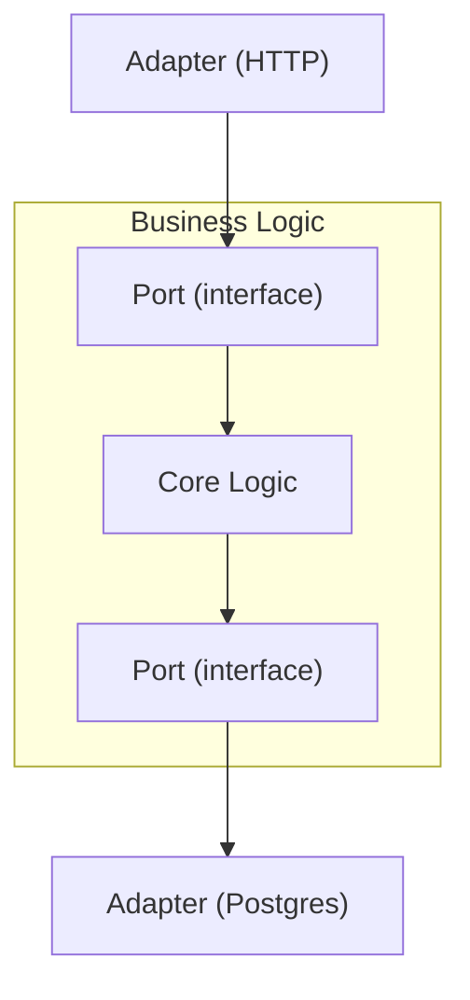
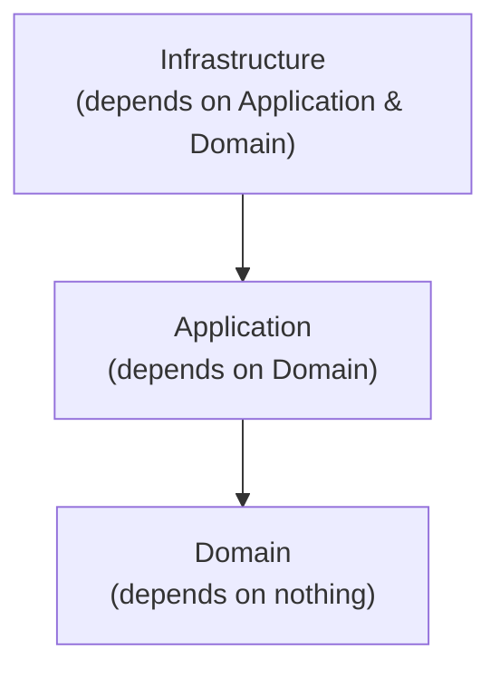

# 🏛️ Level 7: Modular Architecture

## 📖 Introduction

As an application grows, a simple "all files in one folder" structure turns into chaos. Modular architecture is a set of patterns that help **isolate parts of the system** from each other, making them replaceable and testable.

> 🔥 **Key idea:** Dependencies should point toward stability. Business logic does not depend on the database. Modules communicate through contracts, not through internal implementation details.

## 💉 Dependency Injection (DI)

### Problem

```typescript
// ❌ Bad: tight coupling
class OrderService {
  private db = new PostgresDatabase()    // locked to Postgres
  private mailer = new SendGridMailer()  // locked to SendGrid

  createOrder(data: OrderData) {
    this.db.save(data)
    this.mailer.send(data.email, 'Order created')
  }
}
```

This cannot be tested without a real database and mail server. Replacing Postgres with MongoDB requires a rewrite.

### Solution: DI Container

```typescript
// Token — a unique, typed identifier for a dependency
class Token<T> {
  constructor(readonly name: string) {}
}

// Registering dependencies
const DatabaseToken = new Token<Database>('Database')
const MailerToken = new Token<Mailer>('Mailer')

class Container {
  private bindings = new Map<Token<unknown>, () => unknown>()

  register<T>(token: Token<T>, factory: () => T): void {
    this.bindings.set(token, factory)
  }

  resolve<T>(token: Token<T>): T {
    const factory = this.bindings.get(token)
    if (!factory) throw new Error(`No binding for ${token.name}`)
    return factory() as T
  }
}
```

### Lifecycle

| Mode | Description |
|------|-------------|
| 🔄 **Transient** | New instance every time (default) |
| 💎 **Singleton** | One instance per container |
| 📦 **Scoped** | One instance per "scope" (request, transaction) |

```typescript
// Singleton: caches the first call
registerSingleton<T>(token: Token<T>, factory: () => T): void {
  let instance: T | null = null
  this.bindings.set(token, () => {
    if (!instance) instance = factory()
    return instance
  })
}
```

## 🔌 Ports & Adapters (Hexagonal Architecture)

### 🔥 Key Idea

Business logic lives at the center and **knows nothing** about the database, HTTP, or the file system. Instead, it defines **ports** (interfaces), and the outside world provides **adapters** (implementations).



### Example

```typescript
// Port — interface defined by business logic
interface UserRepository {
  findById(id: string): Promise<User | null>
  save(user: User): Promise<void>
}

// Adapter 1 — real database
class PostgresUserRepository implements UserRepository {
  async findById(id: string) { /* SQL query */ }
  async save(user: User) { /* SQL insert */ }
}

// Adapter 2 — for tests
class InMemoryUserRepository implements UserRepository {
  private users = new Map<string, User>()
  async findById(id: string) { return this.users.get(id) ?? null }
  async save(user: User) { this.users.set(user.id, user) }
}
```

> 💡 **Tip:** Business logic works with `UserRepository` without knowing which adapter is behind it. This makes code testable and replaceable.

## 🏛️ Clean Architecture

### Layers



1. 🟢 **Domain (Entity)** — business objects and rules. Depends on nothing.
2. 🔵 **Application (UseCase)** — use cases. Depends only on Domain.
3. 🟠 **Infrastructure** — DB, API, frameworks. Depends on Application and Domain.

### Example

```typescript
// 🟢 Domain — Entity with business rules
class Order {
  constructor(
    readonly id: string,
    readonly items: OrderItem[],
    private _status: OrderStatus
  ) {}

  get total(): number {
    return this.items.reduce((sum, item) => sum + item.price * item.quantity, 0)
  }

  canCancel(): boolean {
    return this._status === 'pending' || this._status === 'confirmed'
  }

  cancel(): void {
    if (!this.canCancel()) {
      throw new Error(`Cannot cancel order in status: ${this._status}`)
    }
    this._status = 'cancelled'
  }
}

// 🔵 Application — UseCase
class CreateOrderUseCase {
  constructor(
    private orderRepo: OrderRepository,
    private notifier: OrderNotifier
  ) {}

  execute(input: CreateOrderInput): Order {
    const order = new Order(generateId(), input.items, 'pending')
    if (order.total <= 0) throw new Error('Order total must be positive')
    this.orderRepo.save(order)
    this.notifier.notify(order)
    return order
  }
}
```

### Dependency Rule

> 📌 **Important:** Dependencies point inward. Infrastructure knows about Domain, but Domain knows nothing about Infrastructure. This is achieved through interfaces (ports) defined in the Domain/Application layers.

## 📦 Module Contracts

### Problem

```typescript
// ❌ Bad: module exports everything
export { UserService } from './UserService'
export { UserRepository } from './UserRepository'
export { UserValidator } from './UserValidator'
export { hashPassword } from './utils'
export { USER_TABLE_NAME } from './constants'
```

Other modules start depending on internal implementation details. Refactoring becomes impossible.

### Solution: Module Public API

```typescript
// users/index.ts — public contract
export type { User, CreateUserInput } from './types'
export { UserService } from './UserService'

// Everything else is internal and not exported
```

### Type-safe Contracts Between Modules

```typescript
// Module contract
interface UserModuleContract {
  getUser(id: string): User | null
  createUser(input: CreateUserInput): User
}

// Module implements the contract
function createUserModule(deps: UserModuleDeps): UserModuleContract {
  return {
    getUser(id) { /* ... */ },
    createUser(input) { /* ... */ },
  }
}

// ✅ Other modules see only the contract
const users: UserModuleContract = createUserModule(deps)
users.getUser('42')
```

> 🔥 **Key point:** The module's public API is a contract. Internals can be freely refactored as long as the contract is upheld.

## ⚠️ Common Beginner Mistakes

### 🐛 1. DI container without typing

```typescript
// ❌ Bad: get returns any
container.get('database') // any
```

✅ **Good** — Token<T> guarantees the type:
```typescript
const DatabaseToken = new Token<Database>('Database')
container.resolve(DatabaseToken) // Database
```

### 🐛 2. Port depends on the adapter

```typescript
// ❌ Bad: port knows about Postgres
interface UserRepository {
  query(sql: string): Promise<PgResult>  // Postgres details in the port!
}
```

✅ **Good** — port is abstract:
```typescript
interface UserRepository {
  findById(id: string): Promise<User | null>
  save(user: User): Promise<void>
}
```

### 🐛 3. Business logic in Infrastructure

```typescript
// ❌ Bad: order rules inside the repository
class OrderRepository {
  save(order: Order) {
    if (order.total < 0) throw new Error('Invalid total')  // business rule!
    this.db.insert(order)
  }
}
```

✅ **Good** — rules in Entity:
```typescript
class Order {
  validate() {
    if (this.total < 0) throw new Error('Invalid total')
  }
}
```

### 🐛 4. Barrel files that create circular dependencies

```typescript
// ❌ Bad: everything through one index.ts
// moduleA/index.ts exports from moduleB
// moduleB/index.ts exports from moduleA
// → Circular dependency!
```

✅ **Good** — modules depend on contracts, not on each other.

## 💡 Best Practices

- 💉 **Token<T>** for DI — type safety at resolve time
- 🔌 **Ports are defined by business logic**, not by infrastructure
- 🏛️ **Dependencies point inward** — Infrastructure → Application → Domain
- 💡 Start simple — you don't need a DI container for 3 services
- 🧪 Test business logic without infrastructure — plug in in-memory adapters
- 📦 Module public API — only types and facades; internals are hidden
